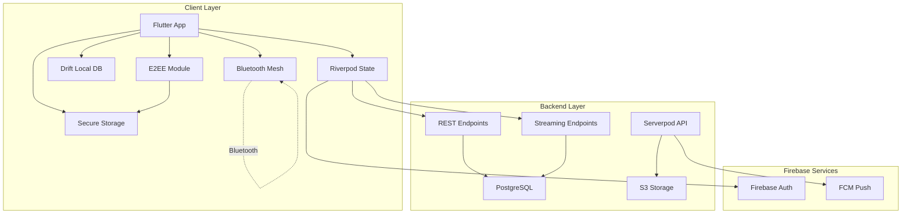
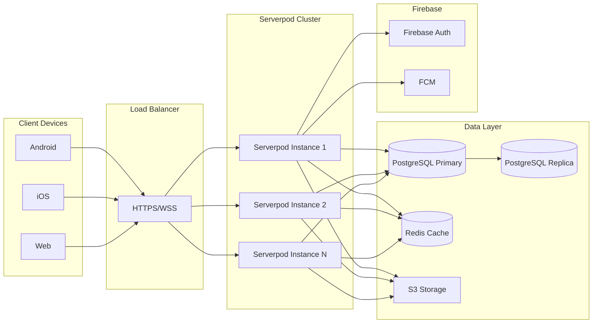
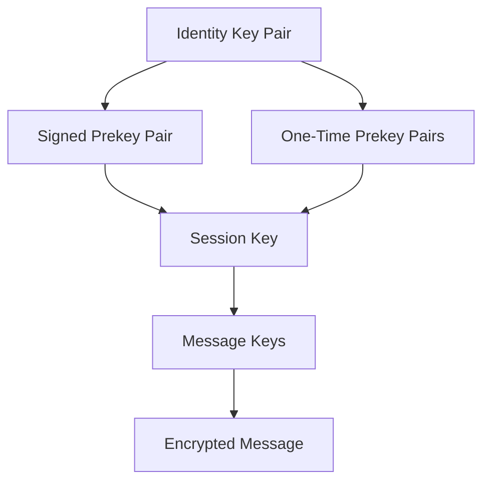
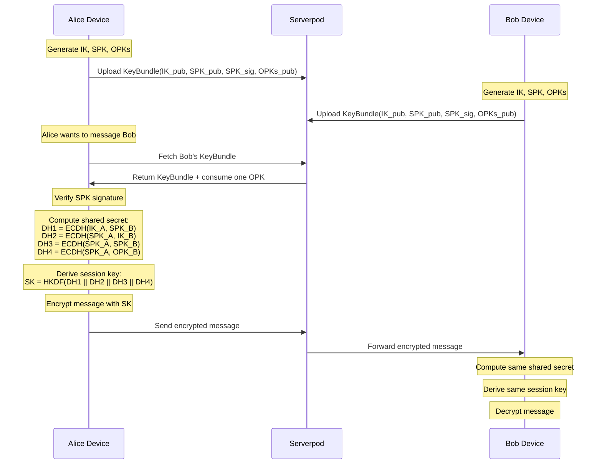
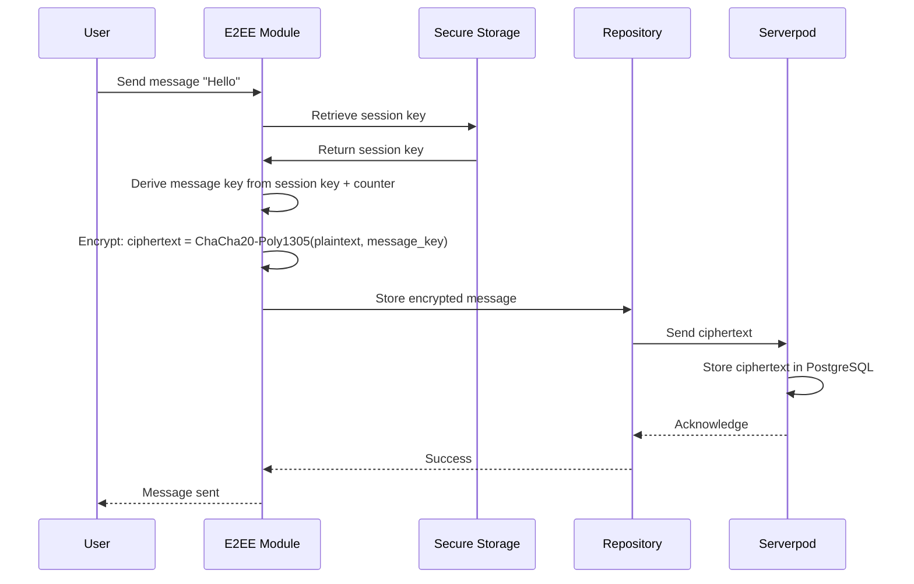
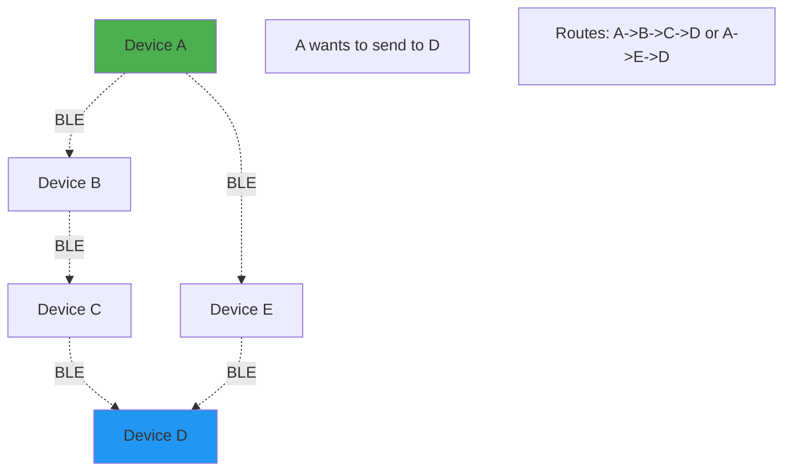

# Design Document: Production-Ready Privacy-Focused Chat Platform

## Overview

This design document specifies the technical architecture for transforming the existing Flutter chat application into a production-ready, privacy-focused, decentralized communication platform. The system implements end-to-end encryption (E2EE), a hybrid Serverpod + Firebase backend architecture, innovative Bluetooth mesh networking for offline communication, WebRTC-based voice/video calls, and comprehensive media sharing capabilities.

### System Goals

- **Privacy-First**: End-to-end encryption for all communications with server storing only ciphertext
- **Decentralized Architecture**: Serverpod backend with PostgreSQL as system of record, Firebase for auth/push only
- **Offline Resilience**: Bluetooth mesh networking for communication without internet connectivity
- **Multi-Device Support**: Seamless synchronization across phones, tablets, and web
- **Production Quality**: Clean architecture, comprehensive testing, scalability, and maintainability

### Technology Stack

- **Frontend**: Flutter (stable), Riverpod, GoRouter, Drift (SQLite), flutter_secure_storage
- **Backend**: Serverpod (Dart) with PostgreSQL, Firebase Auth + FCM
- **Encryption**: cryptography package (Dart), X25519 key exchange, ChaCha20-Poly1305 AEAD
- **Real-time**: Serverpod streaming endpoints, WebRTC for calls
- **Storage**: S3-compatible object storage or Serverpod file storage
- **Offline**: Bluetooth Low Energy (BLE) mesh networking

### Migration Strategy

The system migrates incrementally from the current Firebase/Provider/Hive stack:

1. **Phase M0**: Dual-read mode (Firestore + Serverpod)
2. **Phase M1**: Dual-write mode with Serverpod authoritative
3. **Phase M2**: Serverpod-only with feature flags
4. **Phase M3**: Remove Firestore messaging code paths


## Architecture

### System Architecture Overview

The system follows a hybrid architecture combining Serverpod for message routing and data persistence with Firebase for authentication and push notifications.




### Deployment Architecture



### Trust Boundaries

1. **Client Trust Boundary**: Private keys never leave the device; stored in flutter_secure_storage
2. **Network Trust Boundary**: All communication over TLS 1.3; optional certificate pinning
3. **Server Trust Boundary**: Serverpod sees only ciphertext, routing metadata, and sync cursors
4. **Firebase Trust Boundary**: Firebase Auth sees phone numbers and auth tokens; FCM sees device tokens and generic push metadata (no message content)


## Components and Interfaces

### Flutter Application Components

#### Core Modules

**1. Authentication Module** (`features/auth/`)
- Handles Firebase phone OTP authentication
- Exchanges Firebase ID token for Serverpod session
- Manages device registration and session lifecycle
- Interfaces: `AuthRepository`, `AuthService`, `SessionManager`

**2. End-to-End Encryption Module** (`core/crypto/`)
- Implements X25519 key exchange and ChaCha20-Poly1305 AEAD encryption
- Manages identity keys, signed prekeys, and one-time prekeys
- Handles key generation, storage, and rotation
- Interfaces: `CryptoService`, `KeyManager`, `EncryptionEngine`

**3. Sync Engine** (`core/sync/`)
- Manages offline-first synchronization with Serverpod
- Implements cursor-based incremental sync
- Handles conflict resolution using last-write-wins (LWW)
- Interfaces: `SyncService`, `CursorManager`, `ConflictResolver`

**4. Messaging Module** (`features/chat/`)
- Handles message composition, encryption, and delivery
- Manages chat threads (1:1 and group)
- Implements outbox pattern for offline message queuing
- Interfaces: `MessageRepository`, `ChatRepository`, `OutboxService`

**5. Media Pipeline** (`core/media/`)
- Compresses images and videos before upload
- Encrypts media files before transmission
- Manages presigned URL uploads to S3
- Interfaces: `MediaService`, `CompressionService`, `UploadService`

**6. Bluetooth Mesh Module** (`core/bluetooth/`)
- Discovers nearby devices via BLE
- Establishes encrypted peer-to-peer connections
- Implements multi-hop message routing
- Interfaces: `BluetoothMeshService`, `PeerDiscovery`, `MeshRouter`

**7. WebRTC Module** (`core/webrtc/`)
- Manages voice and video call signaling
- Handles peer connection establishment
- Implements codec negotiation and quality adaptation
- Interfaces: `CallService`, `SignalingService`, `MediaStreamManager`

**8. Local Database** (`core/database/`)
- Drift-based SQLite database for offline storage
- Implements full-text search on messages
- Manages sync state and cursors
- Interfaces: `DriftDatabase`, `MessageDao`, `ChatDao`


### Serverpod Backend Components

#### Endpoint Modules

**1. Auth Endpoints** (`endpoints/auth_endpoint.dart`)
- `exchangeFirebaseToken(String idToken, String deviceId)`: Verifies Firebase token and issues Serverpod session
- `refreshSession(String refreshToken)`: Renews expired session
- `logout(String sessionId)`: Revokes session and device access
- `revokeDevice(String deviceId)`: Removes device from registry

**2. Device Endpoints** (`endpoints/device_endpoint.dart`)
- `registerDevice(DeviceInfo device)`: Registers new device for multi-device support
- `listDevices()`: Returns all devices for current user
- `updateDeviceMetadata(String deviceId, Map<String, dynamic> metadata)`: Updates device info

**3. Key Endpoints** (`endpoints/key_endpoint.dart`)
- `uploadKeyBundle(KeyBundle bundle)`: Stores public key material
- `fetchUserKeyBundles(String userId)`: Retrieves public keys for all user devices
- `replenishPrekeys(List<OneTimePrekey> prekeys)`: Adds new one-time prekeys

**4. Chat Endpoints** (`endpoints/chat_endpoint.dart`)
- `createDirectChat(String recipientId)`: Creates 1:1 chat
- `createGroupChat(String name, List<String> memberIds)`: Creates group chat
- `listChats(int limit, String? cursor)`: Returns user's chat list with pagination
- `getChatDetails(String chatId)`: Returns chat metadata and members
- `addGroupMembers(String chatId, List<String> memberIds)`: Adds members to group
- `removeGroupMember(String chatId, String memberId)`: Removes member from group

**5. Message Endpoints** (`endpoints/message_endpoint.dart`)
- `sendMessage(SendMessageRequest request)`: Persists encrypted message with idempotency
- `listMessages(String chatId, int limit, String? cursor)`: Returns message history
- `deleteMessage(String messageId)`: Creates tombstone for message deletion
- `editMessage(String messageId, String newCiphertext)`: Updates message content

**6. Sync Endpoints** (`endpoints/sync_endpoint.dart`)
- `getChanges(String? cursor, int limit)`: Returns incremental changes since cursor
- `getChatChanges(String chatId, String? cursor, int limit)`: Returns chat-specific changes
- `acknowledgeSync(String cursor)`: Confirms client processed changes

**7. Media Endpoints** (`endpoints/media_endpoint.dart`)
- `prepareUpload(MediaUploadRequest request)`: Generates presigned S3 URL
- `finalizeUpload(String mediaId, String storageKey)`: Confirms upload completion
- `getMediaUrl(String mediaId)`: Returns presigned download URL

**8. Push Endpoints** (`endpoints/push_endpoint.dart`)
- `registerPushToken(String token, String platform)`: Stores FCM token
- `updatePushPreferences(PushPreferences prefs)`: Updates notification settings

**9. Safety Endpoints** (`endpoints/safety_endpoint.dart`)
- `reportUser(String userId, String reason, String? context)`: Creates abuse report
- `blockUser(String userId)`: Blocks user bidirectionally
- `unblockUser(String userId)`: Removes block


#### Streaming Endpoints

**Real-time Event Stream** (`streaming/realtime_stream.dart`)

Events pushed from server to client:
- `message`: New message arrived for user
- `message_ack`: Delivery/read acknowledgment
- `typing`: User typing indicator
- `presence`: User online/away/offline status
- `sync_hint`: Nudge client to pull changes
- `error`: Error notification

Events sent from client to server:
- `send_message`: Client sends new message
- `ack`: Client acknowledges message delivery/read
- `typing`: Client broadcasts typing status

Event envelope structure:
```dart
class StreamEvent {
  String type;
  String? chatId;
  String? deviceId;
  DateTime timestamp;
  String? idempotencyKey;
  Map<String, dynamic> payload;
}
```

### Interface Contracts

#### Serverpod Protocol Models

Generated from YAML protocol definitions:

```yaml
# User model
class: User
fields:
  id: String
  firebaseUid: String
  displayName: String
  photoUrl: String?
  phoneNumber: String
  createdAt: DateTime
  updatedAt: DateTime

# Device model
class: Device
fields:
  id: String
  userId: String
  deviceId: String
  name: String
  platform: String
  lastSeenAt: DateTime
  publicKeyRef: String

# Message model
class: Message
fields:
  id: String
  chatId: String
  senderId: String
  senderDeviceId: String
  clientMsgId: String
  serverSeq: int
  ciphertext: String
  contentType: String
  mediaId: String?
  createdAt: DateTime
  deletedAt: DateTime?

# Chat model
class: Chat
fields:
  id: String
  type: String  # 'direct' or 'group'
  title: String?
  createdBy: String
  createdAt: DateTime
  updatedAt: DateTime
```


## Data Models

### PostgreSQL Schema

#### Users Table
```sql
CREATE TABLE users (
  id UUID PRIMARY KEY DEFAULT gen_random_uuid(),
  firebase_uid VARCHAR(128) UNIQUE NOT NULL,
  display_name VARCHAR(255) NOT NULL,
  photo_url TEXT,
  phone_number VARCHAR(20) NOT NULL,
  status_message TEXT,
  presence_status VARCHAR(20) DEFAULT 'offline',
  created_at TIMESTAMP NOT NULL DEFAULT NOW(),
  updated_at TIMESTAMP NOT NULL DEFAULT NOW()
);

CREATE INDEX idx_users_firebase_uid ON users(firebase_uid);
CREATE INDEX idx_users_phone_number ON users(phone_number);
```

#### Devices Table
```sql
CREATE TABLE devices (
  id UUID PRIMARY KEY DEFAULT gen_random_uuid(),
  user_id UUID NOT NULL REFERENCES users(id) ON DELETE CASCADE,
  device_id VARCHAR(255) UNIQUE NOT NULL,
  name VARCHAR(255) NOT NULL,
  platform VARCHAR(50) NOT NULL,
  public_key_ref TEXT NOT NULL,
  last_seen_at TIMESTAMP NOT NULL DEFAULT NOW(),
  created_at TIMESTAMP NOT NULL DEFAULT NOW(),
  revoked_at TIMESTAMP
);

CREATE INDEX idx_devices_user_id ON devices(user_id);
CREATE INDEX idx_devices_device_id ON devices(device_id);
```

#### Sessions Table
```sql
CREATE TABLE sessions (
  id UUID PRIMARY KEY DEFAULT gen_random_uuid(),
  user_id UUID NOT NULL REFERENCES users(id) ON DELETE CASCADE,
  device_id UUID NOT NULL REFERENCES devices(id) ON DELETE CASCADE,
  refresh_token_hash VARCHAR(255) NOT NULL,
  expires_at TIMESTAMP NOT NULL,
  created_at TIMESTAMP NOT NULL DEFAULT NOW(),
  revoked_at TIMESTAMP
);

CREATE INDEX idx_sessions_user_device ON sessions(user_id, device_id);
CREATE INDEX idx_sessions_expires ON sessions(expires_at) WHERE revoked_at IS NULL;
```

#### Chats Table
```sql
CREATE TABLE chats (
  id UUID PRIMARY KEY DEFAULT gen_random_uuid(),
  type VARCHAR(20) NOT NULL CHECK (type IN ('direct', 'group')),
  title VARCHAR(255),
  created_by UUID NOT NULL REFERENCES users(id),
  created_at TIMESTAMP NOT NULL DEFAULT NOW(),
  updated_at TIMESTAMP NOT NULL DEFAULT NOW()
);

CREATE INDEX idx_chats_type ON chats(type);
CREATE INDEX idx_chats_updated_at ON chats(updated_at DESC);
```


#### Chat Members Table
```sql
CREATE TABLE chat_members (
  chat_id UUID NOT NULL REFERENCES chats(id) ON DELETE CASCADE,
  user_id UUID NOT NULL REFERENCES users(id) ON DELETE CASCADE,
  role VARCHAR(20) NOT NULL DEFAULT 'member' CHECK (role IN ('admin', 'member')),
  joined_at TIMESTAMP NOT NULL DEFAULT NOW(),
  last_read_seq BIGINT DEFAULT 0,
  muted_until TIMESTAMP,
  PRIMARY KEY (chat_id, user_id)
);

CREATE INDEX idx_chat_members_user_id ON chat_members(user_id);
CREATE INDEX idx_chat_members_chat_id ON chat_members(chat_id);
```

#### Messages Table
```sql
CREATE TABLE messages (
  id UUID PRIMARY KEY DEFAULT gen_random_uuid(),
  chat_id UUID NOT NULL REFERENCES chats(id) ON DELETE CASCADE,
  sender_id UUID NOT NULL REFERENCES users(id),
  sender_device_id UUID NOT NULL REFERENCES devices(id),
  client_msg_id VARCHAR(255) NOT NULL,
  server_seq BIGSERIAL NOT NULL,
  ciphertext TEXT NOT NULL,
  content_type VARCHAR(50) NOT NULL,
  media_id UUID,
  created_at TIMESTAMP NOT NULL DEFAULT NOW(),
  updated_at TIMESTAMP NOT NULL DEFAULT NOW(),
  deleted_at TIMESTAMP,
  UNIQUE (sender_id, client_msg_id)
);

CREATE INDEX idx_messages_chat_seq ON messages(chat_id, server_seq DESC);
CREATE INDEX idx_messages_created_at ON messages(created_at DESC);
CREATE INDEX idx_messages_client_msg ON messages(sender_id, client_msg_id);
```

#### Media Objects Table
```sql
CREATE TABLE media_objects (
  id UUID PRIMARY KEY DEFAULT gen_random_uuid(),
  uploader_id UUID NOT NULL REFERENCES users(id),
  storage_key TEXT NOT NULL,
  mime_type VARCHAR(100) NOT NULL,
  size_bytes BIGINT NOT NULL,
  sha256_hash VARCHAR(64) NOT NULL,
  encrypted BOOLEAN NOT NULL DEFAULT true,
  created_at TIMESTAMP NOT NULL DEFAULT NOW()
);

CREATE INDEX idx_media_uploader ON media_objects(uploader_id);
CREATE INDEX idx_media_sha256 ON media_objects(sha256_hash);
```


#### Device Keys Table
```sql
CREATE TABLE device_keys (
  device_id UUID PRIMARY KEY REFERENCES devices(id) ON DELETE CASCADE,
  identity_key TEXT NOT NULL,
  signed_prekey TEXT NOT NULL,
  signed_prekey_signature TEXT NOT NULL,
  created_at TIMESTAMP NOT NULL DEFAULT NOW(),
  updated_at TIMESTAMP NOT NULL DEFAULT NOW()
);
```

#### One-Time Prekeys Table
```sql
CREATE TABLE one_time_prekeys (
  id UUID PRIMARY KEY DEFAULT gen_random_uuid(),
  device_id UUID NOT NULL REFERENCES devices(id) ON DELETE CASCADE,
  key_id INT NOT NULL,
  public_key TEXT NOT NULL,
  used_at TIMESTAMP,
  created_at TIMESTAMP NOT NULL DEFAULT NOW(),
  UNIQUE (device_id, key_id)
);

CREATE INDEX idx_prekeys_device_unused ON one_time_prekeys(device_id) 
  WHERE used_at IS NULL;
```

#### Push Tokens Table
```sql
CREATE TABLE push_tokens (
  id UUID PRIMARY KEY DEFAULT gen_random_uuid(),
  device_id UUID NOT NULL REFERENCES devices(id) ON DELETE CASCADE,
  user_id UUID NOT NULL REFERENCES users(id) ON DELETE CASCADE,
  token TEXT NOT NULL UNIQUE,
  platform VARCHAR(20) NOT NULL CHECK (platform IN ('android', 'ios', 'web')),
  created_at TIMESTAMP NOT NULL DEFAULT NOW(),
  updated_at TIMESTAMP NOT NULL DEFAULT NOW()
);

CREATE INDEX idx_push_tokens_device ON push_tokens(device_id);
CREATE INDEX idx_push_tokens_user ON push_tokens(user_id);
```

#### Blocks Table
```sql
CREATE TABLE blocks (
  blocker_id UUID NOT NULL REFERENCES users(id) ON DELETE CASCADE,
  blocked_id UUID NOT NULL REFERENCES users(id) ON DELETE CASCADE,
  created_at TIMESTAMP NOT NULL DEFAULT NOW(),
  PRIMARY KEY (blocker_id, blocked_id),
  CHECK (blocker_id != blocked_id)
);

CREATE INDEX idx_blocks_blocker ON blocks(blocker_id);
CREATE INDEX idx_blocks_blocked ON blocks(blocked_id);
```

#### Reports Table
```sql
CREATE TABLE reports (
  id UUID PRIMARY KEY DEFAULT gen_random_uuid(),
  reporter_id UUID NOT NULL REFERENCES users(id),
  reported_user_id UUID REFERENCES users(id),
  reported_message_id UUID REFERENCES messages(id),
  reason VARCHAR(100) NOT NULL,
  context TEXT,
  status VARCHAR(20) DEFAULT 'pending',
  created_at TIMESTAMP NOT NULL DEFAULT NOW(),
  resolved_at TIMESTAMP
);

CREATE INDEX idx_reports_status ON reports(status);
CREATE INDEX idx_reports_reported_user ON reports(reported_user_id);
```


#### Stories Table
```sql
CREATE TABLE stories (
  id UUID PRIMARY KEY DEFAULT gen_random_uuid(),
  user_id UUID NOT NULL REFERENCES users(id) ON DELETE CASCADE,
  media_id UUID NOT NULL REFERENCES media_objects(id),
  ciphertext TEXT NOT NULL,
  content_type VARCHAR(50) NOT NULL,
  expires_at TIMESTAMP NOT NULL,
  created_at TIMESTAMP NOT NULL DEFAULT NOW()
);

CREATE INDEX idx_stories_user ON stories(user_id);
CREATE INDEX idx_stories_expires ON stories(expires_at);
```

#### Story Views Table
```sql
CREATE TABLE story_views (
  story_id UUID NOT NULL REFERENCES stories(id) ON DELETE CASCADE,
  viewer_id UUID NOT NULL REFERENCES users(id) ON DELETE CASCADE,
  viewed_at TIMESTAMP NOT NULL DEFAULT NOW(),
  PRIMARY KEY (story_id, viewer_id)
);

CREATE INDEX idx_story_views_story ON story_views(story_id);
```

### Drift Local Database Schema

#### Local Chats Table
```dart
class LocalChats extends Table {
  TextColumn get id => text()();
  TextColumn get type => text()();
  TextColumn get title => text().nullable()();
  TextColumn get lastMessagePreview => text().nullable()();
  IntColumn get unreadCount => integer().withDefault(const Constant(0))();
  DateTimeColumn get lastMessageAt => dateTime().nullable()();
  DateTimeColumn get createdAt => dateTime()();
  DateTimeColumn get updatedAt => dateTime()();
  
  @override
  Set<Column> get primaryKey => {id};
}
```

#### Local Messages Table
```dart
class LocalMessages extends Table {
  TextColumn get id => text()();
  TextColumn get chatId => text()();
  TextColumn get senderId => text()();
  TextColumn get clientMsgId => text()();
  IntColumn get serverSeq => integer().nullable()();
  TextColumn get plaintext => text()();  // Decrypted locally
  TextColumn get contentType => text()();
  TextColumn get mediaId => text().nullable()();
  TextColumn get status => text()();  // pending, sent, delivered, read
  DateTimeColumn get createdAt => dateTime()();
  DateTimeColumn get updatedAt => dateTime()();
  BoolColumn get isDeleted => boolean().withDefault(const Constant(false))();
  
  @override
  Set<Column> get primaryKey => {id};
}
```


#### Outbox Table
```dart
class Outbox extends Table {
  TextColumn get id => text()();
  TextColumn get chatId => text()();
  TextColumn get clientMsgId => text()();
  TextColumn get ciphertext => text()();
  TextColumn get contentType => text()();
  TextColumn get mediaId => text().nullable()();
  IntColumn get retryCount => integer().withDefault(const Constant(0))();
  DateTimeColumn get nextRetryAt => dateTime()();
  DateTimeColumn get createdAt => dateTime()();
  
  @override
  Set<Column> get primaryKey => {id};
}
```

#### Sync State Table
```dart
class SyncState extends Table {
  TextColumn get key => text()();  // 'global_cursor', 'chat:{chatId}:cursor'
  TextColumn get value => text()();
  DateTimeColumn get lastSyncAt => dateTime()();
  
  @override
  Set<Column> get primaryKey => {key};
}
```

#### Pending Media Table
```dart
class PendingMedia extends Table {
  TextColumn get id => text()();
  TextColumn get localPath => text()();
  TextColumn get encryptedPath => text().nullable()();
  TextColumn get mimeType => text()();
  IntColumn get sizeBytes => integer()();
  TextColumn get uploadStatus => text()();  // pending, uploading, completed, failed
  IntColumn get uploadProgress => integer().withDefault(const Constant(0))();
  TextColumn get storageKey => text().nullable()();
  DateTimeColumn get createdAt => dateTime()();
  
  @override
  Set<Column> get primaryKey => {id};
}
```

#### FTS Messages Table (Full-Text Search)
```dart
@UseRowClass(FtsMessage)
class FtsMessages extends Table {
  TextColumn get id => text()();
  TextColumn get chatId => text()();
  TextColumn get content => text()();
  
  @override
  Set<Column> get primaryKey => {id};
  
  @override
  List<String> get customConstraints => [
    'CREATE VIRTUAL TABLE IF NOT EXISTS fts_messages USING fts5(id, chat_id, content)'
  ];
}
```


## End-to-End Encryption Architecture

### Cryptographic Primitives

- **Key Exchange**: X25519 Elliptic Curve Diffie-Hellman (ECDH)
- **Encryption**: ChaCha20-Poly1305 AEAD (Authenticated Encryption with Associated Data)
- **Hashing**: SHA-256 for key derivation and integrity
- **Signing**: Ed25519 for identity key signatures

### Key Hierarchy



### Key Types

**1. Identity Key Pair (IK)**
- Long-term Ed25519 key pair
- Generated once per device
- Public key uploaded to server
- Private key stored in flutter_secure_storage
- Used to sign prekeys

**2. Signed Prekey Pair (SPK)**
- Medium-term X25519 key pair
- Rotated every 30 days
- Signed by identity key
- Public key + signature uploaded to server

**3. One-Time Prekeys (OPK)**
- Short-term X25519 key pairs
- Generated in batches of 100
- Consumed once per session establishment
- Server replenishment when count < 20

**4. Session Key**
- Derived from ECDH(SPK, OPK) using HKDF
- Unique per conversation pair
- Used to derive message keys

**5. Message Keys**
- Derived from session key + message counter
- Unique per message
- Provides forward secrecy


### Session Establishment Flow



### Message Encryption Flow



### Group Chat Encryption

For group chats, messages are encrypted separately for each member device:

1. Sender encrypts message once with a random symmetric key
2. Sender encrypts the symmetric key for each recipient device using their session key
3. Server stores one ciphertext + N encrypted keys
4. Each recipient decrypts their key copy, then decrypts the message

This approach (Sender Keys) reduces bandwidth compared to encrypting the full message N times.


## Bluetooth Mesh Networking Architecture

### Overview

The Bluetooth mesh networking module enables offline peer-to-peer communication when internet connectivity is unavailable. It uses Bluetooth Low Energy (BLE) for device discovery and encrypted data transfer.

### Mesh Network Topology



### Bluetooth Mesh Components

**1. Peer Discovery Service**
- Scans for nearby devices advertising mesh capability
- Advertises own device as mesh node
- Maintains list of discovered peers with signal strength
- Implements exponential backoff for battery efficiency

**2. Mesh Router**
- Implements distance-vector routing protocol
- Maintains routing table: destination → next hop
- Supports multi-hop forwarding (max 5 hops)
- Handles route updates when topology changes

**3. Mesh Protocol Handler**
- Defines mesh packet format
- Handles packet fragmentation for large messages
- Implements TTL (Time To Live) to prevent loops
- Manages acknowledgments and retransmissions

**4. Encryption Layer**
- Reuses E2EE module for end-to-end encryption
- Adds hop-by-hop encryption for relay nodes
- Prevents intermediate nodes from reading content

### Mesh Packet Format

```
+----------------+----------------+----------------+----------------+
| Version (1B)   | Type (1B)      | TTL (1B)       | Flags (1B)     |
+----------------+----------------+----------------+----------------+
| Source Device ID (16B)                                           |
+------------------------------------------------------------------+
| Destination Device ID (16B)                                      |
+------------------------------------------------------------------+
| Message ID (16B)                                                 |
+------------------------------------------------------------------+
| Sequence Number (4B)          | Total Fragments (2B)            |
+----------------+----------------+----------------+----------------+
| Fragment Index (2B)           | Payload Length (2B)             |
+----------------+----------------+----------------+----------------+
| Encrypted Payload (variable)                                     |
+------------------------------------------------------------------+
| HMAC (32B)                                                       |
+------------------------------------------------------------------+
```


### Mesh Message Flow

```mermaid
sequenceDiagram
    participant A as Device A
    participant B as Device B (Relay)
    participant C as Device C (Destination)
    participant DB as Local DB
    
    Note over A: No internet connectivity
    A->>A: Encrypt message with E2EE
    A->>DB: Store in outbox with mesh flag
    A->>A: Discover nearby peers
    A->>B: Send mesh packet (TTL=5)
    
    Note over B: Receive packet, TTL=5
    B->>B: Decrypt hop encryption
    B->>B: Check routing table
    B->>B: Decrement TTL to 4
    B->>C: Forward packet (TTL=4)
    
    Note over C: Receive packet, TTL=4
    C->>C: Verify destination = self
    C->>C: Decrypt E2EE payload
    C->>DB: Store message locally
    C->>B: Send ACK
    B->>A: Forward ACK
    
    Note over A: Receive ACK
    A->>DB: Mark message as 
delivered
    
    Note over A,C: When internet restored
    A->>DB: Sync mesh messages to Serverpod
```

### Mesh-to-Server Synchronization

When internet connectivity is restored:

1. Outbox service detects connectivity
2. Reads all mesh-delivered messages from local DB
3. Sends messages to Serverpod with idempotency keys
4. Serverpod deduplicates based on client_msg_id
5. Server broadcasts to recipient's online devices
6. Outbox marks messages as synced


## WebRTC Voice and Video Call Architecture

### WebRTC Components

**1. Signaling Server (Serverpod)**
- Relays SDP offers and answers between peers
- Relays ICE candidates for NAT traversal
- Does not access call audio/video streams
- Manages call state (ringing, answered, ended)

**2. STUN/TURN Servers**
- STUN for NAT traversal and public IP discovery
- TURN for relay when direct P2P fails
- Configured in WebRTC peer connection

**3. Peer Connection (Flutter)**
- Establishes direct P2P connection between devices
- Negotiates codecs (OPUS for audio, VP8/H.264 for video)
- Handles media stream capture and rendering
- Implements quality adaptation based on network conditions

### Call Signaling Flow

```mermaid
sequenceDiagram
    participant A as Alice
    participant S as Serverpod
    participant B as Bob
    
    A->>S: initiateCall(bobId)
    S->>B: Stream: call_offer event
    B->>B: Display incoming call UI
    B->>S: answerCall(callId)
    S->>A: Stream: call_answered event
    
    Note over A,B: WebRTC negotiation
    A->>A: Create peer connection
    A->>A: Generate SDP offer
    A->>S: sendIceCandidate(offer)
    S->>B: Stream: ice_candidate event
    
    B->>B: Create peer connection
    B->>B: Generate SDP answer
    B->>S: sendIceCandidate(answer)
    S->>A: Stream: ice_candidate event
    
    Note over A,B: Exchange ICE candidates
    A->>S: sendIceCandidate(candidate)
    S->>B: Stream: ice_candidate
    B->>S: sendIceCandidate(candidate)
    S->>A: Stream: ice_candidate
    
    Note over A,B: Direct P2P connection established
    A-.Audio/Video.->B
    B-.Audio/Video.->A
```


## Requirements Traceability Matrix

This section maps each requirement from the requirements document to the corresponding design components, ensuring complete coverage.

### Requirement 1: End-to-End Encryption for All Communications

**Design Components:**
- **E2EE Module** (`core/crypto/`): Implements X25519 key exchange and ChaCha20-Poly1305 encryption
- **Key Hierarchy**: Identity keys, signed prekeys, one-time prekeys stored in flutter_secure_storage
- **Session Establishment Flow**: ECDH-based key agreement with forward secrecy
- **Message Encryption Flow**: Plaintext encrypted before transmission, server stores only ciphertext
- **PostgreSQL Schema**: `messages.ciphertext` field stores encrypted content
- **Device Keys Tables**: `device_keys` and `one_time_prekeys` store public key material only
- **Media Encryption**: Files encrypted before upload to S3

**Acceptance Criteria Coverage:**
- AC 1-3: Message encryption/decryption flow diagram
- AC 4-6: Key generation and storage in secure storage
- AC 7: Media file encryption in media pipeline
- AC 8: Round-trip property validated by crypto service tests
- AC 9: Forward secrecy via one-time prekeys
- AC 10: Error handling in encryption flow

---

### Requirement 2: Decentralized Architecture with Serverpod Backend

**Design Components:**
- **System Architecture**: Hybrid Serverpod + Firebase architecture diagram
- **Deployment Architecture**: Load-balanced Serverpod cluster with PostgreSQL
- **Serverpod Endpoints**: Auth, Device, Key, Chat, Message, Sync, Media, Push, Safety endpoints
- **PostgreSQL Schema**: Complete database schema with all tables
- **Protocol Models**: YAML-based protocol definitions for type safety
- **Streaming Endpoints**: Real-time event delivery via Serverpod streaming

**Acceptance Criteria Coverage:**
- AC 1-2: Serverpod as primary backend with PostgreSQL
- AC 3: Firebase token exchange in Auth endpoints
- AC 4-5: YAML protocol definitions and generated client
- AC 6: Streaming endpoints for real-time delivery
- AC 7: Outbox pattern for offline queuing
- AC 8: No plaintext logging policy
- AC 9: Horizontal scaling with load balancer
- AC 10: Protocol versioning and regeneration

---

### Requirement 3: Offline Mesh Networking via Bluetooth

**Design Components:**
- **Bluetooth Mesh Module** (`core/bluetooth/`): BLE-based peer discovery and routing
- **Mesh Network Topology**: Multi-hop routing diagram
- **Peer Discovery Service**: BLE scanning and advertising
- **Mesh Router**: Distance-vector routing with max 5 hops
- **Mesh Protocol Handler**: Packet format with TTL and fragmentation
- **Encryption Layer**: E2EE + hop-by-hop encryption
- **Mesh-to-Server Sync**: Synchronization when connectivity restored

**Acceptance Criteria Coverage:**
- AC 1: Automatic Bluetooth mesh mode when offline
- AC 2: 100-200m radius peer discovery
- AC 3: Encrypted BLE connections
- AC 4: Multi-hop routing with max 5 hops
- AC 5: Outbox queuing with mesh metadata
- AC 6: Sync with Serverpod on reconnection
- AC 7: E2EE for mesh communications
- AC 8: Seamless mode transitions
- AC 9: Battery-efficient discovery with backoff
- AC 10: Failure notification and retry

---

### Requirement 4: Voice Calls with End-to-End Encryption

**Design Components:**
- **WebRTC Module** (`core/webrtc/`): Call management and peer connections
- **Call Signaling Flow**: SDP offer/answer exchange via Serverpod
- **Signaling Server**: Serverpod relays signaling without accessing audio
- **STUN/TURN Configuration**: NAT traversal setup
- **OPUS Codec**: Audio encoding configuration
- **Call UI Components**: Full-screen call interface with controls

**Acceptance Criteria Coverage:**
- AC 1: WebRTC peer connection with E2EE
- AC 2: Serverpod as signaling server
- AC 3: Incoming call notification UI
- AC 4: OPUS codec for audio
- AC 5: Quality adaptation based on network
- AC 6: Call duration, quality indicator, controls
- AC 7: Call metadata logging (no audio recording)
- AC 8: Voice calls over internet and Bluetooth mesh
- AC 9: Notification suppression during calls
- AC 10: Encryption status indicator

---

### Requirement 5: Video Calls with End-to-End Encryption

**Design Components:**
- **WebRTC Video Extension**: Video track management in peer connection
- **VP8/H.264 Codec**: Video encoding based on device capabilities
- **Video UI Components**: Local and remote video feeds with controls
- **Camera Management**: Front/rear camera switching
- **Quality Adaptation**: Bandwidth-based quality adjustment
- **Picture-in-Picture**: Platform-specific PiP support
- **Screen Sharing**: Screen capture with user consent

**Acceptance Criteria Coverage:**
- AC 1: WebRTC with E2EE for audio and video
- AC 2: VP8/H.264 codec negotiation
- AC 3: Video feeds with camera controls
- AC 4: Camera flip functionality
- AC 5: Automatic downgrade to audio-only
- AC 6: Quality settings (low, medium, high)
- AC 7: Caller info and video preview
- AC 8: Picture-in-picture mode
- AC 9: Screen sharing with permission
- AC 10: Encryption status display

---

### Requirement 6: Encrypted Image and Media Sharing

**Design Components:**
- **Media Pipeline** (`core/media/`): Compression, encryption, upload
- **Media Endpoints**: `prepareUpload`, `finalizeUpload`, `getMediaUrl`
- **S3 Storage**: Presigned URL-based upload/download
- **Media Objects Table**: Metadata storage in PostgreSQL
- **Compression Service**: Image and video compression
- **Pending Media Table**: Upload progress tracking in Drift

**Acceptance Criteria Coverage:**
- AC 1: Image compression in media pipeline
- AC 2: File encryption before upload
- AC 3: Upload to S3 via presigned URLs
- AC 4: Server stores only encrypted files
- AC 5: Message with media_id reference
- AC 6: Download and decrypt locally
- AC 7: Progress indicators in UI
- AC 8: Support for images, videos, documents
- AC 9: Retry with exponential backoff
- AC 10: Cached decrypted media in Drift

---

### Requirement 7: Stories/Posts Functionality (Social Feed)

**Design Components:**
- **Stories Table**: PostgreSQL schema with 24h expiration
- **Story Views Table**: Viewer tracking
- **Story Endpoints**: `createStory`, `listStories`, `viewStory`, `deleteStory`
- **Expiration Cleanup**: Scheduled task for expired stories
- **Story UI Components**: Feed, viewer, composer

**Acceptance Criteria Coverage:**
- AC 1: Encrypted story content
- AC 2: 24h expiration timestamp
- AC 3: Automated deletion after 24h
- AC 4: Stories feed in chronological order
- AC 5: View tracking and notifications
- AC 6: Photo, video, text stories
- AC 7: Privacy settings (all, selected, public)
- AC 8: View counts and viewer lists
- AC 9: Creator deletion with notifications
- AC 10: Story replies as encrypted DMs

---

### Requirement 8: Multi-Device Support

**Design Components:**
- **Devices Table**: Device registry with unique device_id
- **Device Endpoints**: `registerDevice`, `listDevices`, `revokeDevice`
- **Per-Device Keys**: Separate key pairs for each device
- **Multi-Device Encryption**: Encrypt message for each recipient device
- **Sync Cursors**: Per-device sync state tracking
- **Device Management UI**: Settings screen for device list

**Acceptance Criteria Coverage:**
- AC 1: Device registration in Device_Registry
- AC 2: Device list UI with metadata
- AC 3: Cross-device message synchronization
- AC 4: Separate key pairs per device
- AC 5: Encrypt for all recipient devices
- AC 6: Device revocation UI
- AC 7: Session invalidation on revocation
- AC 8: Per-device sync cursors
- AC 9: Fetch missed messages on reconnection
- AC 10: Display sending device in metadata

---

### Requirement 9: Offline-First Data Synchronization

**Design Components:**
- **Drift Database**: Local SQLite storage with Drift ORM
- **Outbox Table**: Pending message queue
- **Sync Engine** (`core/sync/`): Cursor-based incremental sync
- **Sync Endpoints**: `getChanges`, `getChatChanges`
- **Conflict Resolution**: Last-write-wins (LWW) strategy
- **Message Status**: Pending, sent, delivered, read indicators
- **FTS Messages Table**: Full-text search support

**Acceptance Criteria Coverage:**
- AC 1: Drift database for local storage
- AC 2: Outbox queuing when offline
- AC 3: Outbox processing with idempotency
- AC 4: Exponential backoff for retries
- AC 5: Cursor-based change fetching
- AC 6: LWW conflict resolution
- AC 7: Message status indicators
- AC 8: Tombstone record for deletions
- AC 9: Full-text search in Drift
- AC 10: Batched sync requests

---

### Requirement 10: Firebase Authentication Integration

**Design Components:**
- **Firebase Auth Flow**: Phone OTP via Firebase SDK
- **Token Exchange**: Firebase ID token → Serverpod session
- **Auth Endpoints**: `exchangeFirebaseToken`, `refreshSession`, `logout`
- **Firebase Admin SDK**: Server-side token verification
- **Session Management**: Serverpod sessions tied to device_id
- **Secure Storage**: Session tokens in flutter_secure_storage

**Acceptance Criteria Coverage:**
- AC 1: OTP request via Firebase Auth
- AC 2: OTP verification returns ID token
- AC 3: Token exchange with Serverpod
- AC 4: Firebase Admin SDK verification
- AC 5: User record creation and session issuance
- AC 6: Secure session token storage
- AC 7: Refresh token for session renewal
- AC 8: Logout with session revocation
- AC 9: Error handling and retry
- AC 10: Rate limiting on auth attempts

---

### Requirement 11: Push Notifications

**Design Components:**
- **Push Tokens Table**: FCM token storage
- **Push Endpoints**: `registerPushToken`, `updatePushPreferences`
- **FCM Integration**: Firebase Admin SDK for push sending
- **Notification Payload**: Metadata only (no plaintext)
- **Notification Preferences**: Per-chat mute settings

**Acceptance Criteria Coverage:**
- AC 1: FCM token registration
- AC 2: Push via FCM for offline users
- AC 3: Metadata-only payload
- AC 4: Deep link to chat on tap
- AC 5: Per-chat notification preferences
- AC 6: Mute enforcement on server
- AC 7: Notification badges
- AC 8: Grouped notifications
- AC 9: Platform-specific formats
- AC 10: Token update handling

---

### Requirement 12: Contact Discovery and Management

**Design Components:**
- **Contact Sync Flow**: Hash phone numbers before sending
- **Contact Matching**: Server-side hashed number matching
- **Blocks Table**: User blocking with bidirectional enforcement
- **Reports Table**: Abuse reporting with reason
- **Contact UI**: Contact list with profile info

**Acceptance Criteria Coverage:**
- AC 1: Read device contacts with permission
- AC 2: Hash phone numbers for privacy
- AC 3: Server matching of hashed numbers
- AC 4: Display matched contacts
- AC 5: New user notifications
- AC 6: Manual contact addition
- AC 7: Contact blocking
- AC 8: Server-level block enforcement
- AC 9: Report with reason selection
- AC 10: Block and report storage

---

### Requirement 13: Group Chat with Encryption

**Design Components:**
- **Chats Table**: Type field for direct/group
- **Chat Members Table**: Member associations with roles
- **Group Encryption**: Sender Keys pattern for efficiency
- **Group Endpoints**: `createGroupChat`, `addGroupMembers`, `removeGroupMember`
- **Group UI**: Member list, settings, admin indicators

**Acceptance Criteria Coverage:**
- AC 1: Multi-member selection UI
- AC 2: Group chat record creation
- AC 3: Encrypted sessions with each member
- AC 4: Encrypt separately for each device
- AC 5: Member list with admin indicators
- AC 6: Add member notifications
- AC 7: Remove member access revocation
- AC 8: Group settings (name, icon, description)
- AC 9: Leave group notifications
- AC 10: Member limit enforcement (256)

---

### Requirement 14: User Profile Management

**Design Components:**
- **Users Table**: Profile data storage
- **Profile Endpoints**: User CRUD operations
- **Media Upload**: Profile photo compression and upload
- **Presence Status**: Online/away/busy tracking
- **Profile UI**: Setup, edit, view screens

**Acceptance Criteria Coverage:**
- AC 1: Profile setup on first auth
- AC 2: Profile editing UI
- AC 3: Photo compression and upload
- AC 4: Profile data in users table
- AC 5: Profile change propagation
- AC 6: Profile viewing UI
- AC 7: Privacy settings for visibility
- AC 8: Status message display
- AC 9: Presence status setting
- AC 10: Presence broadcast via streaming

---

### Requirement 15: Search Functionality

**Design Components:**
- **FTS Messages Table**: Full-text search in Drift
- **Search UI**: Query input and results display
- **Search Filters**: Date range, chat, content type
- **Metadata Search**: Server-side chat/participant search
- **Search Navigation**: Jump to message in thread

**Acceptance Criteria Coverage:**
- AC 1: FTS on local messages
- AC 2: Results with context snippets
- AC 3: Highlighted search terms
- AC 4: Search by contact, content, date
- AC 5: Navigate to message in thread
- AC 6: Local-only search (no server queries)
- AC 7: Metadata search on server
- AC 8: Grouped or chronological results
- AC 9: Empty state display
- AC 10: Search filters

---

### Requirement 16: Message Delivery and Read Receipts

**Design Components:**
- **Message Status**: Pending, sent, delivered, read states
- **Acknowledgment Events**: `message_ack` in streaming
- **Status Indicators**: UI visual indicators
- **Privacy Settings**: Disable read receipts option
- **Streaming Relay**: Real-time acknowledgment delivery

**Acceptance Criteria Coverage:**
- AC 1: Pending indicator on send
- AC 2: Sent indicator on server receipt
- AC 3: Delivery acknowledgment
- AC 4: Delivered indicator update
- AC 5: Read acknowledgment
- AC 6: Read indicator update
- AC 7: Timestamp display
- AC 8: Privacy setting to disable
- AC 9: Receive but not send when disabled
- AC 10: Streaming relay for real-time updates

---

### Requirement 17: Typing Indicators and Presence

**Design Components:**
- **Typing Events**: `typing` event with 5s TTL
- **Presence Events**: `presence` event (online/away/offline)
- **Streaming Broadcast**: Real-time event delivery
- **Privacy Settings**: Disable presence option
- **Presence UI**: Status display in lists and headers

**Acceptance Criteria Coverage:**
- AC 1: Typing event on user input
- AC 2: 5-second TTL with refresh
- AC 3: "User is typing..." display
- AC 4: Remove indicator on timeout
- AC 5: Presence status display
- AC 6: Online broadcast when active
- AC 7: Away broadcast on background
- AC 8: Offline on disconnect
- AC 9: Privacy setting to disable
- AC 10: Broadcast to mutual contacts only

---

### Requirement 18: Media Compression and Optimization

**Design Components:**
- **Compression Service**: Image and video compression
- **Quality Settings**: Original, high, medium, low
- **Thumbnail Generation**: Preview thumbnails
- **Background Processing**: Isolate for non-blocking
- **Compression Cache**: Avoid reprocessing

**Acceptance Criteria Coverage:**
- AC 1: 50% size reduction with quality
- AC 2: JPEG compression with settings
- AC 3: H.264 video compression
- AC 4: Quality selection UI
- AC 5: Skip compression for original
- AC 6: Thumbnail generation
- AC 7: Size display before/after
- AC 8: Failure handling with original option
- AC 9: Background isolate processing
- AC 10: Compression caching

---

### Requirement 19: Rate Limiting and Abuse Prevention

**Design Components:**
- **Rate Limiter Middleware**: Auth and endpoint limits
- **Device Reputation**: Report-based scoring
- **429 Error Handling**: Retry-after header
- **Connection Limits**: Per-user connection caps
- **Logging**: Rate limit violation tracking

**Acceptance Criteria Coverage:**
- AC 1: Auth attempt limits (5/hour/IP)
- AC 2: Message sending limits (100/min/user)
- AC 3: 429 error with retry-after
- AC 4: Clear error display and respect delays
- AC 5: Group creation/member limits
- AC 6: Device reputation tracking
- AC 7: Stricter limits for low reputation
- AC 8: Connection limits per user
- AC 9: Violation logging
- AC 10: Sliding window algorithms

---

### Requirement 20: Data Backup and Restore

**Design Components:**
- **Backup Export**: Drift database export
- **Backup Encryption**: Passphrase-based encryption
- **Cloud Storage**: Google Drive/iCloud integration
- **Restore Flow**: Decrypt and import
- **Sync Reconciliation**: Post-restore sync
- **Backup UI**: Progress, scheduling, error handling

**Acceptance Criteria Coverage:**
- AC 1: Export Drift database
- AC 2: Encrypt with passphrase
- AC 3: Save to cloud or local
- AC 4: Restore prompt for file/passphrase
- AC 5: Decrypt and verify integrity
- AC 6: Import into Drift
- AC 7: Reconcile with server
- AC 8: Progress and ETA display
- AC 9: Error messages and retry
- AC 10: Scheduled backups

---

### Requirement 21: Compliance and Safety Features

**Design Components:**
- **Report Mechanism**: In-app report UI
- **Block Mechanism**: Bidirectional blocking
- **Safety Endpoints**: `reportUser`, `blockUser`
- **Reports Table**: Moderation queue
- **Compliance UI**: Safety info, policies, support

**Acceptance Criteria Coverage:**
- AC 1: In-app report mechanism
- AC 2: Report submission to server
- AC 3: Reports table storage
- AC 4: Block mechanism UI
- AC 5: Bidirectional block enforcement
- AC 6: Safety information display
- AC 7: Support contact method
- AC 8: Moderation hooks
- AC 9: COPPA compliance (13+ age gate)
- AC 10: Privacy policy and ToS links

---

### Requirement 22: Performance and Scalability

**Design Components:**
- **Deployment Architecture**: Load-balanced Serverpod cluster
- **Database Optimization**: Indexes on frequently queried columns
- **Connection Pooling**: PostgreSQL connection management
- **Lazy Loading**: Paginated message rendering
- **Image Caching**: LRU cache for images
- **Batch Requests**: Minimize network round-trips

**Acceptance Criteria Coverage:**
- AC 1: Inbox loads in < 1 second
- AC 2: Lazy loading with 50 initial messages
- AC 3: Batch loading without blocking
- AC 4: Database indexes
- AC 5: Memory management for off-screen widgets
- AC 6: 10,000 concurrent connections
- AC 7: < 100ms message delivery
- AC 8: Connection pooling
- AC 9: Image caching
- AC 10: Batched sync requests

---

### Requirement 23: Accessibility and Internationalization

**Design Components:**
- **Accessibility Features**: Semantic labels, contrast, text sizing
- **I18n Support**: flutter_localizations with 10 languages
- **Locale Detection**: System language detection
- **RTL Support**: Arabic and Hebrew layouts
- **Alt Text**: Image descriptions

**Acceptance Criteria Coverage:**
- AC 1: Screen reader labels
- AC 2: WCAG AA contrast
- AC 3: Dynamic text sizing
- AC 4: Keyboard navigation
- AC 5: 10 language translations
- AC 6: System language detection
- AC 7: Language selection in settings
- AC 8: Locale-aware formatting
- AC 9: RTL language support
- AC 10: Alt text for images

---

### Requirement 24: Clean Architecture and Code Quality

**Design Components:**
- **Feature-First Structure**: `lib/core/`, `lib/features/`, `lib/shared/`
- **Layer Separation**: Presentation → Application → Data
- **Riverpod State Management**: AsyncNotifier and Notifier patterns
- **Dependency Injection**: Service and repository injection
- **Testing Strategy**: Unit, widget, integration tests
- **CI/CD Pipeline**: Automated testing and linting

**Acceptance Criteria Coverage:**
- AC 1: Feature-first folder structure
- AC 2: No Serverpod imports in presentation
- AC 3: Riverpod state management
- AC 4: 80% code coverage target
- AC 5: Linting without warnings
- AC 6: Clean backend architecture
- AC 7: Typed protocol definitions
- AC 8: Comprehensive documentation
- AC 9: Dependency injection
- AC 10: Automated CI/CD tests

---

### Requirement 25: Migration from Current Architecture

**Design Components:**
- **Migration Phases**: M0 (dual-read) → M1 (dual-write) → M2 (Serverpod-only) → M3 (remove Firestore)
- **Feature Flags**: Control backend selection
- **Data Migration Script**: Firestore to Serverpod transfer
- **Hive to Drift Migration**: Automated data transfer
- **Provider to Riverpod**: Incremental migration
- **Rollback Procedures**: Documented fallback plans

**Acceptance Criteria Coverage:**
- AC 1: Phased migration with feature flags
- AC 2: Firestore fallback when flag disabled
- AC 3: Serverpod for new messages when enabled
- AC 4: Dual-read mode support
- AC 5: Data migration script
- AC 6: Hive to Drift migration
- AC 7: Incremental Riverpod migration
- AC 8: Remove Firestore code paths
- AC 9: Backward compatibility
- AC 10: Rollback procedures

---

## Summary

All 25 requirements are fully covered by the design document with explicit design components, data models, interfaces, and architectural patterns. The traceability matrix ensures that every acceptance criterion has a corresponding design element, providing confidence that the implementation will meet all specified requirements.

