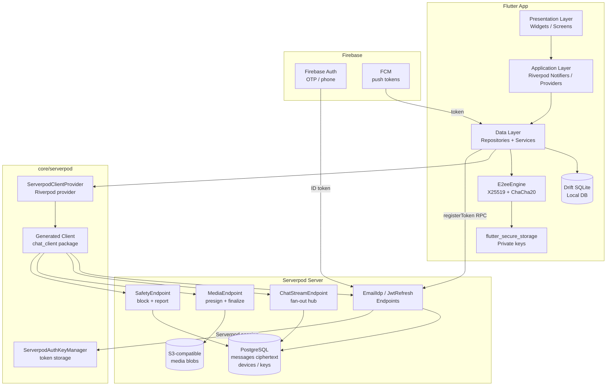
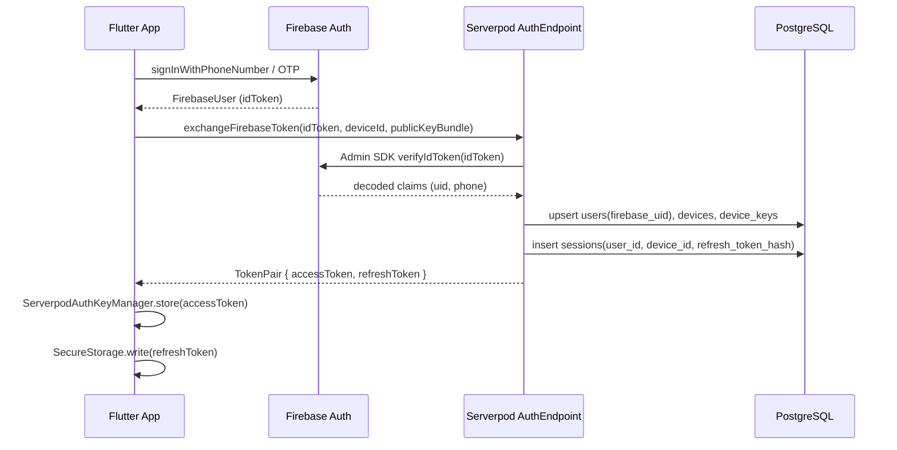
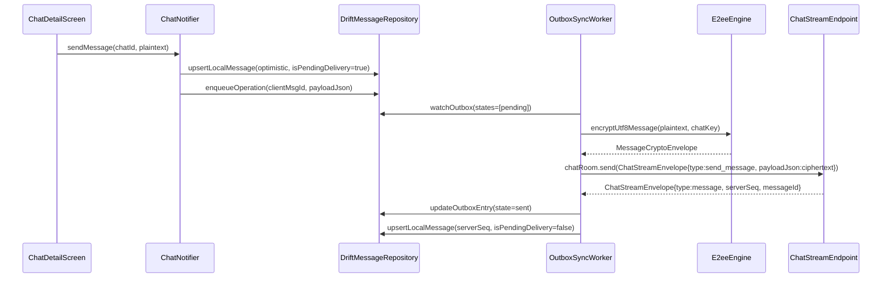
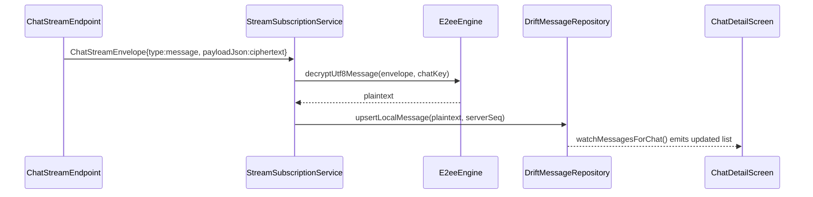
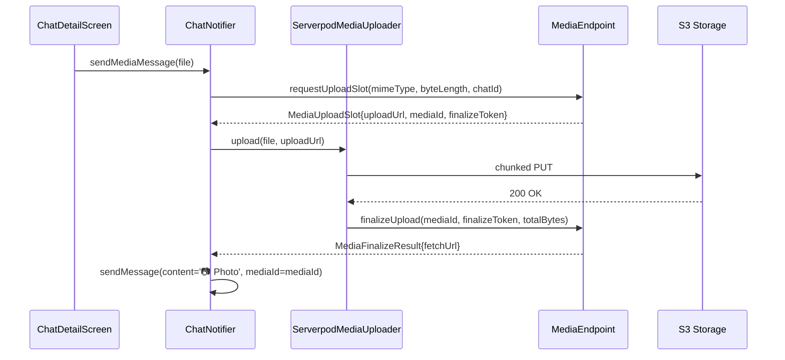

# Design Document: Serverpod MVP Integration

## Overview

This document covers the ten missing integration gaps that bridge the existing
Flutter app (Riverpod + GoRouter + Drift + E2EE crypto) to the live Serverpod
backend (ChatStreamEndpoint, MediaEndpoint, SafetyEndpoint, generated client).
The approach is strictly additive and incremental: every gap is wired behind the
existing `MessagingBackend` dual-mode flag so Firestore paths remain functional
until each milestone is validated and the flag is flipped.

The ten gaps are: (1) Serverpod client instantiation, (2) Firebase→Serverpod
token exchange, (3) streaming subscription, (4) Drift activation, (5) outbox
sync worker, (6) E2EE integration into messaging, (7) device registry wiring,
(8) Serverpod media upload, (9) Serverpod FCM token registration, and
(10) Safety endpoint wiring.

---

## Architecture

### System Component Diagram



### Trust Boundaries

- Flutter app holds private E2EE keys in `flutter_secure_storage`; server never sees them.
- Serverpod stores only ciphertext blobs + routing metadata in PostgreSQL.
- Firebase Auth issues the ID token; Serverpod verifies it and issues its own session.
- FCM sees only device tokens and opaque push payloads (no message content).

---

## Sequence Diagrams

### Auth Token Exchange (Gap 2)



### Message Send with E2EE + Outbox (Gaps 3, 4, 5, 6)



### Inbound Message Receive (Gap 3)



### Media Upload (Gap 8)



---

## Components and Interfaces

### Gap 1 — Serverpod Client Provider (`core/serverpod/`)

**Purpose**: Single instantiation point for the generated `Client`; wires
`ServerpodAuthKeyManager` so every RPC call carries the session token.
No Serverpod imports outside this directory and `data/` layer.

**New files**:
- `lib/core/serverpod/serverpod_client_provider.dart`
- `lib/core/serverpod/serverpod_auth_key_manager.dart`

**Interface**:
```dart
// serverpod_auth_key_manager.dart
final class ServerpodAuthKeyManager implements AuthenticationKeyManager {
  ServerpodAuthKeyManager(this._storage);
  final FlutterSecureStorage _storage;

  @override Future<String?> get() async => _storage.read(key: _kAccessToken);
  @override Future<void> put(String key) async => _storage.write(key: _kAccessToken, value: key);
  @override Future<void> remove() async => _storage.delete(key: _kAccessToken);

  Future<void> storeRefreshToken(String token) async;
  Future<String?> readRefreshToken() async;
  Future<void> clearAll() async;
}

// serverpod_client_provider.dart
final serverpodClientProvider = Provider<Client>((ref) {
  final manager = ref.watch(authKeyManagerProvider);
  return Client(
    Env.serverpodApiUrl,
    authenticationKeyManager: manager,
    disconnectStreamsOnLostInternetConnection: true,
  );
});

final authKeyManagerProvider = Provider<ServerpodAuthKeyManager>((ref) {
  return ServerpodAuthKeyManager(const FlutterSecureStorage());
});
```

**Responsibilities**:
- Instantiate `Client(host)` exactly once per app lifecycle.
- Inject `ServerpodAuthKeyManager` so the generated client attaches the bearer token.
- Expose `serverpodClientProvider` as the single import point for all data-layer code.
- Never imported by `presentation/` layer directly.

---

### Gap 2 — Firebase → Serverpod Token Exchange (`features/auth/data/`)

**Purpose**: After Firebase OTP succeeds, exchange the Firebase ID token for a
Serverpod session tied to `device_id`. Stores `accessToken` in
`ServerpodAuthKeyManager` and `refreshToken` in secure storage.

**New files**:
- `lib/features/auth/data/serverpod_auth_repository.dart`
- `lib/features/auth/application/auth_notifier.dart` (replaces `AuthProvider`)

**Interface**:
```dart
abstract interface class ServerpodAuthRepository {
  /// Exchange Firebase ID token for Serverpod TokenPair.
  /// Uploads [publicKeyBundle] so the server can store the device's X25519 public key.
  Future<TokenPair> exchangeFirebaseToken({
    required String firebaseIdToken,
    required String deviceId,
    required PublicKeyBundle publicKeyBundle,
  });

  Future<TokenPair> refreshSession(String refreshToken);
  Future<void> logout(String deviceId);
}

// TokenPair (mirrors server model)
final class TokenPair {
  final String accessToken;
  final String refreshToken;
  final DateTime expiresAt;
}
```

**Server-side requirement**: A new `exchangeFirebaseToken` endpoint must be added
to `chat_server` (not yet generated). It verifies the Firebase ID token via
Firebase Admin SDK, upserts `users` + `devices` + `device_keys` rows, and
returns a Serverpod `AuthSuccess` / custom `TokenPair`.

**Responsibilities**:
- Call `client.auth.exchangeFirebaseToken(...)` after OTP success.
- Persist `accessToken` via `ServerpodAuthKeyManager.put()`.
- Persist `refreshToken` via `ServerpodAuthKeyManager.storeRefreshToken()`.
- Trigger `client.jwtRefresh.refreshAccessToken()` on 401 responses.
- On logout: call `client.auth.logout()`, then `authKeyManager.clearAll()`.

---

### Gap 3 — Streaming Subscription (`features/chat/data/`)

**Purpose**: Subscribe to `ChatStreamEndpoint.chatRoom` for a given `chatId` +
`deviceId`. Inbound `message` envelopes are decrypted and written to Drift.
Outbound `send_message` envelopes are sent from the outbox worker (Gap 5).

**New files**:
- `lib/features/chat/data/stream_subscription_service.dart`
- `lib/features/chat/application/chat_stream_notifier.dart`

**Interface**:
```dart
abstract interface class ChatStreamService {
  /// Opens the bidirectional stream for [chatId].
  /// Returns a broadcast stream of decrypted inbound events.
  Stream<InboundChatEvent> subscribe({
    required String chatId,
    required String deviceId,
    required Stream<ChatStreamEnvelope> outbound,
  });

  void dispose();
}

sealed class InboundChatEvent {}
final class MessageEvent extends InboundChatEvent {
  final String messageId;
  final String chatId;
  final String senderId;
  final String plaintext;   // decrypted
  final int serverSeq;
  final DateTime ts;
}
final class AckEvent extends InboundChatEvent { ... }
final class TypingEvent extends InboundChatEvent { ... }
final class ErrorEvent extends InboundChatEvent { final String code; final String message; }
```

**Responsibilities**:
- Call `client.chatStream.chatRoom(chatId, deviceId, outboundController.stream)`.
- For each `type == 'message'` envelope: decrypt `payloadJson` via `E2eeEngine`,
  write to `DriftMessageRepository.upsertLocalMessage`.
- Reconnect with exponential backoff on stream error (max 32 s).
- Dual-mode: only open stream when `MessagingSyncMode.useServerpod`.

---

### Gap 4 — Drift Activation (`features/chat/data/`)

**Purpose**: Replace Firestore reads/writes in `ChatProvider` with Drift
repository calls. `AppDatabase` is already defined; it needs to be provided via
Riverpod and injected into repositories.

**New files**:
- `lib/data/providers/database_provider.dart`
- `lib/data/providers/repository_providers.dart`

**Interface**:
```dart
// database_provider.dart
final appDatabaseProvider = Provider<AppDatabase>((ref) {
  final db = AppDatabase();
  ref.onDispose(db.close);
  return db;
});

// repository_providers.dart
final chatRepositoryProvider = Provider<ChatRepository>((ref) {
  return DriftChatRepository(ref.watch(appDatabaseProvider));
});

final messageRepositoryProvider = Provider<MessageRepository>((ref) {
  return DriftMessageRepository(ref.watch(appDatabaseProvider));
});

final syncRepositoryProvider = Provider<SyncRepository>((ref) {
  return DriftSyncRepository(ref.watch(appDatabaseProvider));
});
```

**Responsibilities**:
- `AppDatabase` singleton created once; disposed on provider teardown.
- `ChatNotifier` (replaces `ChatProvider`) reads from `DriftMessageRepository`
  via `watchMessagesForChat` stream — no Firestore imports.
- Dual-mode: when `useFirestore`, `ChatNotifier` delegates to legacy
  `MessagingService`; when `useServerpod`, delegates to Drift repositories.

---

### Gap 5 — Outbox Sync Worker (`features/chat/data/`)

**Purpose**: Process `OutboxEntries` rows with exponential backoff. Sends each
pending operation to Serverpod (via the stream or RPC), marks as `sent` or
`failed`, and updates the local message `isPendingDelivery` flag.

**New files**:
- `lib/features/chat/data/outbox_sync_worker.dart`
- `lib/features/chat/application/outbox_worker_notifier.dart`

**Interface**:
```dart
final class OutboxSyncWorker {
  OutboxSyncWorker({
    required SyncRepository syncRepo,
    required MessageRepository messageRepo,
    required ChatStreamService streamService,
    required E2eeEngine crypto,
    required ChatKeyStore keyStore,
  });

  /// Start processing loop. Call once after auth succeeds.
  void start();

  /// Pause (e.g. no connectivity or signed out).
  void pause();

  void dispose();
}
```

**Algorithm**:
```pascal
PROCEDURE processOutbox()
  LOOP
    entries ← syncRepo.watchOutbox(states=['pending','failed'])
    FOR each entry IN entries WHERE entry.nextRetryAt <= now() DO
      TRY
        syncRepo.updateOutboxEntry(clientMsgId, state='sending')
        chatKey ← keyStore.getChatKey(entry.chatId)
        envelope ← crypto.encryptUtf8Message(entry.payloadJson, chatKey)
        streamService.send(ChatStreamEnvelope{
          type: 'send_message',
          idempotencyKey: entry.clientMsgId,
          chatId: entry.chatId,
          payloadJson: base64(envelope)
        })
        ack ← await streamService.awaitAck(entry.clientMsgId, timeout=10s)
        syncRepo.updateOutboxEntry(clientMsgId, state='sent')
        messageRepo.upsertLocalMessage(serverSeq=ack.serverSeq, isPendingDelivery=false)
      CATCH NetworkError
        backoff ← min(30, 2^entry.attemptCount) seconds + jitter
        syncRepo.updateOutboxEntry(clientMsgId,
          state='failed',
          attemptCount=entry.attemptCount+1,
          nextRetryAt=now()+backoff)
      CATCH PermanentError (e.g. auth, payload_too_large)
        syncRepo.updateOutboxEntry(clientMsgId, state='dead_letter')
    END FOR
    WAIT for next outbox change OR connectivity event
  END LOOP
END PROCEDURE
```

**Retry schedule**: `delay = min(30s, 2^attemptCount) + random(0..2s)`.
Dead-letter after 10 attempts.

---

### Gap 6 — E2EE Integration into Messaging

**Purpose**: Encrypt message plaintext before it enters the outbox; decrypt
inbound ciphertext from the stream before writing to Drift. The `E2eeEngine`
already exists; this gap wires it at the repository boundary.

**New files**:
- `lib/features/chat/data/chat_key_store.dart`
- `lib/features/chat/data/key_exchange_service.dart`

**Interface**:
```dart
/// Manages per-chat symmetric keys in flutter_secure_storage.
abstract interface class ChatKeyStore {
  Future<SecretKey?> getChatKey(String chatId);
  Future<void> storeChatKey(String chatId, SecretKey key);
  Future<void> deleteChatKey(String chatId);
}

/// Bootstraps a new chat: generates chatKey, wraps it for each member,
/// uploads wrapped keys via KeyEndpoint (to be added to server).
abstract interface class KeyExchangeService {
  Future<void> bootstrapChat({
    required String chatId,
    required List<PublicKeyBundle> memberBundles,
  });

  /// Unwrap a WrappedChatKeyEnvelope received from the server.
  Future<void> receiveWrappedKey({
    required String chatId,
    required WrappedChatKeyEnvelope envelope,
  });
}
```

**Encryption boundary rule**: `OutboxSyncWorker` calls
`E2eeEngine.encryptUtf8Message(plaintext, chatKey)` before sending to stream.
`StreamSubscriptionService` calls `E2eeEngine.decryptUtf8Message(envelope, chatKey)`
before writing to Drift. Drift stores plaintext locally (device-only); server
stores ciphertext only.

**Key bootstrap flow**:
1. On `createDirect` / `createGroup`: generate `chatKey` via `E2eeEngine.newChatKey()`.
2. Fetch recipient public bundles from server `KeyEndpoint.fetchUserBundle`.
3. Wrap `chatKey` for each member via `E2eeEngine.wrapChatKey`.
4. Upload wrapped envelopes via `KeyEndpoint.uploadWrappedKeys`.
5. Store own `chatKey` in `ChatKeyStore`.

---

### Gap 7 — Device Registry (`features/settings/`)

**Purpose**: Wire `DeviceManagerScreen` to a real Serverpod `DeviceEndpoint`
(to be added server-side). Lists active sessions, shows `device_id` + `last_seen_at`,
and supports remote sign-out (session revocation).

**New files**:
- `lib/features/settings/data/device_repository.dart`
- `lib/features/settings/application/device_manager_notifier.dart`

**Interface**:
```dart
abstract interface class DeviceRepository {
  Future<List<DeviceInfo>> listMyDevices();
  Future<void> revokeDevice(String deviceId);
}

final class DeviceInfo {
  final String deviceId;
  final String name;
  final DateTime lastSeenAt;
  final bool isCurrentDevice;
}

// Riverpod notifier
class DeviceManagerNotifier extends AsyncNotifier<List<DeviceInfo>> {
  @override
  Future<List<DeviceInfo>> build() => ref.read(deviceRepositoryProvider).listMyDevices();

  Future<void> revoke(String deviceId) async { ... }
}
```

**Server-side requirement**: `DeviceEndpoint` with `list()` and `revoke(deviceId)`
methods; `revoke` sets `sessions.revoked_at` and removes the device's push token.

---

### Gap 8 — Serverpod Media Upload

**Purpose**: Replace Firebase Storage calls in `ChatProvider.sendMediaMessage`
with `ServerpodMediaUploader` + `MediaEndpoint`. The `ServerpodMediaUploader`
class already exists; this gap wires it into the provider and dual-mode flag.

**Modified files**:
- `lib/features/chat/data/media_upload_service.dart` (new adapter)
- `lib/features/chat/application/chat_notifier.dart` (updated)

**Interface**:
```dart
abstract interface class MediaUploadService {
  /// Returns the public fetch URL after upload + finalize.
  Future<String> uploadMedia({
    required String chatId,
    required File file,
    required String mimeType,
    void Function(double progress)? onProgress,
  });
}

// Serverpod implementation
final class ServerpodMediaUploadService implements MediaUploadService {
  ServerpodMediaUploadService(this._client, this._uploader);
  final Client _client;
  final ServerpodMediaUploader _uploader;

  @override
  Future<String> uploadMedia({...}) async {
    final slot = await _client.media.requestUploadSlot(
      MediaUploadRequest(mimeType: mimeType, byteLength: file.lengthSync(), chatId: chatId),
    );
    await _uploader.upload(file: file, slot: slot, onProgress: onProgress);
    final result = await _client.media.finalizeUpload(
      slot.mediaId, slot.finalizeToken, file.lengthSync(),
    );
    return result.fetchUrl;
  }
}
```

---

### Gap 9 — Serverpod FCM Token Registration

**Purpose**: After Serverpod session is established, register the FCM token with
Serverpod `PushEndpoint` (to be added server-side) in addition to the existing
Firestore write. Dual-write during cutover; Firestore write removed when flag flips.

**Modified files**:
- `lib/data/services/fcm_token_sync.dart` (extended)
- `lib/core/platform/fcm_platform_service.dart` (updated `publishToken` callback)

**Interface**:
```dart
// Extended fcm_token_sync.dart
Future<void> syncFcmToken({
  required String userId,
  required String token,
  required MessagingSyncMode mode,
  Client? serverpodClient,
}) async {
  if (mode.useFirestore) {
    await syncFcmTokenToFirestore(userId: userId, token: token);
  }
  if (mode.useServerpod && serverpodClient != null) {
    await serverpodClient.push.registerToken(
      userId: userId, token: token, platform: _currentPlatform(),
    );
  }
}
```

**Server-side requirement**: `PushEndpoint.registerToken(userId, token, platform)`
upserts `push_tokens` table row.

---

### Gap 10 — Safety Endpoint Wiring

**Purpose**: Replace Firestore-backed `AuthService.blockUser` / `reportContent`
calls in `AuthProvider` and `ChatProvider` with `EndpointSafety` RPC calls.
`SafetyEndpoint` is already fully implemented server-side.

**Modified files**:
- `lib/features/chat/application/chat_notifier.dart`
- `lib/features/auth/application/auth_notifier.dart`

**Interface**:
```dart
// In ChatNotifier / AuthNotifier (Serverpod path)
Future<void> blockUser(String targetAuthUserId) async {
  await ref.read(serverpodClientProvider).safety.blockUser(targetAuthUserId);
}

Future<void> reportUser({
  required String targetUserId,
  String? targetChatId,
  String? targetMessageId,
  required String reason,
}) async {
  await ref.read(serverpodClientProvider).safety.submitReport(
    targetUserId: targetUserId,
    targetChatId: targetChatId,
    targetMessageId: targetMessageId,
    reason: reason,
  );
}
```

**Dual-mode**: when `useFirestore`, delegate to existing `AuthService`; when
`useServerpod`, call `EndpointSafety` directly.

---

## Data Models

### ServerpodSession (client-side)

```dart
final class ServerpodSession {
  final String accessToken;
  final String refreshToken;
  final DateTime accessTokenExpiresAt;
  final String userId;       // Serverpod UUID
  final String deviceId;     // stable per-install UUID
}
```

Stored: `accessToken` in `ServerpodAuthKeyManager` (in-memory + secure storage);
`refreshToken` in `flutter_secure_storage` under key `sp_refresh_token`.

### OutboxItem (already in `DriftSyncRepository`)

```dart
final class OutboxItem {
  final int localId;
  final String clientMsgId;   // UUID v4, idempotency key
  final String chatId;
  final String operation;     // 'sendMessage' | 'sendMedia'
  final String payloadJson;   // plaintext payload pre-encryption
  final int attemptCount;
  final String state;         // pending | sending | sent | failed | dead_letter
  final DateTime createdAt;
  final DateTime? nextRetryAt;
}
```

### ChatStreamEnvelope (generated, already exists)

Key fields used by integration:
- `type`: `send_message | message | message_ack | typing | presence | sync_hint | error`
- `idempotencyKey`: matches `clientMsgId` for dedup
- `payloadJson`: base64-encoded `MessageCryptoEnvelope` bytes for message types
- `serverSeq`: assigned by server on `message` events
- `messageId`: server-assigned UUID on `message` events

### MessageCryptoEnvelope (already in `E2eeEngine`)

Serialized to JSON for `payloadJson` field:
```dart
{
  "v": 1,                          // schemaVersion
  "n": "<base64 12-byte nonce>",
  "c": "<base64 ciphertext+mac>"
}
```

### DeviceInfo (new)

```dart
final class DeviceInfo {
  final String deviceId;
  final String name;           // e.g. "iPhone 15 Pro"
  final String platform;       // ios | android | web
  final DateTime lastSeenAt;
  final bool isCurrentDevice;
}
```

---

## Key Functions with Formal Specifications

### `OutboxSyncWorker.processEntry(OutboxItem entry)`

**Preconditions**:
- `entry.state` is `pending` or `failed`
- `entry.nextRetryAt == null || entry.nextRetryAt <= DateTime.now()`
- `chatKey` for `entry.chatId` exists in `ChatKeyStore`
- Stream connection to `ChatStreamEndpoint` is open

**Postconditions**:
- If success: `entry.state == 'sent'`, `localMessage.isPendingDelivery == false`,
  `localMessage.serverSeq` is set
- If transient failure: `entry.state == 'failed'`, `entry.attemptCount` incremented,
  `entry.nextRetryAt` set to exponential backoff time
- If permanent failure (≥10 attempts or auth error): `entry.state == 'dead_letter'`
- `entry.payloadJson` is never transmitted in plaintext; always encrypted first

**Loop invariant** (retry loop): `entry.attemptCount` strictly increases on each
failure; `nextRetryAt` is always in the future after a failure.

---

### `StreamSubscriptionService.handleInbound(ChatStreamEnvelope envelope)`

**Preconditions**:
- `envelope.type == 'message'`
- `envelope.payloadJson` is a valid base64-encoded `MessageCryptoEnvelope`
- `chatKey` for `envelope.chatId` exists in `ChatKeyStore`

**Postconditions**:
- Plaintext is written to `DriftMessageRepository` with `serverSeq` set
- `InboundChatEvent.MessageEvent` is emitted on the broadcast stream
- If decryption fails: `InboundChatEvent.ErrorEvent` is emitted; no partial write

---

### `ServerpodAuthRepository.exchangeFirebaseToken(...)`

**Preconditions**:
- `firebaseIdToken` is a valid, non-expired Firebase ID token
- `deviceId` is a stable UUID (generated once per install, stored in secure storage)
- `publicKeyBundle.x25519Public` is 32 bytes

**Postconditions**:
- Returns `TokenPair` with non-empty `accessToken` and `refreshToken`
- Server has upserted `users`, `devices`, `device_keys` rows
- `accessToken` is stored in `ServerpodAuthKeyManager`
- `refreshToken` is stored in `flutter_secure_storage`
- On failure: throws typed `AuthException`; no partial state stored

---

## Algorithmic Pseudocode

### Outbox Retry Algorithm

```pascal
ALGORITHM OutboxSyncWorker.run()
INPUT: outboxStream: Stream<List<OutboxItem>>
       streamService: ChatStreamService
       crypto: E2eeEngine
       keyStore: ChatKeyStore

BEGIN
  WHILE worker is active DO
    entries ← await outboxStream.first
    
    FOR each entry IN entries DO
      IF entry.nextRetryAt != null AND entry.nextRetryAt > now() THEN
        CONTINUE
      END IF
      
      ASSERT entry.state IN ['pending', 'failed']
      
      syncRepo.updateOutboxEntry(entry.clientMsgId, state='sending')
      
      TRY
        chatKey ← await keyStore.getChatKey(entry.chatId)
        ASSERT chatKey != null
        
        envelope ← await crypto.encryptUtf8Message(entry.payloadJson, chatKey)
        payloadJson ← jsonEncode(envelope)
        
        streamService.send(ChatStreamEnvelope{
          type: 'send_message',
          idempotencyKey: entry.clientMsgId,
          chatId: entry.chatId,
          payloadJson: payloadJson
        })
        
        ack ← await streamService.awaitAck(entry.clientMsgId, timeout=10s)
        
        syncRepo.updateOutboxEntry(entry.clientMsgId, state='sent')
        messageRepo.upsertLocalMessage(
          id: ack.messageId,
          serverSeq: ack.serverSeq,
          isPendingDelivery: false
        )
        
      CATCH TimeoutException
        attempts ← entry.attemptCount + 1
        IF attempts >= 10 THEN
          syncRepo.updateOutboxEntry(entry.clientMsgId, state='dead_letter')
        ELSE
          delay ← min(30, 2^attempts) + random(0, 2)
          syncRepo.updateOutboxEntry(entry.clientMsgId,
            state='failed',
            attemptCount=attempts,
            nextRetryAt=now()+delay)
        END IF
        
      CATCH AuthException
        syncRepo.updateOutboxEntry(entry.clientMsgId, state='dead_letter')
        
      CATCH PayloadTooLargeException
        syncRepo.updateOutboxEntry(entry.clientMsgId, state='dead_letter')
      END TRY
    END FOR
    
    WAIT for connectivity OR outbox change
  END WHILE
END
```

### Token Refresh Algorithm

```pascal
ALGORITHM TokenRefreshInterceptor.intercept(request)
INPUT: request: RpcRequest

BEGIN
  response ← await execute(request)
  
  IF response.statusCode == 401 THEN
    refreshToken ← await secureStorage.read('sp_refresh_token')
    
    IF refreshToken == null THEN
      emit AuthEvent.sessionExpired
      RETURN response
    END IF
    
    TRY
      newPair ← await client.jwtRefresh.refreshAccessToken(refreshToken)
      authKeyManager.put(newPair.accessToken)
      secureStorage.write('sp_refresh_token', newPair.refreshToken)
      RETURN await execute(request)  // retry once
    CATCH RefreshFailedException
      authKeyManager.remove()
      secureStorage.delete('sp_refresh_token')
      emit AuthEvent.sessionExpired
      RETURN response
    END TRY
  END IF
  
  RETURN response
END
```

### Stream Reconnect Algorithm

```pascal
ALGORITHM StreamSubscriptionService.connectWithBackoff(chatId, deviceId)
INPUT: chatId: String, deviceId: String

BEGIN
  attempt ← 0
  
  WHILE service is active DO
    TRY
      outboundController ← StreamController<ChatStreamEnvelope>()
      inbound ← client.chatStream.chatRoom(chatId, deviceId, outboundController.stream)
      attempt ← 0  // reset on success
      
      FOR each envelope IN inbound DO
        handleInbound(envelope)
      END FOR
      
    CATCH StreamError AS e
      IF e.code == 'auth_required' THEN
        emit ConnectionEvent.authRequired
        RETURN
      END IF
      
      delay ← min(32, 2^attempt) + random(0, 3)
      attempt ← attempt + 1
      WAIT delay seconds
    END TRY
  END WHILE
END
```

---

## Riverpod Provider Structure

```
ProviderScope
│
├── appDatabaseProvider          (Provider<AppDatabase>)
├── authKeyManagerProvider       (Provider<ServerpodAuthKeyManager>)
├── serverpodClientProvider      (Provider<Client>)
├── messagingSyncModeProvider    (StateProvider<MessagingSyncMode>)
│
├── chatRepositoryProvider       (Provider<ChatRepository>)
├── messageRepositoryProvider    (Provider<MessageRepository>)
├── syncRepositoryProvider       (Provider<SyncRepository>)
├── chatKeyStoreProvider         (Provider<ChatKeyStore>)
├── e2eeEngineProvider           (Provider<E2eeEngine>)
│
├── serverpodAuthRepositoryProvider  (Provider<ServerpodAuthRepository>)
├── authNotifierProvider         (AsyncNotifierProvider<AuthNotifier, AuthState>)
│     watches: serverpodAuthRepositoryProvider, authKeyManagerProvider
│
├── chatStreamServiceProvider    (Provider.family<ChatStreamService, String>)
│     family key: chatId
│     watches: serverpodClientProvider, e2eeEngineProvider, chatKeyStoreProvider
│
├── outboxWorkerProvider         (Provider<OutboxSyncWorker>)
│     watches: syncRepositoryProvider, messageRepositoryProvider,
│              chatStreamServiceProvider, e2eeEngineProvider, chatKeyStoreProvider
│
├── chatNotifierProvider         (AsyncNotifierProvider.family<ChatNotifier, ChatState, String>)
│     family key: chatId
│     watches: messageRepositoryProvider, chatStreamServiceProvider,
│              outboxWorkerProvider, messagingSyncModeProvider
│
├── inboxNotifierProvider        (AsyncNotifierProvider<InboxNotifier, List<ChatSummary>>)
│     watches: chatRepositoryProvider, messagingSyncModeProvider
│
├── deviceManagerNotifierProvider (AsyncNotifierProvider<DeviceManagerNotifier, List<DeviceInfo>>)
│     watches: serverpodClientProvider
│
└── mediaUploadServiceProvider   (Provider<MediaUploadService>)
      watches: serverpodClientProvider, messagingSyncModeProvider
```

**Key rules**:
- `presentation/` layer only imports `*NotifierProvider` and `*StateProvider`.
- `data/` layer imports `serverpodClientProvider` and repository providers.
- `core/serverpod/` is the only place `chat_client` package is imported outside `data/`.

---

## Migration Strategy: Firestore → Serverpod Cutover

The existing `MessagingBackend` enum and `MessagingSyncMode` class are the
control plane. Migration proceeds in four milestones (M0–M3).

### M0 — Infrastructure (current + Gap 1, 2)

- Serverpod client instantiated; token exchange working.
- All reads/writes still go to Firestore.
- Drift schema exists but not populated.
- Flag: `SERVERPOD_MESSAGING=false` (default).

**Exit criteria**: Login from Flutter staging returns Serverpod `TokenPair`.

### M1 — Dual-Write (Gaps 3, 4, 5, 6)

- `ChatNotifier` writes new messages to both Drift outbox AND Firestore.
- Inbound stream from Serverpod populates Drift; Firestore snapshots still drive UI.
- E2EE active for Serverpod path; Firestore path still plaintext.
- Flag: `SERVERPOD_MESSAGING=false` (Firestore UI) but stream subscription open.

**Exit criteria**: Drift DB populated; outbox processes without errors; E2EE
ciphertext visible in Postgres staging.

### M2 — Serverpod Authoritative Reads (Gaps 7, 8, 9, 10)

- `MessagingSyncMode.useServerpod = true` in staging / dev builds.
- `ChatNotifier` reads from `DriftMessageRepository`; Firestore reads disabled.
- Media uploads go to Serverpod/S3; FCM tokens registered with Serverpod.
- Safety calls go to `EndpointSafety`.
- Device manager wired.
- Flag: `SERVERPOD_MESSAGING=true` via `--dart-define` in staging builds.

**Exit criteria**: Full inbox + chat flow works with zero Firestore reads in
flag-on builds; abuse matrix smoke pass.

### M3 — Remove Firestore Messaging Code

- Delete `MessagingService`, `HiveStorage` offline queue, Firestore message
  collection writes.
- Remove `cloud_firestore` dependency (keep Firebase Auth + FCM).
- Remove dual-mode branches; `MessagingBackend.firestore` becomes unreachable.
- Flag: removed; `kDefaultMessagingBackend` deleted.

**Exit criteria**: `flutter analyze` clean; no `cloud_firestore` imports in
`features/chat/`; RC checklist green.

### Cutover Decision Matrix

| Milestone | `SERVERPOD_MESSAGING` | Firestore reads | Firestore writes | Serverpod reads | Serverpod writes |
|-----------|----------------------|-----------------|------------------|-----------------|------------------|
| M0        | false                | ✓               | ✓                | —               | auth only        |
| M1        | false                | ✓ (UI)          | ✓                | stream only     | ✓ (outbox)       |
| M2        | true                 | —               | —                | ✓               | ✓                |
| M3        | removed              | —               | —                | ✓               | ✓                |

---

## Error Handling

### Auth Errors

| Condition | Response | Recovery |
|-----------|----------|----------|
| Firebase ID token expired | `exchangeFirebaseToken` throws `AuthException.tokenExpired` | Re-trigger Firebase sign-in silently via `currentUser.getIdToken(refresh: true)` |
| Serverpod 401 on RPC | `TokenRefreshInterceptor` retries with `refreshToken` | If refresh fails: emit `AuthEvent.sessionExpired`; GoRouter redirects to `/` |
| Refresh token revoked (device revoked) | `RefreshFailedException` | Clear tokens; force re-auth |

### Stream Errors

| Condition | Response | Recovery |
|-----------|----------|----------|
| `room_full_or_duplicate_device` | Log + surface to user | Reconnect with new `deviceId` suffix |
| `payload_too_large` | Dead-letter outbox entry | Surface error in UI; do not retry |
| Network drop | `StreamError` caught | Exponential backoff reconnect (max 32 s) |
| `auth_required` on stream | Emit `ConnectionEvent.authRequired` | Trigger token refresh; reconnect |

### Outbox Errors

| Condition | Response | Recovery |
|-----------|----------|----------|
| `chatKey` not found | Throw `E2eeException.keyNotFound` | Trigger key re-exchange; pause outbox for chat |
| Decryption failure on inbound | Emit `ErrorEvent`; skip write | Log; surface "message unreadable" in UI |
| `dead_letter` entry | State persisted | Surface in UI as "failed to send"; manual retry option |

---

## Testing Strategy

### Unit Testing Approach

- `OutboxSyncWorker`: mock `SyncRepository`, `ChatStreamService`, `E2eeEngine`.
  Test retry schedule, dead-letter threshold, idempotency on duplicate ack.
- `ServerpodAuthKeyManager`: test `put/get/remove` against in-memory
  `FlutterSecureStorage` mock.
- `E2eeEngine` (existing): encrypt→decrypt round-trip; wrap→unwrap chat key.
- `StreamSubscriptionService`: mock `Client.chatStream`; verify decrypt + Drift write.

### Property-Based Testing Approach

**Property Test Library**: `package:test` with custom generators (no dedicated
PBT library in current pubspec; add `dart_test` generators or `glados` if needed).

Key properties:
- `∀ plaintext: decrypt(encrypt(plaintext, key), key) == plaintext`
- `∀ entry with attemptCount ≥ 10: state becomes dead_letter`
- `∀ outbox entry: nextRetryAt is strictly increasing on each failure`
- `∀ inbound envelope with valid chatKey: upsertLocalMessage called exactly once`
- `∀ duplicate clientMsgId: server returns same serverSeq (idempotency)`

### Integration Testing Approach

- Dart integration tests against staging Serverpod:
  - Login → token exchange → stream open → send message → receive ack → Drift populated.
  - Media upload → finalize → fetchUrl accessible.
  - Block user → `SafetyBlock` row in Postgres.
- Flutter integration tests (golden + widget):
  - `InboxScreen` renders from Drift data (no Firestore).
  - `ChatDetailScreen` shows optimistic message then confirmed state.
  - `DeviceManagerScreen` lists devices and revoke button triggers RPC.

---

## Performance Considerations

- **Stream connection**: one stream per active chat screen; close on `dispose`.
  Do not open streams for background chats.
- **Outbox polling**: use `watchOutbox` (Drift reactive stream) rather than
  polling; worker wakes only on DB change or connectivity event.
- **Drift queries**: `watchMessagesForChat` uses `limit(200)` + index on
  `(chat_id, created_at DESC)`; add index in migration if not present.
- **Media chunking**: `ServerpodMediaUploader` already implements chunked PUT;
  chunk size 512 KB default; configurable via `MediaUploadSlot.chunkSizeBytes`.
- **Token refresh**: access token TTL should be short (15 min); refresh token
  long-lived (30 days). Refresh is transparent to the user.

---

## Security Considerations

- **Private keys never leave the device**: `flutter_secure_storage` with
  `iOSOptions(accessibility: KeychainAccessibility.first_unlock_this_device)`.
- **Server stores ciphertext only**: `payloadJson` in `messages` table is the
  base64-encoded `MessageCryptoEnvelope`; no plaintext column.
- **`deviceId` binding**: Serverpod sessions are scoped to `device_id`; a
  compromised session cannot be used from a different device without re-auth.
- **Rate limits**: `SecurityGuards.requireStreamSendMessageAllowed` already
  enforced server-side; client should surface `rate_limit_exceeded` gracefully.
- **Token storage**: `accessToken` in `ServerpodAuthKeyManager` uses
  `flutter_secure_storage`; never stored in `SharedPreferences`.
- **FCM token**: registered with Serverpod only after successful session
  establishment; revoked on device sign-out.
- **Report/block**: `SafetyEndpoint.requireLogin = true`; reporter identity
  verified server-side; reason field capped at 2000 chars.

---

## Dependencies

| Package | Purpose | Already in pubspec |
|---------|---------|-------------------|
| `chat_client` (path) | Generated Serverpod client | ✓ |
| `serverpod_client` | Base client runtime | via chat_client |
| `drift` | Local SQLite ORM | ✓ |
| `flutter_secure_storage` | Key + token storage | ✓ |
| `cryptography` | E2EE primitives | ✓ |
| `flutter_riverpod` | State management | ✓ |
| `connectivity_plus` | Network state for outbox | ✓ |
| `uuid` | `clientMsgId` + `deviceId` generation | ✓ |
| `http` | Chunked media PUT | ✓ |

**Server-side additions needed** (not yet in `chat_server`):
- `exchangeFirebaseToken` endpoint (auth module)
- `DeviceEndpoint` (list + revoke)
- `KeyEndpoint` (uploadBundle, fetchUserBundle, uploadWrappedKeys)
- `PushEndpoint` (registerToken)
- Firebase Admin SDK Dart package for ID token verification

**No new Flutter dependencies required** for any of the ten gaps.

---

## Correctness Properties

*A property is a characteristic or behavior that should hold true across all valid executions of a system — essentially, a formal statement about what the system should do. Properties serve as the bridge between human-readable specifications and machine-verifiable correctness guarantees.*

### Property 1: E2EE Round-Trip

*For any* plaintext string and chat key, encrypting the plaintext and then decrypting the result must produce a value equal to the original plaintext.

**Validates: Requirements 6.1, 6.2**

---

### Property 2: Server Stores Ciphertext Only

*For any* message sent through the Serverpod path, the value stored in `PostgreSQL.messages.payload_json` must be a `MessageCryptoEnvelope` ciphertext and must not equal the original plaintext.

**Validates: Requirements 6.7, 5.2**

---

### Property 3: Outbox Idempotency

*For any* outbox entry, sending the same `clientMsgId` to `ChatStreamEndpoint` more than once must yield the same `serverSeq` on every acknowledgement.

**Validates: Requirements 5.7**

---

### Property 4: Dead-Letter Bound

*For any* outbox entry whose `attemptCount` reaches 10, the entry's `state` must be set to `dead_letter` and no further send attempts must be made.

**Validates: Requirements 5.5**

---

### Property 5: Token Refresh Transparency

*For any* RPC call that receives an HTTP 401 response, exactly one token refresh attempt must occur before the original request is retried; no more than one retry must be issued.

**Validates: Requirements 2.4**

---

### Property 6: Stream Reconnect Liveness

*For any* stream disconnection caused by a non-auth error, a reconnect attempt must be initiated within 32 seconds, with each successive delay bounded by `min(32, 2^attempt) + random(0..3)` seconds.

**Validates: Requirements 3.5**

---

### Property 7: Token Storage Round-Trip

*For any* access token string, calling `ServerpodAuthKeyManager.put(token)` followed by `get()` must return the same token; calling `remove()` followed by `get()` must return null.

**Validates: Requirements 1.4, 1.5**

---

### Property 8: Token Exchange Persists Both Tokens

*For any* successful `exchangeFirebaseToken` call, both the `accessToken` and `refreshToken` from the returned `TokenPair` must be retrievable from their respective secure storage locations immediately after the call completes.

**Validates: Requirements 2.2, 2.3**

---

### Property 9: Failed Auth Exchange Leaves No Partial State

*For any* `exchangeFirebaseToken` call that throws an exception, neither `accessToken` nor `refreshToken` must be present in secure storage after the exception is thrown.

**Validates: Requirements 2.8**

---

### Property 10: Failed Token Refresh Clears All Tokens

*For any* token refresh attempt that fails, both the `accessToken` and `refreshToken` must be absent from secure storage after the failure, and `AuthEvent.sessionExpired` must be emitted.

**Validates: Requirements 2.6**

---

### Property 11: Inbound Message Decrypt-Then-Write

*For any* inbound `type == 'message'` envelope with a valid `chatKey`, `DriftMessageRepository.upsertLocalMessage` must be called exactly once with the decrypted plaintext; if decryption fails, `upsertLocalMessage` must not be called at all.

**Validates: Requirements 3.2, 3.3, 3.4**

---

### Property 12: Outbox Retry Backoff Is Strictly Increasing

*For any* outbox entry that fails repeatedly, each successive `nextRetryAt` value must be strictly greater than the previous one, and the delay must satisfy `delay <= min(30s, 2^attemptCount) + 2s`.

**Validates: Requirements 5.4**

---

### Property 13: Dual-Mode Isolation

*For any* application state where `MessagingSyncMode.useFirestore` is active, no Serverpod RPC or streaming calls must be made for messaging read or write operations; *for any* state where `MessagingSyncMode.useServerpod` is active, no Firestore read calls must be made for messaging operations.

**Validates: Requirements 3.7, 4.2, 4.3, 8.5, 10.3, 11.1, 11.2**

---

### Property 14: Media Upload Progress Is Bounded

*For any* media upload in progress, every value delivered to the `onProgress` callback must be in the range `[0.0, 1.0]` inclusive, and the sequence of values must be non-decreasing.

**Validates: Requirements 8.6**

---

### Property 15: Safety Endpoint Requires Authentication

*For any* call to `SafetyEndpoint.blockUser` or `SafetyEndpoint.submitReport` made without an authenticated session, the endpoint must reject the call with an auth error and must not persist any block or report record.

**Validates: Requirements 10.4**

---

### Property 16: Drift Reactive Stream Emits on Change

*For any* call to `DriftMessageRepository.upsertLocalMessage`, the stream returned by `watchMessagesForChat(chatId)` for the matching `chatId` must emit an updated list that includes the upserted message.

**Validates: Requirements 4.4**

---

### Property 17: Wrapped Key Round-Trip

*For any* chat key wrapped for a recipient's `PublicKeyBundle` and then unwrapped using the corresponding private key, the unwrapped key must equal the original chat key.

**Validates: Requirements 6.1, 6.2**
