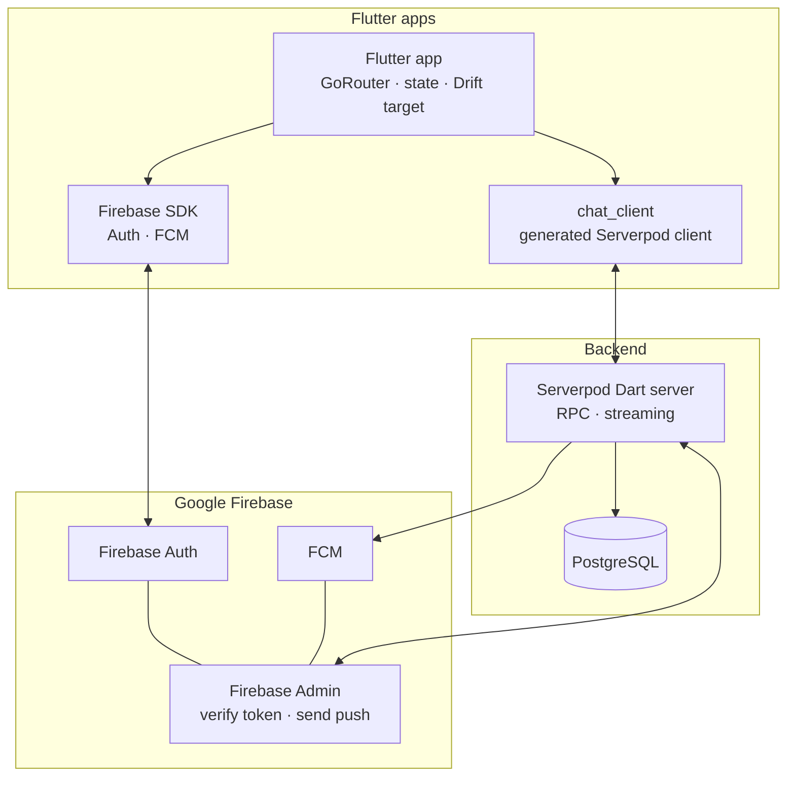

# Documentation index

Entry point for engineers and agents working on the chat monorepo. Product direction and agent briefs live in [`mvp_plan.md`](../mvp_plan.md); this folder holds **operational** and **contract** documentation (Serverpod, infra, ADRs, protocol sketches).

## Monorepo layout

| Path | Role |
|------|------|
| Repository root (`../`) | Flutter application (`lib/`, `pubspec.yaml`), [`.env.example`](../.env.example), CI |
| [`../chat_server/`](../chat_server/) | Serverpod 3.4 server: endpoints, streaming, migrations, generated protocol |
| [`../chat_client/`](../chat_client/) | **Generated** Dart client package (output of `serverpod generate`; path set in `chat_server/config/generator.yaml`) |
| [`docs/`](.) | ADRs, protocol sketches, infra runbooks, this index |

## Logical architecture: Flutter, Serverpod, Firebase

Clients talk to **Serverpod** for messaging, sync, and streaming, and to **Firebase** for authentication and FCM. The server verifies Firebase ID tokens and issues Serverpod sessions (see [ADR-0003](adr/0003-firebase-token-serverpod-session-device-binding.md)).

For a compact ASCII version of the same split, see [`mvp_plan.md`](../mvp_plan.md) §Hybrid architecture.

## Run locally (summary)

| Goal | Where | Doc |
|------|--------|-----|
| Database only (Postgres for Serverpod) | Repo root | [infra/docker-compose.dev.yml](infra/docker-compose.dev.yml) — `docker compose -f docs/infra/docker-compose.dev.yml up -d` (also referenced from [staging-and-production.md](infra/staging-and-production.md)) |
| Postgres + Redis as shipped with `chat_server` | `chat_server/` | `docker compose up --build --detach` per [`chat_server/README.md`](../chat_server/README.md) |
| Serverpod API | `chat_server/` | `dart bin/main.dart` (or `dart pub get` then project `serverpod` scripts — see [Serverpod runbook](serverpod-runbook.md)) |
| Flutter app | Repo root | `flutter pub get`, `flutter run` (with `.env` from [`.env.example`](../.env.example)) |

Full procedures, codegen, and troubleshooting: **[Serverpod runbook](serverpod-runbook.md)**.

## Staging and production URLs (fill per environment)

Replace placeholders when environments exist. Do not commit secrets; store connection strings and service accounts in your secret manager (see [infra/staging-and-production.md](infra/staging-and-production.md)).

| Environment | Serverpod base URL | Flutter flavor / notes | Firebase project id |
|-------------|-------------------|-------------------------|----------------------|
| Local dev | `http://localhost:8080` (typical; confirm `chat_server/config/development.yaml`) | Debug | dev project |
| Staging | `https://{{STAGING_SERVERPOD_HOST}}` | Staging bundle id / package | `{{STAGING_FIREBASE_PROJECT_ID}}` |
| Production | `https://{{PROD_SERVERPOD_HOST}}` | Release | `{{PROD_FIREBASE_PROJECT_ID}}` |

Wire the app with the same variables described under **Environment variables** in [serverpod-runbook.md](serverpod-runbook.md) and [`.env.example`](../.env.example).

## Documentation map

| Doc | Purpose |
|-----|---------|
| [`mvp_plan.md`](../mvp_plan.md) | Product spec, stack targets, UI map, phased roadmap, copy-paste agent briefs |
| [Serverpod runbook](serverpod-runbook.md) | `serverpod generate`, local server, DB, env vars, operational checklist |
| [ADR index](adr/README.md) | Architecture decisions (Firebase ↔ Serverpod boundary, streaming, sync, E2EE scope) |
| [Protocol v1 sketch](protocol/v1/README.md) | Serializable models + endpoint catalog to bridge into `chat_server` |
| [Protocol changelog](protocol/CHANGELOG.md) | **Breaking** protocol / client contract changes |
| [Infra index](infra/README.md) | Staging/production, CI/CD, docker-compose for dev |

## Maintenance

- **Protocol or `*.spy.yaml` changes:** Regenerate client (runbook), update [protocol/CHANGELOG.md](protocol/CHANGELOG.md) if Flutter apps must update in lockstep, and bump or add ADRs when behavior crosses service boundaries.
- **New ADRs:** Add a row to [adr/README.md](adr/README.md) and link from the relevant runbook section if operators need the context.
