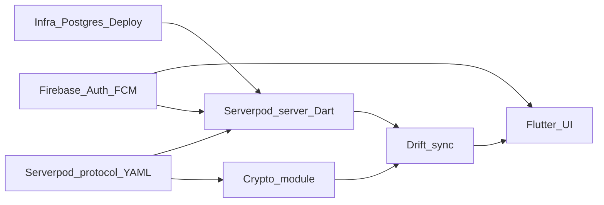
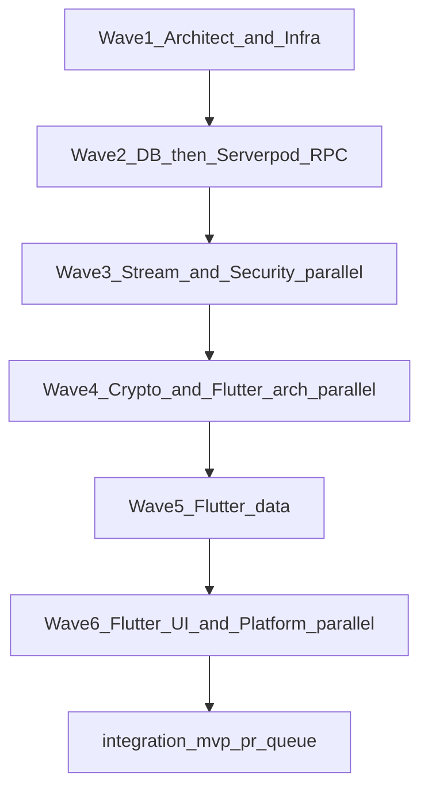

# Privacy-first messaging app — MVP, architecture & agent handbook

Single source of truth for product direction, technical design, and **copy-paste agent delegation briefs**.  
Stack targets: Flutter (stable), **Riverpod**, **GoRouter**, **Drift**, **flutter_secure_storage**, **Serverpod (Dart) + PostgreSQL**, **Firebase (Auth + FCM, phased Firestore migration)**, **S3-compatible or Serverpod file storage**, **FCM**.

---

## Table of contents

1. [Legacy V1 contract summary](#legacy-v1-contract-summary)
2. [Vision & product differentiation](#vision--product-differentiation)
3. [Hybrid architecture: Serverpod + Firebase](#hybrid-architecture-serverpod--firebase)
4. [Current repo baseline vs target stack](#current-repo-baseline-vs-target-stack)
5. [Backend recommendation](#backend-recommendation)
6. [System architecture (deployment view)](#system-architecture-deployment-view)
7. [Flutter application architecture](#flutter-application-architecture)
8. [PostgreSQL schema (v1)](#postgresql-schema-v1)
9. [Local database (Drift)](#local-database-drift)
10. [Serverpod protocol & API surface](#serverpod-protocol--api-surface)
11. [Realtime / streaming event catalog](#realtime--streaming-event-catalog)
12. [End-to-end encryption model](#end-to-end-encryption-model)
13. [Offline-first sync & conflict resolution](#offline-first-sync--conflict-resolution)
14. [Flutter UI structure & screens](#flutter-ui-structure--screens)
15. [Security & threat model](#security--threat-model)
16. [Phased roadmap (Phase 1–3)](#phased-roadmap-phase-1-3)
17. [Phase 1 MVP: feature checklist (additive)](#phase-1-mvp-feature-checklist-additive)
18. [MVP week-by-week roadmap (8-12 weeks)](#mvp-week-by-week-roadmap-8-12-weeks)
19. [Multi-agent schedule & dependency graph](#multi-agent-schedule--dependency-graph)
20. [Additive vs rewrite](#additive-vs-rewrite)
21. [How to use agent briefs](#how-to-use-agent-briefs)
22. [Global constraints for all agents](#global-constraints-for-all-agents)
23. [Agent briefs](#agent-briefs)
24. [Parallel schedule & critical path](#parallel-schedule--critical-path)
25. [Agent Git worktrees & non-overlap rules](#agent-git-worktrees--non-overlap-rules)
26. [Document maintenance](#document-maintenance)

**Canonical extras:** [Docs index](docs/README.md) · [Serverpod runbook](docs/serverpod-runbook.md) · [ADRs](docs/adr/README.md) · [ADR-0010 Phase 2 AI / privacy](docs/adr/0010-phase2-ai-privacy-opt-in.md) · [Protocol v1 sketch](docs/protocol/v1/) · [Protocol changelog](docs/protocol/CHANGELOG.md) · [Cursor meta / plan pointers](docs/cursor_meta_plan.md)

---

## Legacy V1 contract summary

Early scope: auth (phone/OTP style), 1:1 and group chat, media (compress before upload), push (FCM/APNs), cross-platform release, CI/CD, and **Block/Report** for store compliance. The target stack **keeps Firebase where it already works** (identity + push) and **adds Serverpod** as the system of record for messaging, sync, and PostgreSQL-backed features—**incremental** cutover from Firestore-backed messaging if/when ready.

---

## Vision & product differentiation

Each row: **Problem** → **Solution** → **UX principle** → **Constraints / tradeoffs** (for ADRs and scope control).

| Theme | Problem | Solution | UX principle | Constraints |
|--------|---------|----------|--------------|-------------|
| **Privacy-first** | Central plain-text honeypots; opaque data use | E2EE message bodies; Serverpod stores **ciphertext** + routing metadata; minimal logging policy | Users see plain “locked / verified” device and key status; opt-in clarity for anything server-side | Key recovery is hard by design; support UX for lost devices; legal hold ≠ plaintext access in MVP |
| **Multi-device, no phone lock-in** | Single-device OTP silos | Firebase Auth + **device registry** in Postgres; Serverpod sessions per `device_id`; sync cursors | Same inbox on mobile + web + tablet; explicit device list in settings | More session attack surface → device revoke + rate limits |
| **AI (Phase 2)** | Creepy always-on ML | **Opt-in** translation/summaries; DPIA-style flow; provider choice; no training on content by default | Clear toggles; preview before send if server-assisted | Region/compliance; latency; cost caps |
| **Low bandwidth** | Fat payloads, retries storm | Client compress media; small protobuf/JSON payloads; sync **diffs**; backoff | Progress + retry UI; “sent offline” state | Server must cap attachment size; CDN/S3 costs |
| **Anti-spam / safety** | Scams, UGC risk | Rate limits; report/block; device reputation (MVP rules); store-compliant strings | One-tap report; block syncs across devices | False positives → appeals path (product); moderation queue later |
| **Modular interoperability (Phase 3)** | Walled gardens | Abstraction layer for bridges/bots (spec only in Phase 3) | N/A MVP | Out of scope for Phase 1 code paths |

---

## Hybrid architecture: Serverpod + Firebase

| Concern | Owner | Notes |
|--------|--------|------|
| **Phone / OTP sign-in** | **Firebase Auth** (current) | Existing UX and SDK; Serverpod **verifies** Firebase ID tokens (or accepts a signed exchange) to issue **Serverpod sessions** tied to `device_id`. ADR must define token exchange vs per-request verification. |
| **Push notifications** | **FCM** | Firebase Cloud Messaging remains; **Serverpod** triggers pushes via Firebase Admin (Dart) or HTTP v1 API when messages arrive for offline devices. |
| **Messaging & sync (target)** | **Serverpod + PostgreSQL** | Canonical chats, messages (ciphertext), cursors, media metadata, devices, keys (public material only). |
| **Firestore (today)** | **Transitional** | [`lib/data/services/messaging_service.dart`](lib/data/services/messaging_service.dart) and related paths: **dual-write or read-cutover** behind feature flags until Serverpod is authoritative; then remove Firestore message paths. |
| **Realtime delivery** | **Serverpod** | Use Serverpod **streaming endpoints** / real-time patterns (per Serverpod version docs) for `message`, `ack`, `typing`, `presence`; align event names with the protocol ADR. |
| **E2EE** | **Flutter + Serverpod relay** | Plaintext never stored; Serverpod stores ciphertext blobs + minimal routing metadata. |
| **Single language** | **Dart end-to-end** | Serverpod **generates** the Flutter client from YAML protocol—strong typing between app and server. |

**ASCII (logical):**

```
┌─────────────────────────────────────────────────────────────────┐
│                        Flutter app                               │
│  GoRouter + Riverpod + Drift + E2EE (secure storage)             │
└──────────────┬──────────────────────────────┬─────────────────────┘
               │ Generated Serverpod client    │ Firebase SDK
               │ (HTTPS + streaming)           │ (Auth + FCM token)
               ▼                               ▼
┌──────────────────────────────┐     ┌─────────────────────────┐
│   Serverpod server (Dart)     │     │   Firebase             │
│   Endpoints + streaming       │     │   Auth, FCM            │
│   PostgreSQL                  │     │   (Firestore optional) │
│   File storage / S3 presign   │     └─────────────────────────┘
└──────────────────────────────┘
```

---

## Current repo baseline vs target stack

| Area | Current (`lib/` and platform) | Target (MVP) |
|------|------------------------------|--------------|
| Routing | GoRouter ([`lib/main.dart`](lib/main.dart)) | GoRouter (keep); auth redirect with Riverpod |
| State | **Provider** (`AuthProvider`, `ChatProvider`) | **Riverpod** (`Notifier` / `AsyncNotifier`) |
| Remote API | **Firebase** + Firestore-style messaging ([`messaging_service.dart`](lib/data/services/messaging_service.dart)) | **Serverpod** generated client + **Firebase Auth** token exchange |
| Realtime | Firestore snapshots / stubs | **Serverpod streaming** (per protocol ADR) |
| Local persistence | **Hive** ([`hive_storage.dart`](lib/data/local/hive_storage.dart)) | **Drift** (SQLite) + migrations |
| Secrets / config | **envied** ([`lib/core/env/`](lib/core/env)) | Keep envied + **flutter_secure_storage** for keys |
| Push | FCM client-side | FCM + **Serverpod** triggers via Firebase Admin |
| Features | Phone → OTP → profile, inbox, threads, groups, contacts, settings, media scaffolding | Above + **E2EE**, **device list**, **offline outbox**, **Serverpod sync**, **backup stub** (Phase 1 scope) |

**Baseline audit:** Every Phase 1 feature should cite **Current** vs **Target** in PR descriptions until Firestore messaging is removed.

---

## Backend recommendation

**Primary:** **Serverpod** on PostgreSQL, with **Firebase Auth** for phone/OTP and **FCM** for push. Optional: **Redis** later for horizontal scaling / rate-limit buckets if Serverpod deployment pattern requires it.

**Why Serverpod (vs NestJS):** One **Dart** codebase and **generated client** for Flutter reduces contract drift; PostgreSQL remains the source of truth; endpoints and streaming are **typed**. Pairing with **existing Firebase** avoids redoing auth and push while you own message data and sync in PostgreSQL.

**Option B (still valid):** Supabase-only path if you later drop Serverpod—document as alternative, not the default in this plan.

---

## System architecture (deployment view)

Logical deployment (adjust names for your cloud). All client ↔ Serverpod traffic over **TLS**.

```
                    ┌──────────────┐
                    │   Clients    │
                    │ Android/iOS/ │
                    │     Web      │
                    └──────┬───────┘
                           │ TLS
              ┌────────────┼────────────┐
              │            │            │
              ▼            ▼            ▼
     ┌─────────────┐  ┌─────────┐  ┌──────────────┐
     │  Serverpod   │  │ Postgres│  │ S3-compatible│
     │  (API+stream)│◄─┤ primary │  │   or SP      │
     └──────┬──────┘  └─────────┘  │ file storage │
            │                       └──────────────┘
            │ Firebase Admin
            ▼
     ┌─────────────┐
     │   Firebase   │
     │ Auth verify  │
     │ + FCM send   │
     └─────────────┘
```

**Trust boundaries:** (1) Client holds private keys + Drift. (2) Serverpod sees ciphertext, membership, sync cursors, **not** message plaintext. (3) Firebase sees auth tokens and FCM registration; not message content.

---

## Flutter application architecture

**Target layout (feature-first, clean layers):**

```
lib/
  main.dart , app.dart              # ProviderScope, MaterialApp.router
  core/
    env/ , serverpod/ , crypto/ , errors/ , utils/ , network/
  features/
    auth/ , chat/ , groups/ , settings/ , search/ , backup/
      each: data/ , application/ , presentation/
  shared/
    widgets/ , models/
```

**Rules:** `presentation` → `application` → `domain`. `data` implements repositories (Drift + Serverpod + crypto). **No** Serverpod imports under `presentation/`. Generated client package wired in `core/serverpod/`.

**Current repo (`lib/`) → target (incremental move):**

| Today | Target home |
|-------|-------------|
| [`lib/main.dart`](lib/main.dart) | Keep; add `ProviderScope`, MaterialApp.router |
| [`lib/presentation/auth/`](lib/presentation/auth/) | `features/auth/presentation/` |
| [`lib/presentation/chat/`](lib/presentation/chat/) | `features/chat/presentation/` + `features/groups/` as needed |
| [`lib/presentation/settings/`](lib/presentation/settings/) | `features/settings/presentation/` |
| [`lib/presentation/theme/`](lib/presentation/theme/), [`lib/presentation/core/`](lib/presentation/core/) | `shared/` + `core/theme/` |
| [`lib/data/services/`](lib/data/services/) | `features/*/data/` + `core/serverpod/` (thin API adapters) |
| [`lib/data/local/hive_storage.dart`](lib/data/local/hive_storage.dart) | Replace with **Drift** under `features/*/data/local/` |
| [`lib/domain/models/`](lib/domain/models/) | `domain/` (pure) or `shared/models/` until features own them |
| [`lib/core/env/`](lib/core/env/) | `core/env/` (keep **envied**) |

---

## PostgreSQL schema (v1)

| Table | Purpose | Key columns (indicative) |
|-------|---------|--------------------------|
| **users** | Profile | `id`, `firebase_uid` (unique), `display_name`, `photo_url`, `created_at`, `updated_at` |
| **devices** | Multi-device | `id`, `user_id`, `device_id`, `name`, `last_seen_at`, `public_key_ref` |
| **sessions** | Auth (Serverpod-issued) | `id`, `user_id`, `device_id`, `refresh_token_hash`, `created_at`, `revoked_at` |
| **chats** | Thread | `id`, `type` (direct/group), `title`, `created_by`, timestamps |
| **chat_members** | ACL | `chat_id`, `user_id`, `role`, `joined_at`, `last_read_seq`, `muted_until` |
| **messages** | Ciphertext payload | `id`, `chat_id`, `sender_id`, `client_msg_id`, `server_seq`, `ciphertext`, `content_type`, `media_id`, `created_at`, `deleted_at` |
| **media_objects** | Blob metadata | `id`, `uploader_id`, `storage_key`, `mime`, `size_bytes`, `sha256` |
| **device_keys** / **prekey_bundles** | E2EE public | `user_id`, `device_id`, bundle fields, `replenish_at` |
| **push_tokens** | FCM | `device_id`, `user_id`, `token`, `platform`, `updated_at` |
| **reports** | Safety | `reporter_id`, targets, `reason`, `created_at` |
| **blocks** | Safety | `blocker_id`, `blocked_id`, PK composite |

**Indexes:** `messages (chat_id, server_seq DESC)`; `chat_members (user_id)`; unique `users.firebase_uid`; idempotency index per ADR on `client_msg_id`.

---

## Local database (Drift)

| Table | Purpose |
|-------|---------|
| **local_chats** | Inbox mirror, unread, preview |
| **local_messages** | Mirror; plaintext handling per security ADR |
| **outbox** | Pending sends, retry, `client_msg_id`, state |
| **sync_state** | Cursors, `last_sync_at` |
| **pending_media** | Upload progress |
| **fts_messages** (optional) | Local search |

---

## Serverpod protocol & API surface

**Authoritative sketch** (copy into Serverpod `protocol/` when `chat_server` exists):

- Serializable models: [`docs/protocol/v1/models.yaml`](docs/protocol/v1/models.yaml)
- Endpoint method catalog (Dart class names): [`docs/protocol/v1/endpoints.md`](docs/protocol/v1/endpoints.md)

Summary:

- **Auth:** `exchangeFirebaseToken`, `refreshSession`, `logout` → `TokenPair`; ties Firebase user to **sessions** + **devices**.
- **Devices & keys:** `list` / `register` / `revoke`; `uploadBundle` / `fetchUserBundle` (**public** material only).
- **Chats:** `createDirect`, `createGroup`, `listMine`, `get`; members `list`.
- **Messages:** `send` (idempotent `clientMsgId`), `listHistory`.
- **Sync:** `changesForChat` with opaque `cursor` (ADR-0005).
- **Media:** `prepareUpload`, `finalize`.
- **Push:** `registerToken` (FCM).
- **Safety:** `report`, `block`.
- **Search:** `metadataSearch` only (no ciphertext FTS).

After protocol edits: run **`serverpod generate`**, commit generated client, and bump version note in ADR/README if breaking.

---

## Realtime / streaming event catalog

| Event `type` | Direction | Payload hints |
|--------------|-----------|---------------|
| `send_message` | C→S | `client_msg_id`, ciphertext |
| `message` | S→C | `server seq`, sender, ciphertext, `media_id` |
| `message_ack` | both | delivery/read state |
| `typing` | both | `user_id`, TTL |
| `presence` | S→C | status |
| `sync_hint` | S→C | cursor nudge |
| `error` | S→C | `code`, message |

Envelope: `type`, `idempotencyKey`, `chatId`, `deviceId`, `ts`, `payload` — exact schema in YAML.

---

## End-to-end encryption model

- **Keys:** identity + signed prekey + one-time prekeys; private material in **flutter_secure_storage**.
- **Upload:** public bundles via Serverpod `keys.*` endpoints.
- **Send:** encrypt to `ciphertext` before RPC; server relays only ciphertext.
- **Forward secrecy:** level defined in ADR (full ratchet vs simplified session key for MVP).

---

## Offline-first sync & conflict resolution

1. **Outbox** + backoff on failure. 2. **Idempotent** `client_msg_id`. 3. **Pull** batches by cursor/`server_seq`. 4. **LWW** on metadata with server time; message body immutable unless edit/tombstone. 5. **Delete** via tombstone sync.

---

## Flutter UI structure & screens

Onboarding (phone/OTP/profile); **inbox**; **thread** + composer; **profile**; **settings** (notifications, privacy); **devices**; **backup/restore** (ADR scope); **search**; **report/block**. Widgets: list tile, bubble, composer, avatar, settings section, report sheet.

---

## Security & threat model

| Threat | Mitigation |
|--------|------------|
| MITM | TLS; optional cert pinning |
| Server sees content | E2EE ciphertext only |
| Spam/abuse | Rate limits, reports/blocks |
| ATO | Session/device revoke; 2FA Phase 2 |
| Metadata leakage | Logging policy, retention |

---

## Phased roadmap (Phase 1–3)

- **Phase 1 (MVP):** Auth, profiles, 1:1 + group E2EE, multi-device, media, offline, push, search, encrypted backup (ADR), block/report.
- **Phase 2:** Opt-in AI translation/summaries; spam scoring; communities; ephemeral; verified accounts.
- **Phase 3:** Interop layer; payments module; mesh/delayed; bots/APIs.

**Firestore:** `M0` dual-read → `M1` dual-write → `M2` Serverpod-authoritative → `M3` remove message collections (dates in ADR).

---

## Phase 1 MVP: feature checklist (additive)

| # | Feature | Already (partial) | Add / change |
|---|---------|-------------------|--------------|
| 1 | Auth | Firebase OTP UI | Serverpod token exchange + session |
| 2 | Profiles | Create profile | Persist via Serverpod |
| 3 | 1:1 E2EE | Firestore msgs | Client encrypt; Serverpod ciphertext |
| 4 | Groups | Group UI | Serverpod groups + E2EE ADR |
| 5 | Multi-device | Single-device | `devices` table + UI |
| 6 | Media | `media_service` | Serverpod presign/upload |
| 7 | Offline | Hive | Drift + outbox |
| 8 | Push | FCM client | Token registration + server FCM |
| 9 | Search | Limited | Drift FTS / metadata RPC |
| 10 | Backup | None | Encrypted export/import per ADR |

---

## MVP week-by-week roadmap (8-12 weeks)

Realistic **production-ready MVP** ordering; overlap allowed per headcount. Gantt detail: [Parallel schedule & critical path](#parallel-schedule--critical-path).

| Week | Focus | Exit criteria |
|------|--------|----------------|
| **1** | ADRs freeze skeleton; `docs/protocol/v1` ↔ ERD; staging Postgres + Serverpod scaffold; Firebase Admin in env | Staging URL; first migration applied; empty health |
| **2** | `AuthEndpoint.exchangeFirebaseToken` + device row; streaming auth spike; CI runs `dart test` on server + `flutter analyze` on app | Login from Flutter staging → session returned |
| **3** | Chats + members RPC; `MessageEndpoint.send` + idempotency index; persist ciphertext | Integration test: create chat → post message |
| **4** | `SyncEndpoint.changesForChat`; streaming fan-out `message` + `sync_hint`; Drift schema v1 + outbox stub | Reconnect + RPC catches up |
| **5** | Hive → Drift migration path; outbox retries; wire **generated** client in `core/serverpod/` | Airplane send → reconnect → delivered |
| **6** | E2EE encrypt at repository boundary; `KeyEndpoint` public bundles; client secure storage | Staging DB has ciphertext only |
| **7** | Media presign/finalize; push token registration; FCM data path from server | Offline user gets generic push |
| **8** | Firestore **flag**: Serverpod-authoritative reads; dual-write off | No Firestore reads for inbox in flag-on builds |
| **9** | Device manager UI; report/block paths; rate limits + redaction | Abuse matrix smoke pass |
| **10** | Hardening, load notes, cutover docs; **remove** dead Firestore messaging code paths | RC checklist green |
| **11–12** (buffer) | QA regression, store-readiness strings, polish | P0/P1 clear for release |

**Labeled vs current repo:** Weeks 1–2 **extend** Firebase Auth; weeks 3–8 **replace** Firestore messaging with Serverpod; weeks 5–7 **replace** Hive with Drift.

---

## Multi-agent schedule & dependency graph

| Agent / role | Owns | Typical first milestones |
|--------------|------|---------------------------|
| Tech lead / architect | ADRs, **Serverpod protocol** + Firebase boundary, schema review, threat model | Week 1: protocol v1 + token exchange ADR |
| Infra / DevOps | Postgres, run/deploy Serverpod, CI, secrets, FCM server credentials | Week 1–2: staging Serverpod + DB |
| **Backend (Serverpod / Dart)** | Endpoints, streaming/realtime, Postgres migrations, file upload/presign, FCM sender | Week 2–6: protocol + happy path messaging |
| Backend security | Rate limits, abuse signals, session hardening, audit logs | Week 3–8 |
| Crypto / client security | Key lifecycle, secure storage, encrypt/decrypt, tests | Week 2–7 |
| Flutter — data & sync | Drift, sync engine, outbox, Riverpod, **Serverpod client** integration | Week 3–9 |
| Flutter — UI | Onboarding, chat list/thread, settings, device UI, a11y | Week 2–10 |
| Flutter — platform | FCM, background tasks, file picker pipeline | Week 4–8 |
| QA / test | Golden + integration tests vs staging | Week 6–12 |
| AI / privacy (Phase 2 prep) | DPIA-style doc (ADR-0010), per-user `ai_translation_enabled`, `Phase2AiService` stub | Before Phase 2 build |



---

## Additive vs rewrite

For each Phase 1 feature, track:

- **Already in app (partial)** — e.g. phone OTP UI, Firebase Auth, FCM, basic chat UI, Firestore-backed messaging.
- **Add / change** — e.g. **Serverpod** endpoints + generated client, Drift outbox, E2EE at repository boundary, **streaming** subscription for realtime, then **read/write cutover** from Firestore (feature-flag).

---

## How to use agent briefs

Each block is **standalone**: copy into a ticket, Cursor agent chat, or SOW. Replace `{{PROJECT}}`, `{{SERVERPOD_HOST}}`, `{{WS_OR_STREAM_URL}}` when ready.

---

## Global constraints for all agents

- Stack targets: Flutter (stable), **Riverpod**, **GoRouter**, **Drift**, **flutter_secure_storage**, backend **Serverpod + PostgreSQL**, **Firebase Auth + FCM** (ongoing), optional **S3-compatible** storage or Serverpod file API, **Firestore phased out** for messages per ADR.
- Clean architecture: **no business logic in widgets**; strong typing; **prefer generated Serverpod client** for network DTOs.
- Privacy: server stores **ciphertext** for message bodies; minimize metadata; document what is logged.
- Repo baseline today: Firebase + Provider + Hive + GoRouter — migration is **incremental**, not rewrite.

---

## Agent briefs

### Tech Lead / Principal Architect

**Mission:** Own technical coherence: **Serverpod YAML protocol** v1, PostgreSQL schema, **Firebase ID token → Serverpod session** strategy, E2EE MVP scope, threat model, ADRs.

**Deliverables**

1. ADR set (`/docs/adr`): **Serverpod** as primary backend; **Firebase Auth** trust model; session refresh + `device_id` binding; streaming/realtime method naming; sync cursor strategy; **Firestore cutover** phases; E2EE MVP vs Phase 2.
2. **Serverpod protocol:** versioned YAML models + endpoint/streaming definitions; **generated client** consumption rules in Flutter (package path, null safety).
3. ERD + migration numbering aligned with **Serverpod migration** workflow.
4. Threat model one-pager: MITM, relay honesty, metadata leakage, spam, account takeover; mitigations mapped to features.

**Inputs you need from product**

- Supported identity methods for MVP (phone OTP stays on Firebase?).
- Whether “verified accounts” is Phase 1 or 2 only.

**Dependencies:** None (first).

**Acceptance criteria**

- Another engineer can implement **Serverpod** and Flutter **without** daily ambiguity; protocol versioned (`v1`).
- Security sign-off checklist: TLS, token rotation, rate-limit categories, **Firebase Admin** credential handling.

**Week-by-week (MVP)**

- W1: ADRs + ERD + protocol skeleton + Firebase exchange flow.
- W2: Review PRs from backend + crypto; freeze breaking protocol changes.
- W3–W4: Sync/cursor edge cases; conflict rules frozen.
- W5+: Release candidate gates.

**Handoff:** Infra (deploy + env vars), Serverpod backend (protocol file), Crypto (E2EE ADR), Flutter leads (client generation in CI).

---

### Infra / DevOps

**Mission:** Staging/prod for **Serverpod**, PostgreSQL, secrets, CI, observability, FCM credentials for **server-triggered** push.

**Deliverables**

1. **Serverpod deployment** path (Docker / `serverpod deploy` / cloud VM—per official docs for current Serverpod version); **PostgreSQL** managed preferred; optional Redis later.
2. CI: `flutter analyze`, `dart test` for **both** `chat` app and **`{{PROJECT}}_server`**; `serverpod create-migration` / apply in staging; Android/iOS/Web artifacts as needed.
3. Secrets: Firebase **service account** for Admin SDK (token verify + FCM send) stored in vault/OIDC; Serverpod `passwords.yaml` / env injection; **no** secrets in repo.
4. Observability: structured logs, health checks, request correlation; Sentry optional.
5. Document: `SERVERPOD_API_URL`, DB URL, Firebase project IDs per env.

**Dependencies:** Architect ADR for regions/hostnames.

**Acceptance criteria**

- Fresh staging: DB migrate + seed + Serverpod reachable from Flutter staging build.
- Rollback procedure for failed migration tested once.

**Handoff:** Serverpod agent (connection config); QA (URLs); Mobile (Google services per env).

---

### Backend (Serverpod) — Endpoints & REST-style RPC

**Mission:** Implement **Serverpod endpoints** per protocol: user/device binding, chats, messages (ciphertext handles), sync cursors, media upload flow, search stubs aligned with policy.

**Deliverables**

1. **Serverpod project structure:** `lib/src/endpoints/`, generated code, migrations; modules mirroring domain: `auth`, `users`, `devices`, `chats`, `messages`, `media`, `sync`, `search`, `admin` (as appropriate).
2. **Firebase Auth integration:** verify ID token on register/login; map `firebase_uid` → internal `user_id`; issue Serverpod **authentication** per docs (custom authentication flow / `AuthenticationInfo`).
3. Idempotent message create: `client_msg_id` uniqueness scope (per user or device).
4. Sync: cursor endpoints (global or per-chat) + pagination contract from ADR.
5. Media: presigned S3 or Serverpod file storage; finalize message attachment.
6. **Migrations:** SQL migrations via Serverpod tooling matching ERD.

**Dependencies:** Architect protocol YAML + ERD; Infra DB + storage.

**Acceptance criteria**

- Integration tests in **Dart** on server: login exchange + post message + sync.
- All failures return typed `Result`-style or exception mapping documented for Flutter.

**Non-goals (MVP)**

- Full-text search inside ciphertext.

**Handoff:** Streaming agent (call after persist); Flutter data (regenerate client); QA (integration scenarios).

---

### Backend (Serverpod) — Realtime / streaming

**Mission:** **Streaming methods** (or Serverpod-supported realtime pattern) for fan-out: new message, ack, typing, presence; authenticate stream using same session as HTTP/RPC.

**Deliverables**

1. Auth on stream: reject unauthenticated; include `device_id` in session context.
2. Events aligned with ADR: `send_message`, `message`, `message_ack`, `typing`, `presence`, `error`, `sync_hint`.
3. Backpressure: payload caps; per-connection rate limits; idle disconnects.
4. On persisted message: notify chat members via streaming hub / channel pattern per Serverpod capabilities.
5. Scale notes: sticky sessions vs pub/sub (Redis) if multi-instance—ADR decision.

**Dependencies:** Endpoint path persists messages; Infra scaling story.

**Acceptance criteria**

- Two Dart integration clients (or Flutter integration) see ordering consistent with ADR after reconnect + REST resync.

**Handoff:** Flutter sync layer; QA multi-client harness.

---

### Backend security / abuse / anti-spam

**Mission:** Rate limits, reporting, audit logs—**Dart** middleware / endpoint guards; no plaintext logging.

**Deliverables**

1. Limits: auth attempts, endpoint calls per user/device/IP; streaming connection abuse.
2. `reports` + `blocks` APIs; moderation export optional.
3. Device reputation heuristics (MVP rules).
4. Dependency audit: `dart pub audit` in CI where available; pin Serverpod version.
5. Coordinate PII logging policy with architect.

**Dependencies:** Core endpoints + streams live.

**Acceptance criteria**

- Abuse test matrix with expected errors; redaction in logs verified.

**Handoff:** Flutter report/block UI; compliance.

---

### Database engineer (PostgreSQL)

**Mission:** Schema and indexes optimized for inbox + sync; aligned with **Serverpod** entities.

**Deliverables**

1. Tables per ERD; **Serverpod** model classes kept in sync with migrations.
2. Indexes: `(chat_id, server_seq DESC)`, `(user_id, updated_at)`, soft-delete partial indexes.
3. Partitioning plan documented (Phase 2+).
4. Seed data for staging.

**Dependencies:** ERD sign-off.

**Acceptance criteria**

- Query plans for inbox + sync documented under synthetic load.

**Handoff:** Serverpod dev (model + migration PRs).

---

### Cryptography / E2EE (client + protocol)

**Mission:** Same as before: keys, session encrypt/decrypt, **flutter_secure_storage**; Serverpod only receives ciphertext + public keys.

**Deliverables**

1. Dart **client** crypto module; optional shared **pure Dart** package if server must verify shapes only (no private keys on server).
2. Serverpod endpoints for public key bundles / prekey replenishment.
3. Test vectors; CI simulations.
4. Documentation: forward secrecy level for MVP; account recovery implications.

**Dependencies:** E2EE ADR; Serverpod key endpoints implemented.

**Acceptance criteria**

- Tests fail if plaintext hits logs or DB columns in staging tests.

**Handoff:** Flutter repositories (encrypt before RPC); Serverpod (no plaintext storage).

---

### Flutter — Architecture & Riverpod migration lead

**Mission:** Feature-first layout; **Provider → Riverpod**; **integrate generated Serverpod client** (singleton / Riverpod provider wrapping `Client` + session).

**Deliverables**

1. Target tree: `lib/core`, `lib/features/...`, `lib/shared`; **thin** `lib/core/serverpod/` for host + auth hook-in with Firebase.
2. Regenerate client on protocol changes in CI (documented step).
3. Lint + `ProviderContainer` tests.

**Dependencies:** Architect module boundaries.

**Acceptance criteria**

- `flutter analyze` clean; navigation parity.

**Handoff:** UI and data agents.

---

### Flutter — Data layer (Drift + repositories + sync)

**Mission:** **Hive → Drift**; outbox; sync via **Serverpod** RPC + streaming subscriptions; E2EE at repository edge.

**Deliverables**

1. Drift tables; repositories domain-pure.
2. Outbox: idempotency keys match server.
3. Apply sync batches idempotently; tombstones; conflict policy from ADR.
4. **Dual-mode period:** feature flag to read Firestore vs Serverpod during migration—**remove** when cutover complete.

**Dependencies:** Stable protocol v1; crypto API.

**Acceptance criteria**

- Airplane mode → reconnect delivers pending.
- Drift migrations tested.

**Handoff:** UI streams; QA matrices; Platform background flush.

---

### Flutter — UI / Design system

**Mission:** Same scope; wire only to **notifiers**, never to raw Serverpod client in widgets.

**Deliverables**

1. Tokens from [`lib/presentation/theme/app_theme.dart`](lib/presentation/theme/app_theme.dart).
2. Loading/error states; a11y; web responsive notes.

**Dependencies:** Notifiers stable.

**Handoff:** QA cases.

---

### Flutter — Platform (iOS / Android / Web)

**Mission:** **FCM** unchanged client-side; register FCM token with **Serverpod** `push_tokens` endpoint; deep links to chat.

**Deliverables**

1. Pass **Firebase Auth** user into token exchange flow as today.
2. Platform test matrix.

**Dependencies:** Serverpod push token API; Infra FCM credentials on server.

**Handoff:** QA.

---

### Media pipeline (Flutter + Serverpod)

**Mission:** Client compress; upload via **Serverpod** media flow (presign or upload endpoint); attach `media_id` to message RPC.

**Deliverables**

1. Extend [`lib/data/services/media_service.dart`](lib/data/services/media_service.dart).
2. Server: TTL, size, MIME allowlist.

**Dependencies:** Storage bucket or Serverpod storage config.

---

### QA / Test automation

**Mission:** Plan + automation against **staging Serverpod**; Flutter integration + **server** Dart tests in CI.

**Deliverables**

1. Matrix: auth exchange, 1:1, group, offline, reconnect, push, search smoke, backup smoke.
2. Contract: protocol YAML reviewed when breaking.

**Dependencies:** Staging URLs; test Firebase project optional.

---

### Technical writer / API documentation

**Mission:** `/docs` for monorepo: Flutter app + **Serverpod** server runbooks, `serverpod generate`, env vars, Firebase + Serverpod diagram.

**Deliverables**

1. Developer index: clone, env templates, run app + server locally, staging URLs.
2. Changelog when **protocol YAML** breaks generated clients.
3. Link to ADRs and this `mvp_plan.md`.

**Dependencies:** ADRs + deployed staging.

---

### AI / ML + Privacy (Phase 2 — prepare in MVP)

**Mission:** Opt-in translation/summaries; **no** training on message content by default; data flow documented before any provider wiring.

**Deliverables**

1. Privacy DPIA-style summary: what leaves device, retention, provider choice — [**ADR-0010**](docs/adr/0010-phase2-ai-privacy-opt-in.md).
2. Feature flag design: **`ai_translation_enabled`** per user (Postgres/Serverpod when available); optional remote kill-switch; client mirror in Drift when profiles sync exists.
3. Stub service interface for Flutter: [`lib/core/ai/phase2_ai_service.dart`](lib/core/ai/phase2_ai_service.dart) — inject [`NoOpPhase2AiService`](lib/core/ai/phase2_ai_service.dart) until legal review; **no** network calls from stub.

**Dependencies:** Product/legal input for copy, provider, and regions.

**Non-goals (MVP / Phase 1):** Production AI, prompts, or third-party API integration.

---

### Compliance / App Store & Play policy

**Mission:** Keep **user-generated content (UGC)** flows review-ready for **App Store** and **Google Play**: in-app **block** and **report**, transparency about what is shared with moderators, and a reachable **contact** path for safety or appeals (as product assigns).

**Deliverables**

1. **Store readiness checklist** (below): Apple Guideline **1.2** (User-Generated Content), Google Play **UGC / Safety** expectations, and **COPPA / under-13** positioning.
2. **Copy deck + app wiring:** strings live in [`lib/core/compliance/store_compliance_copy.dart`](lib/core/compliance/store_compliance_copy.dart). Optional moderation inbox: build with `--dart-define=MODERATION_CONTACT_EMAIL=hello@yourcompany.com`.
3. **Privacy policy & Terms:** legal URLs and in-app links must match what reports/blocks collect (reporter id, reported user, reason, chat id / context) — **product + counsel** own the documents.

**Dependencies:** Final **product/legal** copy, support email or ticket URL, age-rating questionnaire answers.

**Acceptance criteria**

- Reviewers can **block** and **file a report** without leaving the thread; confirmation before block; empty report reason is rejected with clear feedback.
- Settings **Safety** explainer describes flows and, when configured, lists the **contact** line for appeals or questions.
- Checklist below is tracked to **green** before store submission.

#### Apple App Store (Guideline 1.2 — UGC)

| # | Requirement (summary) | App / ops status |
|---|------------------------|------------------|
| A1 | **Filter / detect** objectionable content (MVP: reliance on **user reports** + server rate limits; document roadmap for proactive moderation if asked) | Product note in review notes |
| A2 | **Flag / report** mechanism | Chat **···** → Report ([`chat_detail_screen.dart`](lib/presentation/chat/chat_detail_screen.dart)) |
| A3 | **Block** abusive users | Chat **···** → Block (confirm dialog) |
| A4 | Developer acts on reports **within 24h** (or as committed in policy) | Ops / Serverpod `reports` table + owner |
| A5 | **Contact info** published (e.g. support URL or email in listing + in-app for appeals) | `MODERATION_CONTACT_EMAIL` or website in Settings / policy |
| A6 | **EULA / Terms** available; prohibited content defined | Legal |
| A7 | **ageRating** matches content (anonymous chat / UGC often **17+** or as counsel advises) | App Store Connect |

#### Google Play (User-generated content)

| # | Requirement (summary) | App / ops status |
|---|------------------------|------------------|
| G1 | In-app **reporting** for objectionable UGC | Same as A2 |
| G2 | **Blocking** between users | Same as A3 |
| G3 | **Moderation practices** documented in Play Console (how reports are handled) | Ops |
| G4 | **Content policies** aligned with UGC declaration | Legal |
| G5 | If targeting children / designed for families, **additional** Families / Ads / Data policies apply | See COPPA row |

#### COPPA / under-13 (U.S.) — positioning note

- **General-audience chat** with phone sign-in: treat as **not directed to children under 13** unless marketing, UX, or store listing targets kids. If you add a **kids mode**, school integrations, or child-directed marketing, **re-run COPPA** (verifiable parental consent, limited collection) and Play **Designed for Families** rules.
- **Age gate / self-declared DOB:** if implemented, wire minimum age per counsel (often **13+** or **16+** depending on region).

#### In-app strings (mirror of code)

| Key | Purpose |
|-----|---------|
| Block confirm title/body | Informs user that the other party cannot message them |
| Report title, reason hint, submit | Clear, requires reason |
| Success / validation snackbars | Confirms receipt or asks for details |
| Settings safety explainer | How to report/block; optional **appeals / contact** sentence when email define is set |

**Handoff:** **Technical writer** (privacy policy cross-links); **QA** (store demo account with report path); **Backend security** (`reports` persistence per ADR-0007).

---

## Parallel schedule & critical path

### Gantt-style (adjust for team size)

| Week | Architect | Infra | Serverpod RPC | Serverpod stream | Security | Crypto | Flutter Arch | Flutter Data | Flutter UI | Platform | QA |
|------|-----------|-------|----------------|------------------|----------|--------|--------------|--------------|------------|----------|-----|
| 1 | Protocol + Firebase ADR | Staging + DB | Scaffold server | Spike streams | Rules draft | Spec | Folder ADR | Drift spike | Tokens audit | FCM checklist | Plan |
| 2 | Review | CI Dart+Flutter | Auth exchange + users | Auth streams | Rate limits | Keygen spike | Riverpod + client gen | Schema v1 | Onboarding | iOS FCM | Staging tests |
| 3 | Review | Prod prep | Chats + messages | Fan-out | Reports API | API hooks | Migrate auth path | Outbox | Inbox/thread | Android | Integration |
| 4 | Freeze v1 | DR backup | Sync cursors | Presence | Blocks | Tests | Firestore flag | Search UI | Web smoke | E2E | Regression |
| 5–8 | Gates | On-call | Hardening | Scale ADR | Tuning | Hardening | Cutover + remove Firestore reads | Polish | Media | Ship prep | Full regression |

### Critical path (standup ordering)

`Architect protocol + Firebase ADR` → `Infra Postgres + Serverpod deploy` → `Serverpod auth exchange + message RPC` → `Crypto + Flutter Data (outbox + client)` → `Streaming fan-out` → `Firestore cutover (flag)` → `UI + Platform polish` → `QA sign-off`.

---

## Agent Git worktrees & non-overlap rules

Use **separate Git worktrees** (or long-lived branches) so agents rarely touch the same files. One integration branch (e.g. `integration/mvp`) receives **ordered merges** from agent branches.

### Suggested worktree layout (repo root = monorepo parent)

Assume layout: `chat/` = Flutter app, `chat_server/` = Serverpod (create when starting backend). From a common parent directory:

| Worktree path | Branch name | Primary owner |
|---------------|-------------|----------------|
| `chat/` (default) | `integration/mvp` | **Tech lead** merges only; or shared integration |
| `../chat-wt-architect/` | `agent/architect-protocol` | Tech lead / architect |
| `../chat-wt-infra/` | `agent/infra-ci-deploy` | Infra |
| `../chat-wt-serverpod-rpc/` | `agent/serverpod-endpoints` | Backend Serverpod RPC |
| `../chat-wt-serverpod-stream/` | `agent/serverpod-streaming` | Backend streaming |
| `../chat-wt-security/` | `agent/serverpod-security` | Backend security |
| `../chat-wt-db/` | `agent/postgres-schema` | DB engineer |
| `../chat-wt-crypto/` | `agent/e2ee-client` | Crypto |
| `../chat-wt-flutter-arch/` | `agent/flutter-riverpod-serverpod` | Flutter architecture |
| `../chat-wt-flutter-data/` | `agent/flutter-drift-sync` | Flutter data |
| `../chat-wt-flutter-ui/` | `agent/flutter-ui` | Flutter UI |
| `../chat-wt-platform/` | `agent/flutter-fcm-platform` | Flutter platform |
| `../chat-wt-qa/` | `agent/qa-automation` | QA |

**Create worktrees** (example — adjust branch base):

```bash
cd /path/to/parent
git worktree add ../chat-wt-serverpod-rpc -b agent/serverpod-endpoints integration/mvp
```

**Rule:** Only **`integration/mvp`** (or `main`) runs full CI before release; agent branches rebase on it frequently.

### File / module ownership (minimize merge conflicts)

| Zone | Owner | Others may… |
|------|-------|-------------|
| `chat/docs/adr/`, protocol YAML ownership listed in ADR | **Architect** | Open PRs; no direct edits to frozen `protocol` without architect ACK |
| `chat_server/**/protocol/*.yaml`, generated `*.dart` (server client dirs) | **Architect** + **Serverpod RPC** | Streaming agent **only** adds streaming after RPC agent stubs sessions |
| `chat_server/migrations/**`, Serverpod model classes tied to ERD | **DB** + **Serverpod RPC** | One PR at a time per migration version; **DB leads** numbering |
| `chat_server/lib/src/endpoints/**` (non-stream) | **Serverpod RPC** | Security adds **middleware** in agreed folders only |
| `chat_server/lib/**` streaming / channel code | **Serverpod stream** | Must not change RPC contracts without sync |
| `chat/lib/core/crypto/**` or agreed E2EE package | **Crypto** | Data layer **calls** APIs only |
| `chat/lib/core/serverpod/**`, Riverpod `Provider` for `Client` | **Flutter arch** | Data/UI **inject** via overrides in tests |
| `chat/lib/**/data/**`, Drift `*.drift` | **Flutter data** | UI **never** edits Drift files |
| `chat/lib/**/presentation/**`, `shared/widgets` | **Flutter UI** | No `Serverpod` imports in widgets |
| `chat/lib/**` FCM, background, MethodChannel | **Platform** | Coordinate with data for token registration API |
| `.github/workflows/**`, Terraform, deploy scripts | **Infra** | App/server CI jobs: touch **only** agreed workflow files |
| `chat/integration_test/**`, `chat_server/test/**` | **QA** (+ feature owner for fixes) | QA does not change production logic without owner review |

### Merge wave order (reduces overlap)

Branches **rebase on `integration/mvp` often** and open PRs **into** `integration/mvp`. The diagram shows **dependency order** (start B after A); everything still lands via PR to integration.



**Practical sequence:**

1. **Architect** freezes `protocol v1` skeleton → merge to `integration/mvp`.
2. **Infra** + **DB** land CI + first migrations → integration.
3. **Serverpod RPC** implements endpoints + merges generated code from **same** protocol revision.
4. **Serverpod stream** branches from latest integration; only touches streaming + minimal RPC hooks agreed in ADR.
5. **Security** layers on (rate limit modules); avoid editing message payload shapes.
6. **Crypto** lands pure Dart / `flutter_secure_storage` module; **Flutter data** wires it in a **separate** PR after crypto API stable.
7. **Flutter arch** (Riverpod + generated client host) merges before **Flutter data** wholesale rewrite.
8. **Flutter UI** only consumes notifiers — branch from integration after data interfaces exist (or use stub notifiers from arch).
9. **Platform** merges in small PRs touching `android/`, `ios/`, `lib/.../platform` only.
10. **QA** adds tests in `integration_test/` and server `test/` — rebase daily on integration.

### “Do not overlap” quick checklist

- **One owner per migration version** on Postgres/Serverpod.
- **One owner per protocol change**; bump version in ADR when multiple agents need the bump.
- **UI agent:** zero changes under `chat/lib/**/data/**` except fixing imports if arch renames (prefer arch PR).
- **RPC vs stream:** stream agent does not rename endpoint method signatures; coordinate via shared `protocol` PR owned by architect/RPC.

---

## Document maintenance

- Regenerate **Serverpod client** whenever protocol version bumps; record in changelog.
- Update **baseline** table after Riverpod/Drift/Firestore removal milestones.
- Keep **Firebase vs Serverpod** boundary one click away in [ADR-0002](docs/adr/0002-backend-serverpod-postgresql-firebase.md) + [ADR-0003](docs/adr/0003-firebase-token-serverpod-session-device-binding.md).
- Maintain [**`docs/cursor_meta_plan.md`**](docs/cursor_meta_plan.md) pointers when Cursor plans change; **`mvp_plan.md`** stays the handbook.
- **No NestJS/OpenAPI creep**: backend contracts are **Serverpod protocol + ADRs**; re-sync from this file if docs diverge.
