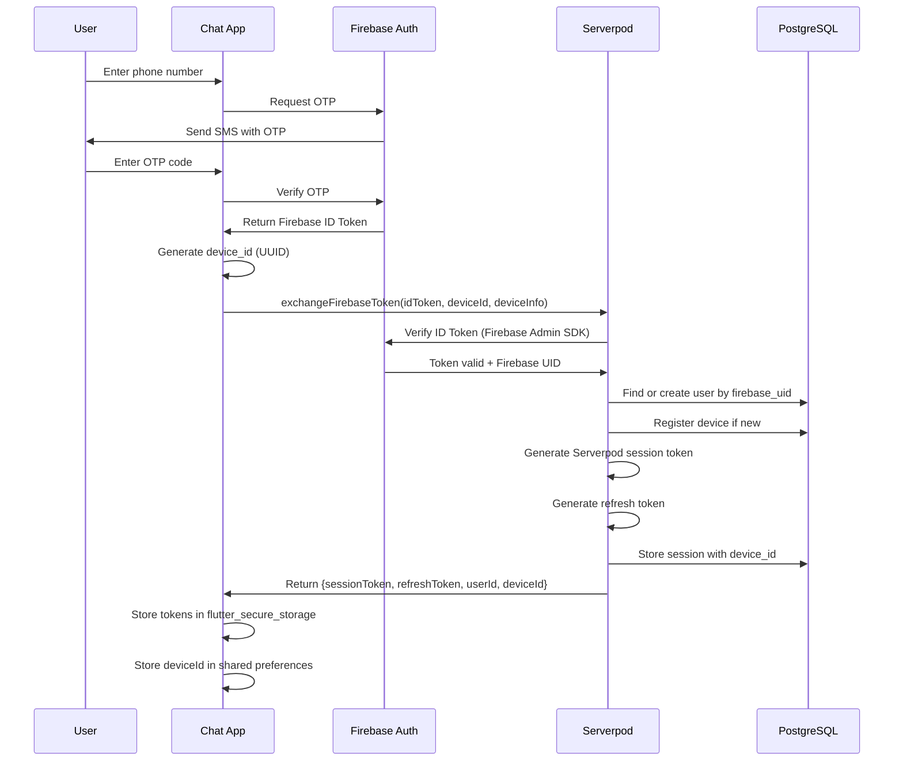
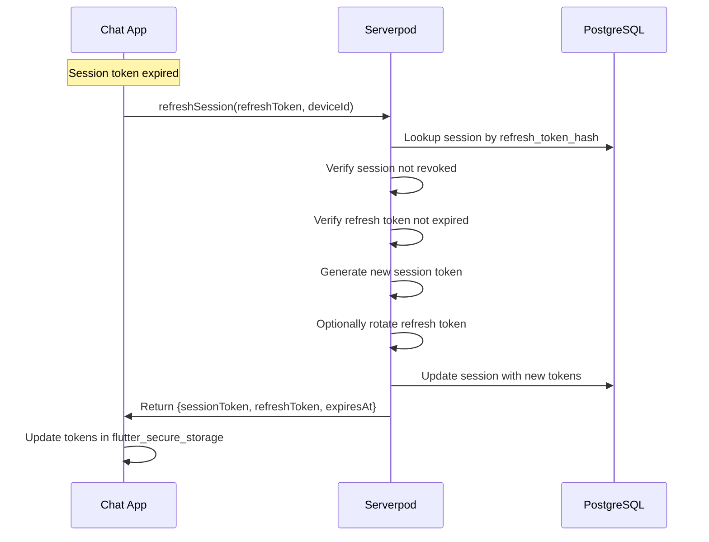
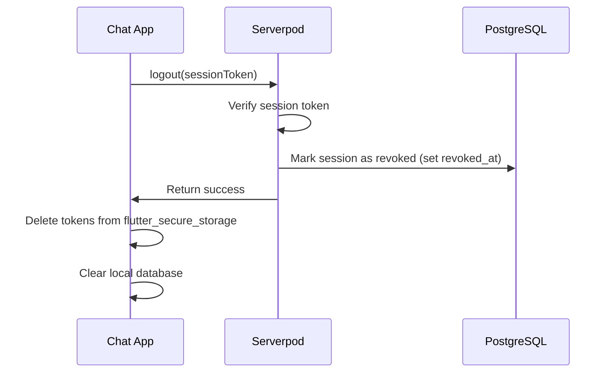
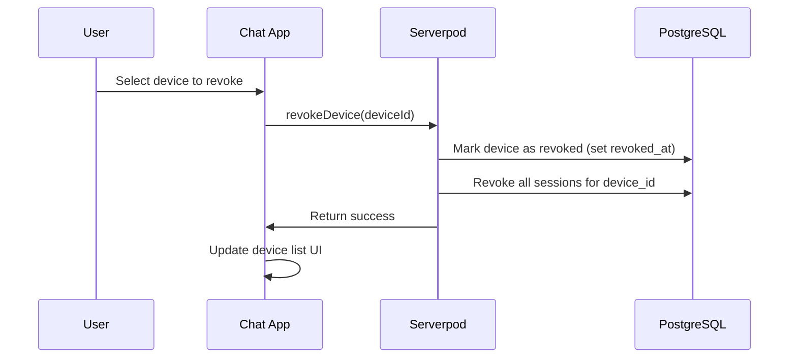

# ADR-0003: Firebase ID Token to Serverpod Session Exchange Flow

**Status:** Accepted  
**Date:** 2024  
**Deciders:** Backend Team, Frontend Team, Security Team  
**Technical Story:** Production-Ready Privacy-Focused Chat Platform

## Context

The chat platform uses Firebase Authentication for phone number-based OTP authentication but requires Serverpod as the primary backend for message routing and data persistence. We need a secure mechanism to:

1. Leverage Firebase Auth's robust phone OTP verification
2. Exchange Firebase authentication credentials for Serverpod sessions
3. Tie sessions to specific devices for multi-device support
4. Maintain security without storing Firebase credentials long-term
5. Support session refresh without re-authentication
6. Enable device-specific session revocation
7. Prevent session hijacking and replay attacks

## Decision

We will implement a **Firebase ID Token to Serverpod Session Exchange Flow** with the following architecture:

### 1. Authentication Flow Overview



### 2. Token Exchange Endpoint

**Endpoint:** `POST /v1/auth/exchange-firebase-token`

**Request:**
```dart
class ExchangeFirebaseTokenRequest {
  String idToken;           // Firebase ID token from OTP verification
  String deviceId;          // Client-generated UUID for this device
  DeviceInfo deviceInfo;    // Device metadata (name, platform, model)
}

class DeviceInfo {
  String name;              // e.g., "John's iPhone"
  String platform;          // "ios", "android", "web"
  String model;             // Device model
  String osVersion;         // OS version
  String appVersion;        // App version
}
```

**Response:**
```dart
class ExchangeFirebaseTokenResponse {
  String sessionToken;      // Serverpod session token (JWT)
  String refreshToken;      // Long-lived refresh token
  String userId;            // User UUID in Serverpod
  String deviceId;          // Confirmed device UUID
  DateTime expiresAt;       // Session expiration timestamp
}
```

**Server-Side Logic:**
1. Verify Firebase ID token using Firebase Admin SDK
2. Extract Firebase UID and phone number from verified token
3. Find existing user by `firebase_uid` or create new user record
4. Register device if `device_id` is new for this user
5. Generate Serverpod session token (JWT with 7-day expiry)
6. Generate refresh token (random 256-bit token, 90-day expiry)
7. Hash and store refresh token in `sessions` table
8. Return session credentials to client

### 3. Session Token Structure (JWT)

**Claims:**
```json
{
  "sub": "user-uuid",           // Subject: User ID
  "device_id": "device-uuid",   // Device ID
  "session_id": "session-uuid", // Session ID for revocation
  "iat": 1234567890,            // Issued at timestamp
  "exp": 1234567890,            // Expiration timestamp (7 days)
  "iss": "chatapp-serverpod",   // Issuer
  "aud": "chatapp-client"       // Audience
}
```

**Signing:**
- Algorithm: RS256 (RSA with SHA-256)
- Private key stored securely on Serverpod server
- Public key distributed to clients for offline verification (future enhancement)

### 4. Session Refresh Flow



**Endpoint:** `POST /v1/auth/refresh-session`

**Request:**
```dart
class RefreshSessionRequest {
  String refreshToken;      // Current refresh token
  String deviceId;          // Device ID for validation
}
```

**Response:**
```dart
class RefreshSessionResponse {
  String sessionToken;      // New session token
  String refreshToken;      // New or same refresh token
  DateTime expiresAt;       // New expiration timestamp
}
```

**Refresh Token Rotation:**
- Optional: Generate new refresh token on each refresh
- Invalidate old refresh token to prevent reuse
- Provides additional security against token theft

### 5. Device Registration

When a user logs in on a new device:

1. Client generates a unique `device_id` (UUID v4)
2. Client stores `device_id` in shared preferences (persists across app restarts)
3. Client sends `device_id` with authentication request
4. Server registers device in `devices` table if not already registered
5. Server associates session with `device_id` in `sessions` table

**Devices Table:**
```sql
CREATE TABLE devices (
  id UUID PRIMARY KEY DEFAULT gen_random_uuid(),
  user_id UUID NOT NULL REFERENCES users(id) ON DELETE CASCADE,
  device_id VARCHAR(255) UNIQUE NOT NULL,
  name VARCHAR(255) NOT NULL,
  platform VARCHAR(50) NOT NULL,
  last_seen_at TIMESTAMP NOT NULL DEFAULT NOW(),
  created_at TIMESTAMP NOT NULL DEFAULT NOW(),
  revoked_at TIMESTAMP
);
```

### 6. Session Management

**Sessions Table:**
```sql
CREATE TABLE sessions (
  id UUID PRIMARY KEY DEFAULT gen_random_uuid(),
  user_id UUID NOT NULL REFERENCES users(id) ON DELETE CASCADE,
  device_id UUID NOT NULL REFERENCES devices(id) ON DELETE CASCADE,
  refresh_token_hash VARCHAR(255) NOT NULL,
  expires_at TIMESTAMP NOT NULL,
  created_at TIMESTAMP NOT NULL DEFAULT NOW(),
  revoked_at TIMESTAMP
);
```

**Session Lifecycle:**
- **Creation**: On successful Firebase token exchange
- **Active**: Session token valid and not expired
- **Expired**: Session token past `exp` claim, requires refresh
- **Revoked**: Manually revoked via logout or device removal
- **Deleted**: Cleaned up after 90 days of inactivity

### 7. Logout Flow



**Endpoint:** `POST /v1/auth/logout`

**Request:**
```dart
class LogoutRequest {
  String sessionToken;      // Current session token
}
```

**Response:**
```dart
class LogoutResponse {
  bool success;
}
```

### 8. Device Revocation

Users can revoke access for specific devices from the device management screen:



**Endpoint:** `POST /v1/auth/revoke-device`

**Request:**
```dart
class RevokeDeviceRequest {
  String deviceId;          // Device to revoke
}
```

**Response:**
```dart
class RevokeDeviceResponse {
  bool success;
}
```

### 9. Security Considerations

**Token Storage:**
- Session tokens and refresh tokens stored in `flutter_secure_storage`
- Device ID stored in shared preferences (not sensitive)
- Never log tokens in plaintext

**Token Transmission:**
- All API requests over HTTPS (TLS 1.3)
- Session token sent in `Authorization: Bearer <token>` header
- Refresh token sent only to refresh endpoint

**Token Validation:**
- Verify JWT signature on every request
- Check `exp` claim to ensure not expired
- Check session not revoked in database
- Validate `device_id` matches session record

**Rate Limiting:**
- Limit token exchange attempts: 5 per hour per IP
- Limit refresh attempts: 10 per hour per device
- Implement exponential backoff on client

**Token Expiry:**
- Session token: 7 days (short-lived)
- Refresh token: 90 days (long-lived)
- Expired sessions require refresh
- Expired refresh tokens require re-authentication

### 10. Multi-Device Session Management

Each device has its own session:

- User can be logged in on multiple devices simultaneously
- Each device has separate session and refresh tokens
- Revoking one device does not affect others
- User can view all active devices in settings
- User can remotely revoke any device

**Device List UI:**
```
My Devices
├── iPhone 14 Pro (This device)
│   └── Last active: 2 minutes ago
├── iPad Air
│   └── Last active: 1 hour ago
└── Web Browser
    └── Last active: 2 days ago
    └── [Revoke Access]
```

## Consequences

### Positive

1. **Security**: Firebase handles phone OTP verification (proven, secure)
2. **Flexibility**: Serverpod controls session lifecycle and business logic
3. **Multi-Device**: Per-device sessions enable granular access control
4. **Revocation**: Users can remotely revoke compromised devices
5. **Offline Validation**: JWT tokens can be validated without database lookup (future enhancement)
6. **Refresh Tokens**: Long-lived refresh tokens reduce re-authentication friction
7. **Auditability**: Session table provides complete audit trail
8. **Scalability**: Stateless JWT tokens reduce database load

### Negative

1. **Complexity**: Two-step authentication adds complexity
2. **Firebase Dependency**: Still depends on Firebase Auth for initial verification
3. **Token Management**: Clients must handle token refresh logic
4. **Storage Security**: Tokens must be stored securely on client
5. **Revocation Delay**: JWT tokens remain valid until expiry even if revoked (requires database check)

### Neutral

1. **Token Size**: JWT tokens are larger than opaque tokens
2. **Clock Skew**: Requires synchronized clocks for `exp` validation
3. **Key Rotation**: Requires process for rotating JWT signing keys

## Implementation Notes

### Firebase Admin SDK Setup

```dart
// Serverpod server initialization
import 'package:firebase_admin/firebase_admin.dart';

void main() async {
  // Initialize Firebase Admin SDK
  final firebaseApp = FirebaseAdmin.instance.initializeApp(
    AppOptions(
      credential: ServiceAccountCredential.fromJson(
        File('firebase-service-account.json').readAsStringSync(),
      ),
    ),
  );
  
  // Start Serverpod
  await Serverpod.start();
}
```

### Token Verification

```dart
// Auth endpoint implementation
class AuthEndpoint extends Endpoint {
  Future<ExchangeFirebaseTokenResponse> exchangeFirebaseToken(
    Session session,
    ExchangeFirebaseTokenRequest request,
  ) async {
    // Verify Firebase ID token
    final firebaseAuth = FirebaseAuth.instance;
    final decodedToken = await firebaseAuth.verifyIdToken(request.idToken);
    
    if (decodedToken == null) {
      throw Exception('Invalid Firebase ID token');
    }
    
    final firebaseUid = decodedToken.uid;
    final phoneNumber = decodedToken.phoneNumber;
    
    // Find or create user
    var user = await User.db.findByFirebaseUid(session, firebaseUid);
    if (user == null) {
      user = User(
        firebaseUid: firebaseUid,
        phoneNumber: phoneNumber,
        displayName: phoneNumber, // Default, user can change later
      );
      await User.db.insertRow(session, user);
    }
    
    // Register device
    var device = await Device.db.findByDeviceId(session, request.deviceId);
    if (device == null) {
      device = Device(
        userId: user.id!,
        deviceId: request.deviceId,
        name: request.deviceInfo.name,
        platform: request.deviceInfo.platform,
      );
      await Device.db.insertRow(session, device);
    } else {
      // Update last seen
      device.lastSeenAt = DateTime.now();
      await Device.db.updateRow(session, device);
    }
    
    // Generate session token (JWT)
    final sessionToken = _generateSessionToken(
      userId: user.id!,
      deviceId: device.id!,
    );
    
    // Generate refresh token
    final refreshToken = _generateRefreshToken();
    final refreshTokenHash = _hashToken(refreshToken);
    
    // Store session
    final sessionRecord = SessionRecord(
      userId: user.id!,
      deviceId: device.id!,
      refreshTokenHash: refreshTokenHash,
      expiresAt: DateTime.now().add(Duration(days: 90)),
    );
    await SessionRecord.db.insertRow(session, sessionRecord);
    
    return ExchangeFirebaseTokenResponse(
      sessionToken: sessionToken,
      refreshToken: refreshToken,
      userId: user.id!,
      deviceId: device.id!,
      expiresAt: DateTime.now().add(Duration(days: 7)),
    );
  }
  
  String _generateSessionToken({
    required String userId,
    required String deviceId,
  }) {
    final jwt = JWT({
      'sub': userId,
      'device_id': deviceId,
      'iat': DateTime.now().millisecondsSinceEpoch ~/ 1000,
      'exp': DateTime.now().add(Duration(days: 7)).millisecondsSinceEpoch ~/ 1000,
      'iss': 'chatapp-serverpod',
      'aud': 'chatapp-client',
    });
    
    return jwt.sign(SecretKey(_getJwtSecret()));
  }
  
  String _generateRefreshToken() {
    final random = Random.secure();
    final bytes = List<int>.generate(32, (_) => random.nextInt(256));
    return base64Url.encode(bytes);
  }
  
  String _hashToken(String token) {
    final bytes = utf8.encode(token);
    final digest = sha256.convert(bytes);
    return digest.toString();
  }
}
```

### Client-Side Token Management

```dart
class AuthService {
  final FlutterSecureStorage _secureStorage = FlutterSecureStorage();
  final SharedPreferences _prefs;
  
  Future<void> authenticateWithFirebase(String phoneNumber) async {
    // Firebase phone auth flow
    await FirebaseAuth.instance.verifyPhoneNumber(
      phoneNumber: phoneNumber,
      verificationCompleted: (PhoneAuthCredential credential) async {
        final userCredential = await FirebaseAuth.instance.signInWithCredential(credential);
        final idToken = await userCredential.user?.getIdToken();
        
        if (idToken != null) {
          await _exchangeFirebaseToken(idToken);
        }
      },
      verificationFailed: (FirebaseAuthException e) {
        // Handle error
      },
      codeSent: (String verificationId, int? resendToken) {
        // Show OTP input UI
      },
      codeAutoRetrievalTimeout: (String verificationId) {
        // Handle timeout
      },
    );
  }
  
  Future<void> _exchangeFirebaseToken(String idToken) async {
    // Get or generate device ID
    String? deviceId = _prefs.getString('device_id');
    if (deviceId == null) {
      deviceId = Uuid().v4();
      await _prefs.setString('device_id', deviceId);
    }
    
    // Exchange token with Serverpod
    final response = await _serverpodClient.auth.exchangeFirebaseToken(
      ExchangeFirebaseTokenRequest(
        idToken: idToken,
        deviceId: deviceId,
        deviceInfo: DeviceInfo(
          name: await _getDeviceName(),
          platform: Platform.operatingSystem,
          model: await _getDeviceModel(),
          osVersion: Platform.operatingSystemVersion,
          appVersion: await _getAppVersion(),
        ),
      ),
    );
    
    // Store tokens securely
    await _secureStorage.write(key: 'session_token', value: response.sessionToken);
    await _secureStorage.write(key: 'refresh_token', value: response.refreshToken);
    await _prefs.setString('user_id', response.userId);
  }
  
  Future<String?> getSessionToken() async {
    final token = await _secureStorage.read(key: 'session_token');
    
    if (token == null) return null;
    
    // Check if token is expired
    if (_isTokenExpired(token)) {
      // Refresh token
      return await _refreshSession();
    }
    
    return token;
  }
  
  Future<String?> _refreshSession() async {
    final refreshToken = await _secureStorage.read(key: 'refresh_token');
    final deviceId = _prefs.getString('device_id');
    
    if (refreshToken == null || deviceId == null) {
      return null;
    }
    
    try {
      final response = await _serverpodClient.auth.refreshSession(
        RefreshSessionRequest(
          refreshToken: refreshToken,
          deviceId: deviceId,
        ),
      );
      
      // Update stored tokens
      await _secureStorage.write(key: 'session_token', value: response.sessionToken);
      await _secureStorage.write(key: 'refresh_token', value: response.refreshToken);
      
      return response.sessionToken;
    } catch (e) {
      // Refresh failed, require re-authentication
      await logout();
      return null;
    }
  }
  
  Future<void> logout() async {
    final token = await _secureStorage.read(key: 'session_token');
    
    if (token != null) {
      try {
        await _serverpodClient.auth.logout(LogoutRequest(sessionToken: token));
      } catch (e) {
        // Ignore errors, clear local state anyway
      }
    }
    
    // Clear all stored credentials
    await _secureStorage.deleteAll();
    await _prefs.remove('user_id');
    // Keep device_id for future logins
  }
}
```

## Alternatives Considered

### 1. Firebase Auth Only (No Serverpod Sessions)

**Pros:**
- Simpler architecture
- No token exchange needed
- Firebase handles all session management

**Cons:**
- Serverpod endpoints must verify Firebase tokens on every request (slower)
- No control over session lifecycle
- Difficult to implement per-device revocation
- Firebase token format may change

**Decision:** Rejected - Need control over session management for multi-device support.

### 2. Serverpod Native Auth (No Firebase)

**Pros:**
- Full control over authentication
- No external dependencies
- Simpler token flow

**Cons:**
- Must implement phone OTP verification (complex, expensive)
- Must handle SMS delivery (requires Twilio/similar)
- Reinventing proven authentication system
- Higher security risk

**Decision:** Rejected - Firebase Auth is proven, secure, and handles OTP complexity.

### 3. Opaque Tokens Instead of JWT

**Pros:**
- Smaller token size
- Easier revocation (just delete from database)
- No clock skew issues

**Cons:**
- Requires database lookup on every request (slower)
- No offline validation capability
- Less standard than JWT

**Decision:** Rejected - JWT provides better performance and future extensibility.

### 4. Single Session Per User (No Multi-Device)

**Pros:**
- Simpler session management
- No device tracking needed

**Cons:**
- Poor user experience (logging in on new device logs out old device)
- No remote device revocation
- Doesn't meet multi-device requirement

**Decision:** Rejected - Multi-device support is a core requirement.

## Related Decisions

- ADR-0001: Serverpod Protocol v1 Definition
- ADR-0002: E2EE Implementation Strategy (per-device keys)
- ADR-0006: Multi-Device Key Distribution

## References

- [Firebase Admin SDK Documentation](https://firebase.google.com/docs/admin/setup)
- [JWT Best Practices](https://datatracker.ietf.org/doc/html/rfc8725)
- [OAuth 2.0 Token Exchange](https://datatracker.ietf.org/doc/html/rfc8693)
- Requirements 2.3, 8.1-8.10, 10.1-10.10 in `requirements.md`

---

**Approved by:** Backend Team, Frontend Team, Security Team  
**Implementation Status:** In Progress  
**Next Review:** After security audit
