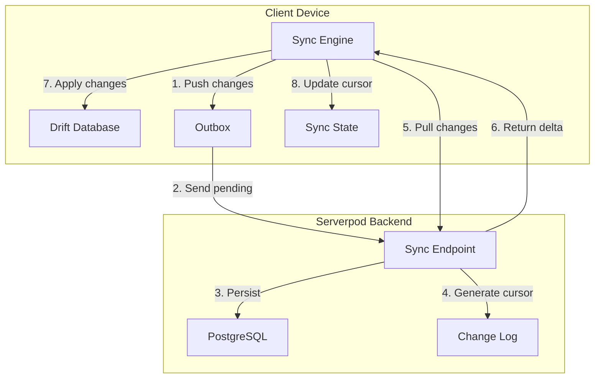
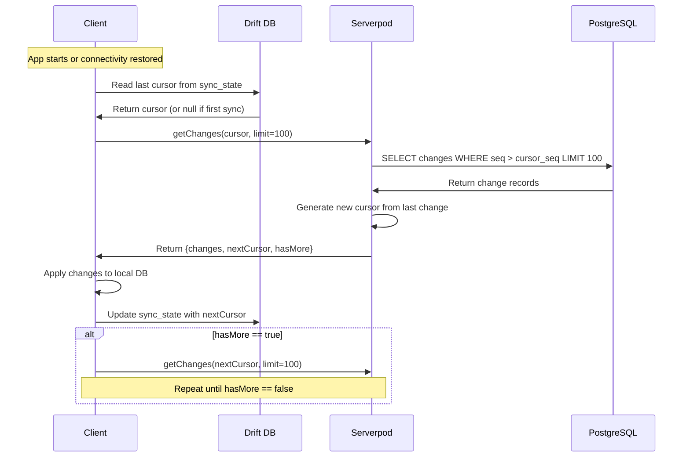
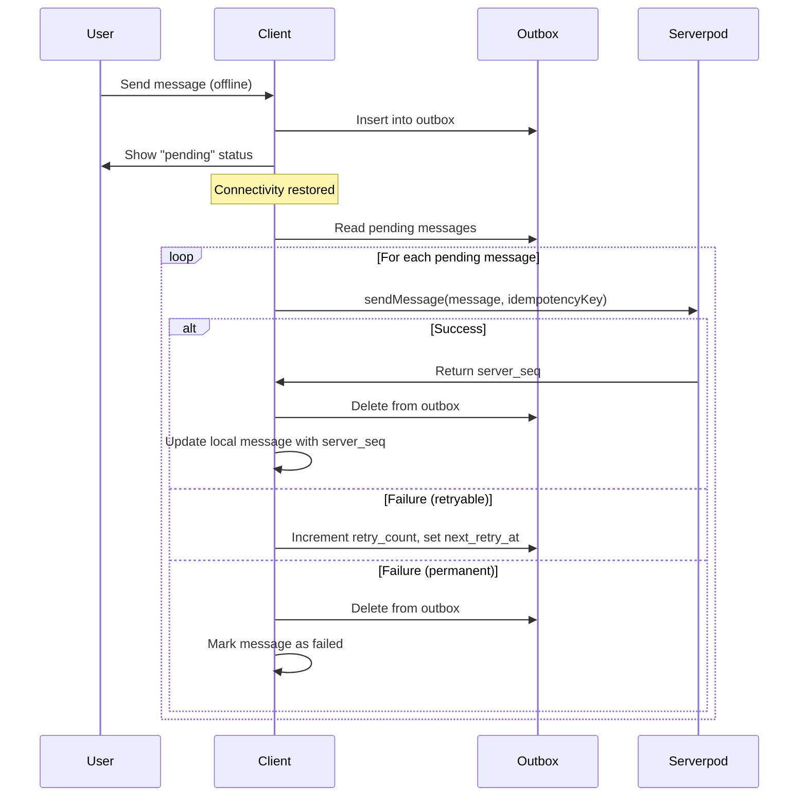

# ADR-0004: Sync Cursor Strategy and Conflict Resolution (LWW)

**Status:** Accepted  
**Date:** 2024  
**Deciders:** Backend Team, Frontend Team  
**Technical Story:** Production-Ready Privacy-Focused Chat Platform

## Context

The chat platform requires offline-first synchronization where users can:

1. Read and compose messages while offline
2. Automatically sync changes when connectivity is restored
3. Handle conflicts when the same data is modified on multiple devices
4. Efficiently fetch only new changes without downloading entire datasets
5. Support incremental sync for large message histories
6. Maintain consistency across multiple devices
7. Minimize bandwidth usage and battery consumption
8. Provide clear sync status to users

The system must handle various conflict scenarios:
- User edits a message on Device A while offline, then edits the same message on Device B
- User deletes a message on one device while another device is offline
- Multiple devices send messages simultaneously
- Network partitions causing temporary inconsistency

## Decision

We will implement a **Cursor-Based Incremental Sync Strategy with Last-Write-Wins (LWW) Conflict Resolution** using the following architecture:

### 1. Sync Architecture Overview



### 2. Cursor-Based Sync

**Cursor Definition:**
A cursor is an opaque string representing a point in time in the change stream. It encodes:
- Timestamp (milliseconds since epoch)
- Server sequence number
- Optional: shard ID for horizontal scaling

**Cursor Format:**
```
base64(timestamp:sequence:shard)
Example: "MTcwMDAwMDAwMDAwMDoxMjM0NTY6MA=="
```

**Sync State Table (Client):**
```dart
class SyncState extends Table {
  TextColumn get key => text()();        // 'global_cursor', 'chat:{chatId}:cursor'
  TextColumn get value => text()();      // Cursor value
  DateTimeColumn get lastSyncAt => dateTime()();
  
  @override
  Set<Column> get primaryKey => {key};
}
```

### 3. Incremental Sync Flow



### 4. Change Log Schema

**Server-Side Change Log:**
```sql
CREATE TABLE change_log (
  id UUID PRIMARY KEY DEFAULT gen_random_uuid(),
  seq BIGSERIAL NOT NULL,
  entity_type VARCHAR(50) NOT NULL,  -- 'message', 'chat', 'user', etc.
  entity_id UUID NOT NULL,
  operation VARCHAR(20) NOT NULL,    -- 'insert', 'update', 'delete'
  user_id UUID NOT NULL REFERENCES users(id),
  device_id UUID REFERENCES devices(id),
  data JSONB NOT NULL,               -- Full entity snapshot or delta
  created_at TIMESTAMP NOT NULL DEFAULT NOW()
);

CREATE INDEX idx_change_log_seq ON change_log(seq);
CREATE INDEX idx_change_log_user ON change_log(user_id, seq);
CREATE INDEX idx_change_log_entity ON change_log(entity_type, entity_id);
```

**Change Log Entry Example:**
```json
{
  "seq": 123456,
  "entity_type": "message",
  "entity_id": "550e8400-e29b-41d4-a716-446655440000",
  "operation": "insert",
  "user_id": "user-uuid",
  "device_id": "device-uuid",
  "data": {
    "id": "550e8400-e29b-41d4-a716-446655440000",
    "chat_id": "chat-uuid",
    "sender_id": "user-uuid",
    "ciphertext": "encrypted-content",
    "server_seq": 789,
    "created_at": "2024-01-01T12:00:00Z"
  },
  "created_at": "2024-01-01T12:00:00Z"
}
```

### 5. Sync Endpoints

**Global Sync Endpoint:**
```dart
// Get all changes for the authenticated user
Future<SyncResponse> getChanges(
  Session session,
  String? cursor,
  int limit,
) async {
  final userId = session.userId;
  final cursorSeq = _decodeCursor(cursor);
  
  final changes = await ChangeLog.db.find(
    session,
    where: (t) => t.userId.equals(userId) & t.seq.greaterThan(cursorSeq),
    orderBy: (t) => t.seq,
    limit: limit,
  );
  
  final hasMore = changes.length == limit;
  final nextCursor = changes.isNotEmpty 
    ? _encodeCursor(changes.last.seq, changes.last.createdAt)
    : cursor;
  
  return SyncResponse(
    changes: changes,
    nextCursor: nextCursor,
    hasMore: hasMore,
  );
}
```

**Chat-Specific Sync Endpoint:**
```dart
// Get changes for a specific chat (more efficient for large histories)
Future<SyncResponse> getChatChanges(
  Session session,
  String chatId,
  String? cursor,
  int limit,
) async {
  final userId = session.userId;
  final cursorSeq = _decodeCursor(cursor);
  
  // Verify user is member of chat
  final isMember = await ChatMember.db.exists(
    session,
    where: (t) => t.chatId.equals(chatId) & t.userId.equals(userId),
  );
  
  if (!isMember) {
    throw Exception('User is not a member of this chat');
  }
  
  final changes = await ChangeLog.db.find(
    session,
    where: (t) => 
      t.entityType.equals('message') & 
      t.data['chat_id'].equals(chatId) &
      t.seq.greaterThan(cursorSeq),
    orderBy: (t) => t.seq,
    limit: limit,
  );
  
  final hasMore = changes.length == limit;
  final nextCursor = changes.isNotEmpty 
    ? _encodeCursor(changes.last.seq, changes.last.createdAt)
    : cursor;
  
  return SyncResponse(
    changes: changes,
    nextCursor: nextCursor,
    hasMore: hasMore,
  );
}
```

### 6. Last-Write-Wins (LWW) Conflict Resolution

**Conflict Scenarios:**

**Scenario 1: Concurrent Message Edits**
- Device A edits message at 12:00:00
- Device B edits same message at 12:00:05 (while offline)
- Both devices sync when online

**Resolution:**
- Server compares `updated_at` timestamps
- Message with later timestamp wins
- Losing edit is discarded
- Client receives winning version in next sync

**Scenario 2: Message Deletion vs. Edit**
- Device A deletes message at 12:00:00
- Device B edits message at 12:00:05 (while offline)

**Resolution:**
- Deletion wins if `deleted_at > updated_at`
- Edit wins if `updated_at > deleted_at`
- Tombstone record prevents resurrection of deleted messages

**Scenario 3: Duplicate Message Sends**
- Device A sends message while offline
- Device A comes online and sends message
- Device A goes offline again
- Device A comes online and retries send

**Resolution:**
- Server uses `client_msg_id` for idempotency
- Duplicate sends are detected and ignored
- Client receives acknowledgment for original message

### 7. Conflict Resolution Algorithm

```dart
class ConflictResolver {
  /// Resolves conflicts between local and remote entities using LWW
  Future<ResolvedEntity> resolve({
    required Entity local,
    required Entity remote,
  }) async {
    // Deletion always wins over edits
    if (remote.deletedAt != null) {
      if (local.deletedAt == null || remote.deletedAt!.isAfter(local.deletedAt!)) {
        return ResolvedEntity(
          entity: remote,
          resolution: ConflictResolution.remoteWins,
          reason: 'Remote deletion is newer',
        );
      }
    }
    
    if (local.deletedAt != null) {
      if (remote.deletedAt == null || local.deletedAt!.isAfter(remote.deletedAt!)) {
        return ResolvedEntity(
          entity: local,
          resolution: ConflictResolution.localWins,
          reason: 'Local deletion is newer',
        );
      }
    }
    
    // Compare updated_at timestamps
    if (remote.updatedAt.isAfter(local.updatedAt)) {
      return ResolvedEntity(
        entity: remote,
        resolution: ConflictResolution.remoteWins,
        reason: 'Remote update is newer',
      );
    } else if (local.updatedAt.isAfter(remote.updatedAt)) {
      return ResolvedEntity(
        entity: local,
        resolution: ConflictResolution.localWins,
        reason: 'Local update is newer',
      );
    } else {
      // Timestamps equal, use server_seq as tiebreaker
      if (remote.serverSeq != null && (local.serverSeq == null || remote.serverSeq! > local.serverSeq!)) {
        return ResolvedEntity(
          entity: remote,
          resolution: ConflictResolution.remoteWins,
          reason: 'Remote has higher server sequence',
        );
      } else {
        return ResolvedEntity(
          entity: local,
          resolution: ConflictResolution.localWins,
          reason: 'Local has higher or equal server sequence',
        );
      }
    }
  }
}
```

### 8. Outbox Pattern for Offline Writes

**Outbox Table (Client):**
```dart
class Outbox extends Table {
  TextColumn get id => text()();
  TextColumn get chatId => text()();
  TextColumn get clientMsgId => text()();
  TextColumn get ciphertext => text()();
  TextColumn get contentType => text()();
  TextColumn get mediaId => text().nullable()();
  IntColumn get retryCount => integer().withDefault(const Constant(0))();
  DateTimeColumn get nextRetryAt => dateTime()();
  DateTimeColumn get createdAt => dateTime()();
  
  @override
  Set<Column> get primaryKey => {id};
}
```

**Outbox Processing Flow:**


**Retry Strategy:**
```dart
class OutboxService {
  Future<void> processOutbox() async {
    final now = DateTime.now();
    final pending = await _db.outbox
      .select()
      .where((t) => t.nextRetryAt.isSmallerOrEqualValue(now))
      .get();
    
    for (final item in pending) {
      try {
        final response = await _serverpodClient.message.sendMessage(
          SendMessageRequest(
            chatId: item.chatId,
            clientMsgId: item.clientMsgId,
            ciphertext: item.ciphertext,
            contentType: item.contentType,
            mediaId: item.mediaId,
          ),
        );
        
        // Success: remove from outbox
        await _db.outbox.deleteWhere((t) => t.id.equals(item.id));
        
        // Update local message with server_seq
        await _db.localMessages.update().replace(
          LocalMessage(
            id: item.id,
            serverSeq: response.serverSeq,
            status: 'sent',
          ),
        );
      } catch (e) {
        if (_isRetryable(e)) {
          // Exponential backoff: 1s, 2s, 4s, 8s, 16s, 32s, 60s (max)
          final backoffSeconds = min(pow(2, item.retryCount).toInt(), 60);
          
          await _db.outbox.update().replace(
            item.copyWith(
              retryCount: item.retryCount + 1,
              nextRetryAt: now.add(Duration(seconds: backoffSeconds)),
            ),
          );
        } else {
          // Permanent failure: remove from outbox and mark as failed
          await _db.outbox.deleteWhere((t) => t.id.equals(item.id));
          await _db.localMessages.update().replace(
            LocalMessage(
              id: item.id,
              status: 'failed',
            ),
          );
        }
      }
    }
  }
  
  bool _isRetryable(Exception e) {
    // Network errors, 5xx errors are retryable
    // 4xx errors (except 429) are not retryable
    if (e is NetworkException) return true;
    if (e is ServerException && e.statusCode >= 500) return true;
    if (e is ServerException && e.statusCode == 429) return true;
    return false;
  }
}
```

### 9. Sync Status UI

**Status Indicators:**
- **Syncing**: Animated spinner, "Syncing messages..."
- **Synced**: Checkmark, "All messages synced"
- **Offline**: Cloud with slash, "Offline - changes will sync when online"
- **Error**: Warning icon, "Sync failed - tap to retry"

**Message Status:**
- **Pending**: Clock icon, gray
- **Sent**: Single checkmark, gray
- **Delivered**: Double checkmark, gray
- **Read**: Double checkmark, blue
- **Failed**: Exclamation mark, red

### 10. Sync Optimization Strategies

**Batching:**
- Fetch changes in batches of 100 records
- Process multiple changes in a single database transaction
- Reduce network round-trips

**Prioritization:**
- Sync active chats first
- Defer sync of archived chats
- Prioritize recent messages over old history

**Differential Sync:**
- Only sync entities that changed since last cursor
- Avoid re-downloading unchanged data

**Compression:**
- Compress change payloads with gzip
- Reduce bandwidth usage by 60-80%

**Background Sync:**
- Use WorkManager (Android) / Background Tasks (iOS) for periodic sync
- Sync when device is charging and on WiFi
- Respect battery saver mode

## Consequences

### Positive

1. **Efficiency**: Cursor-based sync fetches only new changes, minimizing bandwidth
2. **Scalability**: Incremental sync scales to large message histories
3. **Simplicity**: LWW conflict resolution is simple and predictable
4. **Consistency**: Eventually consistent across all devices
5. **Offline Support**: Outbox pattern enables full offline functionality
6. **Idempotency**: Client message IDs prevent duplicate sends
7. **Auditability**: Change log provides complete audit trail
8. **Performance**: Batching and compression optimize network usage

### Negative

1. **Data Loss**: LWW discards losing edits without user notification
2. **Timestamp Dependency**: Requires synchronized clocks (NTP)
3. **Storage Overhead**: Change log grows indefinitely (requires cleanup)
4. **Complexity**: Cursor encoding/decoding adds complexity
5. **Eventual Consistency**: Temporary inconsistency during sync
6. **No Merge**: Cannot merge conflicting edits (e.g., collaborative editing)

### Neutral

1. **Conflict Frequency**: Conflicts are rare in typical chat usage
2. **User Awareness**: Users may not notice losing edits if conflicts are rare
3. **Cleanup**: Change log requires periodic cleanup (e.g., delete entries > 90 days)

## Implementation Notes

### Cursor Encoding/Decoding

```dart
class CursorCodec {
  static String encode(int seq, DateTime timestamp) {
    final parts = [
      timestamp.millisecondsSinceEpoch.toString(),
      seq.toString(),
      '0', // Shard ID (for future horizontal scaling)
    ];
    final encoded = parts.join(':');
    return base64Url.encode(utf8.encode(encoded));
  }
  
  static CursorData decode(String? cursor) {
    if (cursor == null || cursor.isEmpty) {
      return CursorData(seq: 0, timestamp: DateTime.fromMillisecondsSinceEpoch(0));
    }
    
    try {
      final decoded = utf8.decode(base64Url.decode(cursor));
      final parts = decoded.split(':');
      
      return CursorData(
        seq: int.parse(parts[1]),
        timestamp: DateTime.fromMillisecondsSinceEpoch(int.parse(parts[0])),
        shardId: int.parse(parts[2]),
      );
    } catch (e) {
      throw Exception('Invalid cursor format');
    }
  }
}

class CursorData {
  final int seq;
  final DateTime timestamp;
  final int shardId;
  
  CursorData({required this.seq, required this.timestamp, this.shardId = 0});
}
```

### Sync Engine Implementation

```dart
class SyncEngine {
  final ServerpodClient _client;
  final DriftDatabase _db;
  final ConflictResolver _conflictResolver;
  
  Future<void> sync() async {
    // 1. Process outbox (push local changes)
    await _processOutbox();
    
    // 2. Pull remote changes
    await _pullChanges();
  }
  
  Future<void> _pullChanges() async {
    // Read last cursor
    final syncState = await _db.syncState
      .select()
      .where((t) => t.key.equals('global_cursor'))
      .getSingleOrNull();
    
    String? cursor = syncState?.value;
    bool hasMore = true;
    
    while (hasMore) {
      final response = await _client.sync.getChanges(cursor, 100);
      
      // Apply changes
      await _applyChanges(response.changes);
      
      // Update cursor
      await _db.syncState.insertOnConflictUpdate(
        SyncStateData(
          key: 'global_cursor',
          value: response.nextCursor,
          lastSyncAt: DateTime.now(),
        ),
      );
      
      cursor = response.nextCursor;
      hasMore = response.hasMore;
    }
  }
  
  Future<void> _applyChanges(List<ChangeLogEntry> changes) async {
    await _db.transaction(() async {
      for (final change in changes) {
        switch (change.entityType) {
          case 'message':
            await _applyMessageChange(change);
            break;
          case 'chat':
            await _applyChatChange(change);
            break;
          case 'user':
            await _applyUserChange(change);
            break;
        }
      }
    });
  }
  
  Future<void> _applyMessageChange(ChangeLogEntry change) async {
    final remoteMessage = Message.fromJson(change.data);
    
    // Check if message exists locally
    final localMessage = await _db.localMessages
      .select()
      .where((t) => t.id.equals(remoteMessage.id))
      .getSingleOrNull();
    
    if (localMessage == null) {
      // New message: insert
      await _db.localMessages.insertOne(remoteMessage.toLocal());
    } else {
      // Existing message: resolve conflict
      final resolved = await _conflictResolver.resolve(
        local: localMessage,
        remote: remoteMessage,
      );
      
      if (resolved.resolution == ConflictResolution.remoteWins) {
        await _db.localMessages.update().replace(resolved.entity.toLocal());
      }
      // If localWins, keep local version (do nothing)
    }
  }
}
```

## Alternatives Considered

### 1. Operational Transformation (OT)

**Pros:**
- Can merge conflicting edits
- Better for collaborative editing
- No data loss

**Cons:**
- Extremely complex to implement correctly
- High computational overhead
- Overkill for chat messages (rarely edited)

**Decision:** Rejected - Complexity not justified for chat use case.

### 2. Conflict-Free Replicated Data Types (CRDTs)

**Pros:**
- Automatic conflict resolution
- No central authority needed
- Mathematically proven convergence

**Cons:**
- Complex to implement
- Higher storage overhead
- Not well-suited for immutable messages
- Limited Dart library support

**Decision:** Rejected - LWW is simpler and sufficient for chat.

### 3. Version Vectors

**Pros:**
- Can detect concurrent edits
- More precise than timestamps

**Cons:**
- Requires tracking version per device
- Storage overhead grows with device count
- Complex to implement

**Decision:** Rejected - Timestamps are simpler and sufficient.

### 4. Full State Sync (No Cursors)

**Pros:**
- Simpler implementation
- No cursor management

**Cons:**
- Inefficient for large datasets
- High bandwidth usage
- Slow sync times

**Decision:** Rejected - Does not scale to large message histories.

### 5. Manual Conflict Resolution (Ask User)

**Pros:**
- No data loss
- User has full control

**Cons:**
- Poor user experience
- Interrupts workflow
- Conflicts are rare in chat

**Decision:** Rejected - Automatic resolution is better UX for chat.

## Related Decisions

- ADR-0001: Serverpod Protocol v1 Definition
- ADR-0003: Firebase ID Token to Serverpod Session Exchange Flow
- ADR-0006: Multi-Device Key Distribution

## References

- [Conflict-Free Replicated Data Types](https://crdt.tech/)
- [Operational Transformation](https://en.wikipedia.org/wiki/Operational_transformation)
- [Last-Write-Wins Element Set](https://en.wikipedia.org/wiki/Conflict-free_replicated_data_type#LWW-Element-Set_(Last-Write-Wins-Element-Set))
- Requirements 9.1-9.10, 22.1-22.10 in `requirements.md`

---

**Approved by:** Backend Team, Frontend Team  
**Implementation Status:** In Progress  
**Next Review:** After performance testing with large datasets
