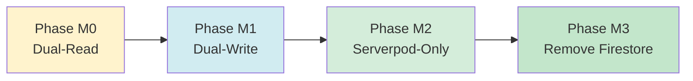

# ADR-0005: Firestore Migration Phases (M0-M3)

**Status:** Accepted  
**Date:** 2024  
**Deciders:** Backend Team, Frontend Team, DevOps Team  
**Technical Story:** Production-Ready Privacy-Focused Chat Platform

## Context

The chat platform is currently built on Firebase Firestore for message storage and real-time synchronization. We need to migrate to Serverpod + PostgreSQL as the primary backend while:

1. Maintaining service availability during migration (zero downtime)
2. Preserving all existing user data and message history
3. Supporting gradual rollout with feature flags
4. Enabling rollback if critical issues are discovered
5. Minimizing risk through incremental phases
6. Validating data consistency between systems
7. Supporting users on different app versions during transition
8. Eventually removing Firebase dependencies to reduce costs

The migration must be carefully orchestrated to avoid data loss, service disruption, or user experience degradation.

## Decision

We will implement a **Four-Phase Incremental Migration Strategy (M0-M3)** with feature flags controlling backend selection:

### Migration Phases Overview



### Phase M0: Dual-Read Mode (Validation)

**Objective:** Validate Serverpod implementation without affecting production traffic.

**Duration:** 2-4 weeks

**Characteristics:**
- **Write**: Firestore only (existing behavior)
- **Read**: Both Firestore and Serverpod
- **Authoritative**: Firestore
- **Feature Flag**: `serverpod_read_enabled` (default: false)

**Architecture:**
```mermaid
graph TB
    subgraph "Client"
        A[Chat App]
        B[Feature Flag]
    en