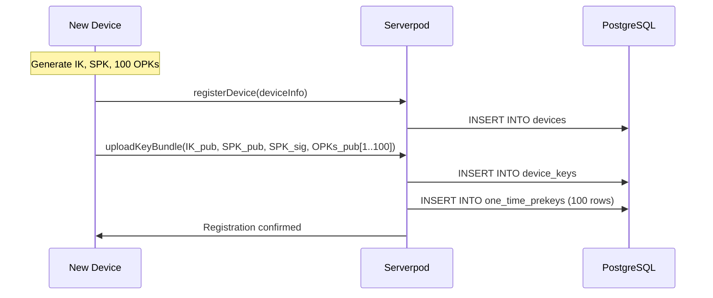
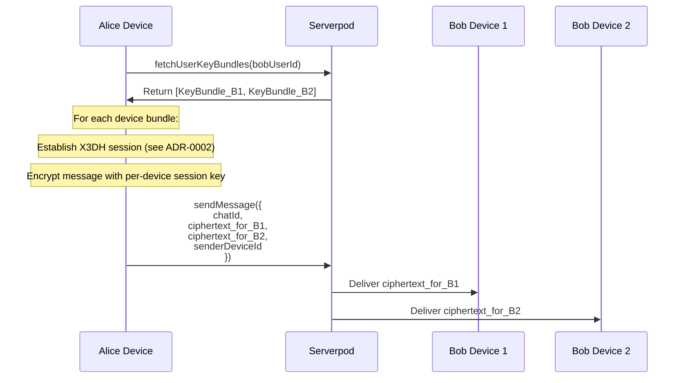
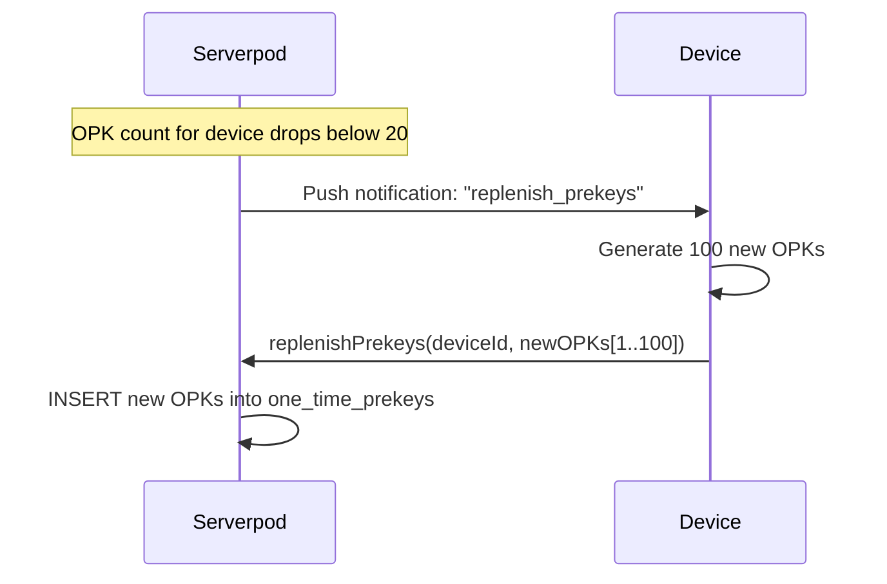
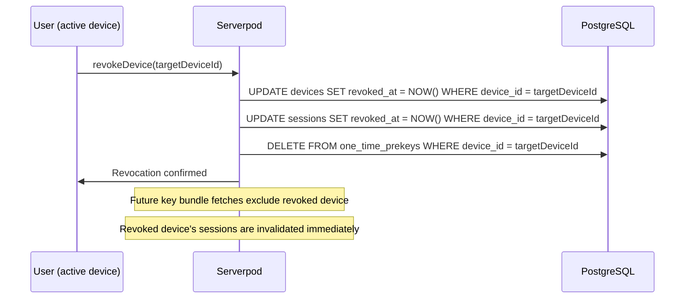

# ADR-0006: Multi-Device Key Distribution

**Status:** Accepted  
**Date:** 2024  
**Deciders:** Security Team, Backend Team, Frontend Team  
**Technical Story:** Production-Ready Privacy-Focused Chat Platform

## Context

The chat platform supports users accessing their account from multiple devices simultaneously (phone, tablet, web). Each device must be able to send and receive end-to-end encrypted messages independently. This creates a fundamental challenge: how do we distribute encryption keys across devices so that:

1. Every device can decrypt messages sent to the user
2. Senders can encrypt a single message for all of a recipient's devices
3. Private keys never leave the originating device
4. A compromised or revoked device cannot decrypt future messages
5. A newly registered device can receive messages going forward (but not retroactively)
6. The server cannot access plaintext at any point
7. Key distribution scales efficiently as device count grows

The system must handle:
- A user registering a new device and receiving future messages on it
- A user revoking a device (e.g., lost phone) and preventing it from receiving future messages
- Senders discovering all active devices for a recipient and encrypting for each
- Per-device sync cursors tracking which messages each device has received
- Key bundle replenishment when one-time prekeys are exhausted on any device

## Decision

We will implement **per-device key pairs with server-mediated key bundle distribution**, where each device maintains its own independent E2EE key material and senders encrypt messages separately for each registered device.

### 1. Per-Device Key Architecture

Each device generates and owns its own complete key hierarchy (see ADR-0002):

```
Device A (phone)
├── Identity Key Pair (IK_A) — Ed25519, long-term
├── Signed Prekey Pair (SPK_A) — X25519, rotated every 30 days
└── One-Time Prekeys (OPK_A[1..100]) — X25519, single-use

Device B (tablet)
├── Identity Key Pair (IK_B) — Ed25519, long-term
├── Signed Prekey Pair (SPK_B) — X25519, rotated every 30 days
└── One-Time Prekeys (OPK_B[1..100]) — X25519, single-use
```

Private keys are stored exclusively in `flutter_secure_storage` on each device and are never transmitted to the server or any other device.

### 2. Device Registry

The `Device_Registry` tracks all active devices per user in PostgreSQL:

```sql
CREATE TABLE devices (
  id UUID PRIMARY KEY DEFAULT gen_random_uuid(),
  user_id UUID NOT NULL REFERENCES users(id) ON DELETE CASCADE,
  device_id VARCHAR(255) UNIQUE NOT NULL,
  name VARCHAR(255) NOT NULL,
  platform VARCHAR(50) NOT NULL,
  public_key_ref TEXT NOT NULL,
  last_seen_at TIMESTAMP NOT NULL DEFAULT NOW(),
  created_at TIMESTAMP NOT NULL DEFAULT NOW(),
  revoked_at TIMESTAMP
);
```

A device is considered active when `revoked_at IS NULL`. Revoked devices are retained for audit purposes but excluded from key bundle lookups.

### 3. Key Bundle Upload on Registration

When a user registers a new device:



The server stores only public key material. The device retains all private keys locally.

### 4. Multi-Device Message Encryption

When Alice sends a message to Bob (who has N active devices):



Each device receives a ciphertext encrypted specifically for it. The server stores one record per recipient device in the `message_recipients` table.

### 5. Message Recipients Table

To support per-device delivery, messages have a recipients table:

```sql
CREATE TABLE message_recipients (
  message_id UUID NOT NULL REFERENCES messages(id) ON DELETE CASCADE,
  device_id UUID NOT NULL REFERENCES devices(id) ON DELETE CASCADE,
  ciphertext TEXT NOT NULL,
  delivered_at TIMESTAMP,
  read_at TIMESTAMP,
  PRIMARY KEY (message_id, device_id)
);

CREATE INDEX idx_msg_recipients_device ON message_recipients(device_id, delivered_at NULLS FIRST);
```

### 6. Per-Device Sync Cursors

Each device maintains its own sync cursor tracking which messages it has received:

```dart
// Sync state key format: 'device:{deviceId}:cursor'
// Stored in local SyncState table (Drift)
class SyncState extends Table {
  TextColumn get key => text()();    // 'global_cursor' or 'chat:{chatId}:cursor'
  TextColumn get value => text()();  // Opaque cursor string
  DateTimeColumn get lastSyncAt => dateTime()();

  @override
  Set<Column> get primaryKey => {key};
}
```

When a device comes online after being offline, it fetches all missed messages using its stored cursor:

```dart
// Sync engine fetches only messages addressed to this device
final response = await _client.sync.getChanges(
  cursor: lastCursor,
  deviceId: currentDeviceId,
  limit: 100,
);
```

### 7. One-Time Prekey Replenishment

The server monitors OPK counts per device and triggers replenishment:



If a device is offline and OPKs are exhausted, the server falls back to the signed prekey for session establishment (reduced forward secrecy, acceptable tradeoff).

### 8. Device Revocation

When a user revokes a device (e.g., lost phone):



After revocation:
- The revoked device cannot authenticate (session invalidated)
- Senders no longer encrypt for the revoked device (excluded from key bundle lookups)
- Messages sent before revocation remain encrypted for the revoked device but cannot be decrypted without a valid session

### 9. New Device Catch-Up

A newly registered device receives messages going forward from registration time. It does **not** receive historical messages encrypted for other devices, as those ciphertexts were encrypted with different session keys.

This is an intentional security property: a new device cannot retroactively read past conversations. Users who need history on a new device must use the encrypted backup/restore mechanism (see Requirement 20).

### 10. Sender's Own Devices

When Alice sends a message, she also encrypts it for her own other devices so they can display the sent message:

```dart
Future<void> sendMessage(String chatId, String plaintext) async {
  // Fetch recipient's devices
  final recipientBundles = await _keyService.fetchUserKeyBundles(recipientId);
  // Fetch sender's own other devices
  final senderBundles = await _keyService.fetchUserKeyBundles(currentUserId);

  final allBundles = [...recipientBundles, ...senderBundles]
    .where((b) => b.deviceId != currentDeviceId)
    .toList();

  final encryptedPayloads = await Future.wait(
    allBundles.map((bundle) => _crypto.encryptForDevice(plaintext, bundle)),
  );

  await _client.message.sendMessage(SendMessageRequest(
    chatId: chatId,
    recipients: encryptedPayloads,
    senderDeviceId: currentDeviceId,
    clientMsgId: _generateIdempotencyKey(),
  ));
}
```

## Consequences

### Positive

1. **Privacy**: Private keys never leave the originating device; the server is fully blind to plaintext
2. **Independence**: Each device can encrypt and decrypt independently without coordination
3. **Revocation**: Compromised devices can be immediately cut off from future messages
4. **Forward Secrecy**: Per-device OPKs ensure past sessions are not exposed by key compromise
5. **Scalability**: Key bundle lookups are O(N) in device count, which is small in practice (typically 1–5 devices)
6. **Auditability**: Device registry provides a clear record of all registered and revoked devices

### Negative

1. **Sender Overhead**: Senders must encrypt once per recipient device; for a user with 3 devices, this triples encryption work
2. **No Historical Access**: New devices cannot read messages sent before registration without a backup restore
3. **OPK Exhaustion**: If a device is offline for extended periods, OPKs may be exhausted, reducing forward secrecy
4. **Storage**: `message_recipients` table grows proportionally with device count per user
5. **Complexity**: Multi-device session management adds complexity to the E2EE module

### Neutral

1. **Device Limit**: A practical limit of 10 active devices per user is enforced to bound sender overhead
2. **Key Verification**: Users should verify device identity keys out-of-band to prevent MITM; this is a future enhancement
3. **Backup Dependency**: Historical message access on new devices depends on the backup/restore feature

## Implementation Notes

### Key Bundle Fetch Response

```dart
class KeyBundle {
  final String deviceId;
  final String identityKey;       // Ed25519 public key (base64)
  final String signedPrekey;      // X25519 public key (base64)
  final String signedPrekeySignature;
  final String? oneTimePrekey;    // X25519 public key (base64), nullable if exhausted
  final int? oneTimePrekeyId;
}
```

### Device Limit Enforcement

```dart
// Enforced in registerDevice endpoint
const maxDevicesPerUser = 10;

final activeDeviceCount = await Device.db.count(
  session,
  where: (t) => t.userId.equals(userId) & t.revokedAt.isNull(),
);

if (activeDeviceCount >= maxDevicesPerUser) {
  throw MaxDevicesExceededException(
    'Maximum of $maxDevicesPerUser devices allowed per user',
  );
}
```

## Alternatives Considered

### 1. Shared Key Pair Across Devices

**Pros:**
- Simpler: sender encrypts once regardless of device count
- New devices can read all historical messages

**Cons:**
- Private key must be transferred between devices (transmission risk)
- Revoking one device requires re-keying all devices
- Compromise of any device compromises all past messages

**Decision:** Rejected — violates the principle that private keys never leave the originating device.

### 2. Key Agreement Between Devices (Device-to-Device Sync)

**Pros:**
- New devices can receive historical messages via device-to-device key sync
- Reduces sender overhead (encrypt once, sync key to other devices)

**Cons:**
- Requires devices to be online simultaneously for initial sync
- Complex key sync protocol with its own attack surface
- Server could potentially intercept device-to-device key exchange

**Decision:** Deferred — may be implemented as a future enhancement using QR-code-based out-of-band key verification.

### 3. Server-Side Fan-Out with Single Ciphertext

**Pros:**
- Sender encrypts once; server re-encrypts for each device
- Reduces client-side work

**Cons:**
- Server must hold decryption keys, breaking E2EE
- Fundamentally incompatible with the privacy model

**Decision:** Rejected — breaks end-to-end encryption guarantees.

## Related Decisions

- ADR-0002: E2EE Implementation Strategy (X25519 + ChaCha20-Poly1305)
- ADR-0003: Firebase ID Token to Serverpod Session Exchange Flow
- ADR-0004: Sync Cursor Strategy and Conflict Resolution

## References

- [Signal Multi-Device Protocol](https://signal.org/docs/)
- [X3DH Key Agreement Protocol](https://signal.org/docs/specifications/x3dh/)
- Requirements 2.1, 2.3, 2.4, 8.1–8.10 in `requirements.md`

---

**Approved by:** Security Team, Backend Team, Frontend Team  
**Implementation Status:** Planned  
**Next Review:** After E2EE module implementation
