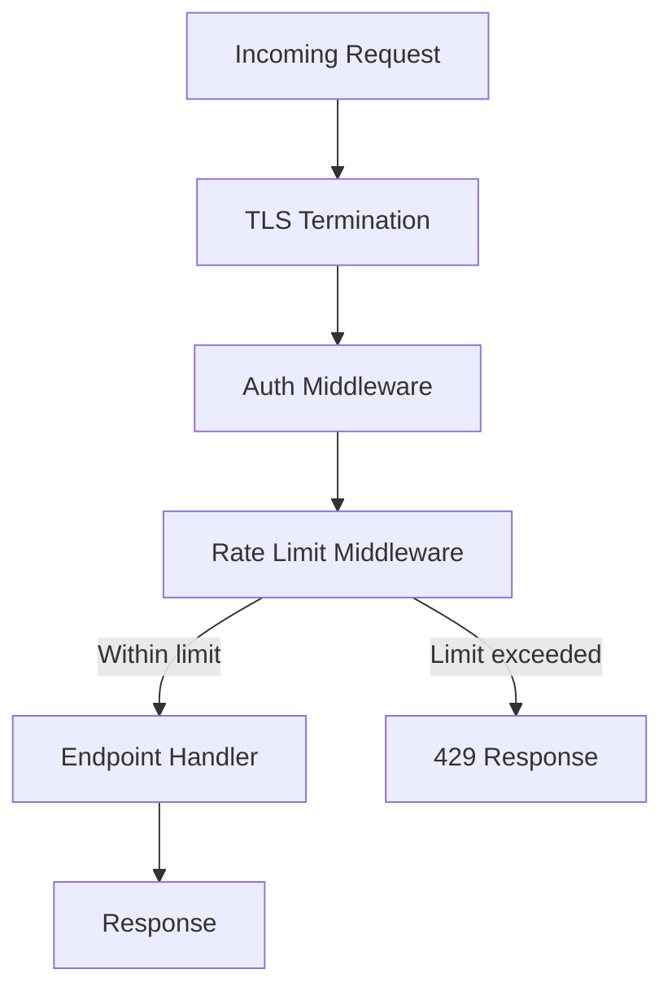
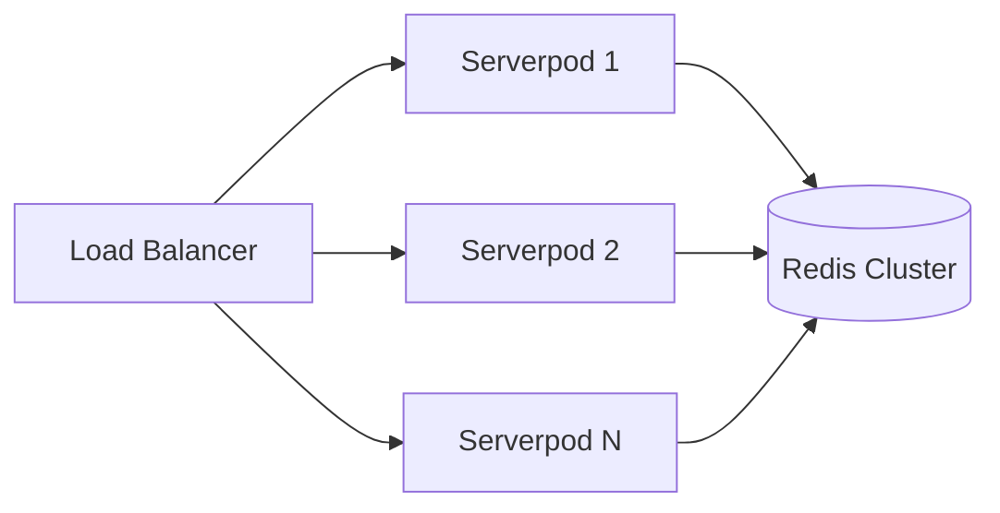

# ADR-0007: Rate Limiting and Abuse Prevention

**Status:** Accepted  
**Date:** 2024  
**Deciders:** Backend Team, Security Team, Platform Team  
**Technical Story:** Production-Ready Privacy-Focused Chat Platform

## Context

The chat platform must protect against abuse, spam, and resource exhaustion while remaining responsive for legitimate users. Without rate limiting, the platform is vulnerable to:

1. **Credential stuffing / brute force**: Automated attempts to guess OTP codes or session tokens
2. **Message spam**: Flooding a user or group with high-volume messages
3. **Resource exhaustion**: Overwhelming the Serverpod cluster with excessive connections or API calls
4. **Group abuse**: Rapidly creating groups or adding members to evade blocks
5. **Reputation gaming**: Devices with poor report history continuing to abuse the platform

The rate limiting strategy must:
- Apply limits at multiple granularities (IP, user, device)
- Use sliding window algorithms to prevent burst abuse at window boundaries
- Return standard HTTP 429 responses with `Retry-After` headers
- Apply stricter limits to low-reputation devices
- Log violations for security monitoring without logging message content
- Scale horizontally across multiple Serverpod instances using a shared Redis store

## Decision

We will implement a **multi-tier sliding window rate limiter** backed by Redis, applied at the Serverpod middleware layer before endpoint handlers execute.

### 1. Rate Limit Tiers

| Endpoint Category | Limit | Window | Key |
|---|---|---|---|
| Authentication (OTP request) | 5 attempts | 1 hour | IP address |
| Authentication (OTP verify) | 10 attempts | 1 hour | IP + phone number |
| Message sending | 100 messages | 1 minute | user_id |
| Message sending (low reputation) | 20 messages | 1 minute | user_id |
| Group creation | 5 groups | 1 hour | user_id |
| Group member additions | 50 additions | 1 hour | user_id |
| Media uploads | 20 uploads | 1 minute | user_id |
| Key bundle fetches | 200 fetches | 1 minute | user_id |
| Concurrent connections | 10 connections | — (active) | user_id |
| API requests (general) | 1000 requests | 1 minute | user_id |

### 2. Sliding Window Algorithm

We use the **sliding window log** algorithm implemented in Redis to prevent burst abuse at window boundaries (a known weakness of fixed window counters):

```
For each request:
  key = "rl:{category}:{identifier}"
  now = current_timestamp_ms
  window_start = now - window_duration_ms

  MULTI
    ZREMRANGEBYSCORE key 0 window_start   # Remove expired entries
    ZADD key now now                       # Add current request
    ZCARD key                              # Count requests in window
    EXPIRE key window_duration_seconds     # Auto-cleanup
  EXEC

  if count > limit:
    oldest_in_window = ZRANGE key 0 0 WITHSCORES
    retry_after = ceil((oldest_in_window + window_duration_ms - now) / 1000)
    return 429 with Retry-After: retry_after
```

This ensures the count always reflects the true number of requests in the last `window_duration` seconds, regardless of when within the window the burst occurs.

### 3. Middleware Architecture

Rate limiting is applied as a Serverpod middleware interceptor before any endpoint handler:



```dart
class RateLimitMiddleware {
  final RateLimiter _limiter;

  Future<Response?> intercept(Session session, Request request) async {
    final category = _categorize(request.endpoint);
    final identifier = _identify(session, request, category);
    final config = _configs[category]!;

    final result = await _limiter.check(
      key: 'rl:$category:$identifier',
      limit: _effectiveLimit(config, session.deviceReputation),
      windowMs: config.windowMs,
    );

    if (!result.allowed) {
      return Response(
        statusCode: 429,
        headers: {
          'Retry-After': result.retryAfterSeconds.toString(),
          'X-RateLimit-Limit': config.limit.toString(),
          'X-RateLimit-Remaining': '0',
          'X-RateLimit-Reset': result.resetTimestamp.toString(),
        },
        body: jsonEncode({
          'error': 'rate_limit_exceeded',
          'message': 'Too many requests. Please retry after ${result.retryAfterSeconds} seconds.',
          'retryAfter': result.retryAfterSeconds,
        }),
      );
    }

    return null; // Continue to handler
  }

  int _effectiveLimit(RateLimitConfig config, DeviceReputation reputation) {
    return switch (reputation) {
      DeviceReputation.low => (config.limit * 0.2).floor(),
      DeviceReputation.medium => config.limit,
      DeviceReputation.high => config.limit,
    };
  }
}
```

### 4. Rate Limit Key Strategy

Different endpoint categories use different identifiers to balance precision and fairness:

| Category | Key Components | Rationale |
|---|---|---|
| Auth (OTP request) | IP address | Prevent credential stuffing before user is known |
| Auth (OTP verify) | IP + phone hash | Prevent targeted brute force on a specific account |
| Message sending | user_id | Per-user limit; IP is unreliable behind NAT |
| Group operations | user_id | Prevent group spam tied to account |
| General API | user_id | Authenticated requests tied to account |
| Unauthenticated | IP address | No user context available |

Phone numbers are hashed (SHA-256) before use as rate limit keys to avoid storing PII in Redis.

### 5. Device Reputation System

Devices accumulate a reputation score based on report history and violation patterns:

```sql
CREATE TABLE device_reputation (
  device_id UUID PRIMARY KEY REFERENCES devices(id) ON DELETE CASCADE,
  score INT NOT NULL DEFAULT 100,        -- 0-100, higher is better
  report_count INT NOT NULL DEFAULT 0,
  violation_count INT NOT NULL DEFAULT 0,
  last_violation_at TIMESTAMP,
  updated_at TIMESTAMP NOT NULL DEFAULT NOW()
);
```

Reputation tiers:
- **High** (score 70–100): Standard rate limits
- **Medium** (score 30–69): Standard rate limits with closer monitoring
- **Low** (score 0–29): Stricter rate limits (20% of standard)

Reputation decreases on:
- Confirmed abuse reports: −20 points
- Rate limit violations: −5 points per violation
- Spam detection triggers: −10 points

Reputation recovers slowly over time (+1 point per day of clean activity, capped at 100).

### 6. Connection Limits

To prevent resource exhaustion from WebSocket connections:

```dart
class ConnectionLimitMiddleware {
  final Redis _redis;
  static const maxConnectionsPerUser = 10;

  Future<bool> allowConnection(String userId, String connectionId) async {
    final key = 'conn:$userId';
    final count = await _redis.scard(key);

    if (count >= maxConnectionsPerUser) {
      return false;
    }

    // Track connection; auto-expire after 24h as safety net
    await _redis.sadd(key, connectionId);
    await _redis.expire(key, 86400);
    return true;
  }

  Future<void> releaseConnection(String userId, String connectionId) async {
    await _redis.srem('conn:$userId', connectionId);
  }
}
```

### 7. Client-Side Handling

The Flutter client respects rate limit responses and surfaces them clearly:

```dart
class ServerpodInterceptor {
  Future<Response> intercept(Request request) async {
    final response = await _send(request);

    if (response.statusCode == 429) {
      final retryAfter = int.tryParse(
        response.headers['retry-after'] ?? '60',
      ) ?? 60;

      // Surface to UI
      _rateLimitNotifier.setRateLimited(
        endpoint: request.endpoint,
        retryAfterSeconds: retryAfter,
      );

      // Do not retry automatically for auth endpoints
      if (_isAuthEndpoint(request)) {
        throw RateLimitException(retryAfterSeconds: retryAfter);
      }

      // For message sending, queue in outbox and retry after delay
      if (_isMessageEndpoint(request)) {
        await _outbox.scheduleRetry(request, retryAfter);
        return response;
      }
    }

    return response;
  }
}
```

The UI displays a clear message: *"Too many requests. Please wait X seconds before trying again."*

### 8. Violation Logging

Rate limit violations are logged for security monitoring without capturing message content:

```dart
Future<void> _logViolation(
  String category,
  String identifier,
  String? userId,
  String? deviceId,
) async {
  await RateLimitViolation.db.insertRow(session, RateLimitViolation(
    category: category,
    identifierHash: sha256(identifier),  // Hash to avoid storing raw IPs/IDs
    userId: userId,
    deviceId: deviceId,
    timestamp: DateTime.now(),
  ));

  // Update device reputation if device is known
  if (deviceId != null) {
    await _reputationService.recordViolation(deviceId);
  }
}
```

```sql
CREATE TABLE rate_limit_violations (
  id UUID PRIMARY KEY DEFAULT gen_random_uuid(),
  category VARCHAR(100) NOT NULL,
  identifier_hash VARCHAR(64) NOT NULL,
  user_id UUID REFERENCES users(id),
  device_id UUID REFERENCES devices(id),
  timestamp TIMESTAMP NOT NULL DEFAULT NOW()
);

CREATE INDEX idx_rl_violations_timestamp ON rate_limit_violations(timestamp DESC);
CREATE INDEX idx_rl_violations_device ON rate_limit_violations(device_id, timestamp DESC);
```

### 9. Redis Key Expiry and Cleanup

All Redis rate limit keys have TTLs set to the window duration, ensuring automatic cleanup:

```
rl:auth_otp:192.168.1.1          TTL: 3600s
rl:message:user-uuid             TTL: 60s
rl:group_create:user-uuid        TTL: 3600s
conn:user-uuid                   TTL: 86400s (safety net)
```

No manual cleanup is required; Redis handles expiry automatically.

### 10. Horizontal Scaling

Because rate limit state is stored in Redis (shared across all Serverpod instances), the rate limiter works correctly in a multi-instance deployment:



Redis Cluster with replication ensures high availability. If Redis is temporarily unavailable, the middleware fails open (allows requests) to avoid blocking legitimate users, and logs the Redis outage for alerting.

## Consequences

### Positive

1. **Abuse Prevention**: Sliding window algorithm prevents burst abuse at window boundaries
2. **Scalability**: Redis-backed state works correctly across all Serverpod instances
3. **Fairness**: Per-user limits prevent one abusive user from affecting others
4. **Reputation System**: Low-reputation devices face stricter limits without full bans
5. **Standard Compliance**: HTTP 429 + `Retry-After` follows RFC 6585
6. **Privacy**: Violation logs hash identifiers; no message content is logged
7. **Client UX**: Clear error messages and automatic retry scheduling for message queuing

### Negative

1. **Redis Dependency**: Rate limiting requires Redis; Redis outage causes fail-open behavior
2. **IP Unreliability**: IP-based limits are less effective behind shared NAT or VPNs
3. **Legitimate Bursts**: Power users sending many messages quickly may hit limits
4. **Reputation Lag**: Reputation recovery is slow; legitimate users with low scores face friction
5. **Complexity**: Multi-tier configuration requires careful tuning and ongoing adjustment

### Neutral

1. **Limit Tuning**: Initial limits are estimates; production traffic data will inform adjustments
2. **Fail-Open**: Failing open on Redis outage prioritizes availability over strict enforcement
3. **No CAPTCHA**: The current design does not include CAPTCHA; may be added for auth endpoints if brute force persists

## Implementation Notes

### Rate Limiter Interface

```dart
abstract class RateLimiter {
  Future<RateLimitResult> check({
    required String key,
    required int limit,
    required int windowMs,
  });
}

class RateLimitResult {
  final bool allowed;
  final int remaining;
  final int retryAfterSeconds;
  final DateTime resetTimestamp;
}
```

### Configuration

Rate limit configurations are loaded from environment variables to allow tuning without code changes:

```yaml
# config/rate_limits.yaml
auth_otp_request:
  limit: 5
  window_seconds: 3600
  key_type: ip

message_send:
  limit: 100
  window_seconds: 60
  key_type: user_id
  low_reputation_multiplier: 0.2

group_create:
  limit: 5
  window_seconds: 3600
  key_type: user_id
```

## Alternatives Considered

### 1. Fixed Window Counter

**Pros:**
- Simpler implementation
- Lower Redis memory usage

**Cons:**
- Vulnerable to boundary bursts: a user can send 2× the limit by timing requests at the window boundary
- Less accurate representation of actual request rate

**Decision:** Rejected — sliding window is worth the modest additional complexity.

### 2. Token Bucket Algorithm

**Pros:**
- Allows controlled bursts up to bucket capacity
- Smooth rate limiting

**Cons:**
- More complex Redis implementation
- Harder to reason about `Retry-After` values
- Burst allowance may be exploited

**Decision:** Rejected — sliding window provides clearer semantics for our use case.

### 3. In-Memory Rate Limiting (Per Instance)

**Pros:**
- No Redis dependency
- Lower latency

**Cons:**
- Does not work correctly with multiple Serverpod instances (each instance has independent counters)
- Users can bypass limits by hitting different instances

**Decision:** Rejected — incompatible with horizontal scaling requirements.

### 4. API Gateway Rate Limiting (e.g., AWS API Gateway)

**Pros:**
- Offloads rate limiting to infrastructure layer
- No application code required

**Cons:**
- Couples the application to a specific cloud provider
- Cannot implement reputation-based dynamic limits
- Less flexibility for custom key strategies (e.g., hashed phone numbers)

**Decision:** Rejected — application-level rate limiting provides the flexibility needed for reputation-based limits and privacy-preserving key strategies.

## Related Decisions

- ADR-0001: Serverpod Protocol v1 Definition
- ADR-0003: Firebase ID Token to Serverpod Session Exchange Flow
- ADR-0006: Multi-Device Key Distribution

## References

- [RFC 6585 — Additional HTTP Status Codes (429)](https://datatracker.ietf.org/doc/html/rfc6585)
- [Redis Sorted Sets for Rate Limiting](https://redis.io/docs/manual/patterns/rate-limiting/)
- [Sliding Window Rate Limiting](https://blog.cloudflare.com/counting-things-a-lot-of-different-things/)
- Requirements 19.1–19.10, 10.10, 24.8 in `requirements.md`

---

**Approved by:** Backend Team, Security Team, Platform Team  
**Implementation Status:** Planned  
**Next Review:** After load testing in staging environment
