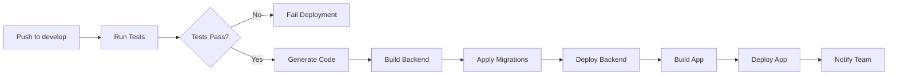
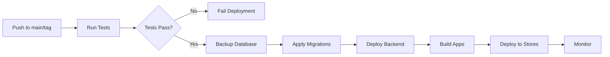

# CI/CD Pipeline Overview

This document provides an overview of the continuous integration and deployment pipeline for the production-ready privacy-focused chat platform.

## Pipeline Architecture

```
┌─────────────────────────────────────────────────────────────────┐
│                         Code Changes                             │
└────────────┬────────────────────────────────────────────────────┘
             │
             ├─── Push to feature branch
             │    └─→ No deployment (CI only)
             │
             ├─── Pull Request to develop/main
             │    └─→ Run CI checks (block merge if failed)
             │
             ├─── Push to develop branch
             │    └─→ Deploy to Staging
             │
             └─── Push to main branch / Tag release
                  └─→ Deploy to Production
```

## Workflow Summary

| Workflow | Trigger | Purpose | Duration |
|----------|---------|---------|----------|
| **Serverpod Backend CI** | Push/PR (server changes) | Test backend code | ~5 min |
| **Flutter CI** | Push/PR (app changes) | Test Flutter app | ~8 min |
| **Deploy Staging** | Push to `develop` | Deploy to staging env | ~15 min |
| **Deploy Production** | Push to `main` or tag | Deploy to production | ~25 min |

## Key Features

### 1. Automated Code Generation
- Runs `serverpod generate` in all workflows
- Ensures protocol definitions are always in sync
- Fails CI if generated code is out of date

### 2. Comprehensive Testing
- Backend: `dart test` with PostgreSQL test database
- Frontend: `flutter test` with coverage reporting
- Blocks deployment if tests fail

### 3. Database Migration Management
- Automatic migration application during deployment
- Migration tracking to prevent duplicates
- Production backup before migration

### 4. Multi-Platform Builds
- Android: APK (staging) and AAB (production)
- iOS: Build for TestFlight and App Store
- Web: Future support planned

### 5. Environment Separation
- Staging: `develop` branch → staging environment
- Production: `main` branch → production environment
- Different configurations per environment

## Quick Start

### For Developers

**Before committing:**
```bash
# Generate Serverpod code
cd server
serverpod generate

# Run tests locally
cd chat_server
dart test

cd ../../chat
flutter test

# Commit changes
git add .
git commit -m "Your changes"
git push
```

**Creating a pull request:**
1. Push your feature branch
2. Create PR to `develop`
3. Wait for CI checks to pass
4. Request review
5. Merge when approved

**Deploying to staging:**
```bash
# Merge to develop branch
git checkout develop
git merge feature/your-feature
git push origin develop

# Deployment starts automatically
# Monitor at: https://github.com/your-org/your-repo/actions
```

**Deploying to production:**
```bash
# Merge to main branch
git checkout main
git merge develop
git push origin main

# Or create a release tag
git tag v1.0.0
git push origin v1.0.0

# Deployment starts automatically
```

### For DevOps

**Initial setup:**
1. Configure GitHub secrets (see `.github/SECRETS_SETUP.md`)
2. Set up staging and production environments
3. Configure database instances
4. Set up Serverpod servers
5. Test deployment workflows

**Monitoring:**
- GitHub Actions: Check workflow runs
- Database: Monitor migration logs
- Servers: Check application logs
- Alerts: Set up notifications for failures

## Environment Configuration

### Staging Environment

**Purpose:** Testing and QA before production release

**Configuration:**
- Branch: `develop`
- Database: Separate staging PostgreSQL instance
- Serverpod: Staging server with staging config
- App Distribution: Firebase App Distribution or internal testing

**Access:**
- Developers: Full access
- QA Team: Testing access
- Stakeholders: Demo access

### Production Environment

**Purpose:** Live application for end users

**Configuration:**
- Branch: `main`
- Database: Production PostgreSQL with backups
- Serverpod: Production server with high availability
- App Distribution: Google Play Store, App Store

**Access:**
- Limited to authorized personnel
- Requires approval for deployments
- Automated backups and monitoring

## Deployment Process

### Staging Deployment



**Steps:**
1. Developer pushes to `develop` branch
2. CI runs all tests (backend + frontend)
3. If tests pass, generate Serverpod code
4. Build backend binary
5. Apply database migrations to staging DB
6. Deploy backend to staging server
7. Build Flutter app with staging config
8. Deploy app to Firebase App Distribution
9. Notify team of successful deployment

**Rollback:**
- Revert commit on `develop` branch
- Push to trigger re-deployment
- Or manually deploy previous version

### Production Deployment



**Steps:**
1. Developer pushes to `main` or creates release tag
2. CI runs comprehensive test suite
3. If tests pass, create database backup
4. Apply database migrations to production DB
5. Deploy backend with zero-downtime strategy
6. Build Android AAB and iOS app
7. Deploy to Google Play Store and App Store
8. Monitor deployment health
9. Notify team of successful deployment

**Rollback:**
- Restore database from backup if needed
- Deploy previous backend version
- Revert app store releases if critical

## Migration Management

### Migration Files

Location: `server/chat_server/migrations/`

**Structure:**
```
migrations/
├── apply_all.sql          # Main migration script
├── 001_initial_schema.sql # Individual migrations
├── 002_add_stories.sql
└── 003_add_indexes.sql
```

### Creating Migrations

```sql
-- migrations/00X_description.sql
DO $$
BEGIN
    IF NOT migration_applied('00X_description') THEN
        -- Your migration SQL here
        CREATE TABLE new_table (...);
        
        -- Record migration
        INSERT INTO schema_migrations (version, description) 
        VALUES ('00X_description', 'Description of changes');
    END IF;
END $$;
```

### Applying Migrations

**Automatic (via CI/CD):**
- Staging: Applied on every `develop` push
- Production: Applied on every `main` push/tag

**Manual (for testing):**
```bash
psql -h localhost -U postgres -d chat_dev -f migrations/apply_all.sql
```

### Migration Best Practices

1. **Always test locally first**
2. **Make migrations reversible when possible**
3. **Use transactions for atomic changes**
4. **Document breaking changes**
5. **Coordinate with team on schema changes**

## Monitoring and Alerts

### GitHub Actions Notifications

**Configure in:** `Settings → Notifications → Actions`

Options:
- Email on workflow failure
- Slack/Discord webhooks
- GitHub mobile app notifications

### Application Monitoring

**Recommended tools:**
- Sentry: Error tracking
- Datadog/New Relic: Performance monitoring
- CloudWatch/Stackdriver: Infrastructure monitoring
- Uptime Robot: Availability monitoring

### Database Monitoring

**Key metrics:**
- Connection pool usage
- Query performance
- Disk space
- Backup status
- Replication lag (if applicable)

## Troubleshooting

### Common Issues

**1. Generated code out of sync**
```bash
cd server
serverpod generate
git add .
git commit -m "Update generated code"
git push
```

**2. Test failures**
- Check test logs in GitHub Actions
- Run tests locally to reproduce
- Fix issues and push again

**3. Migration failures**
- Check migration SQL syntax
- Verify database credentials
- Review migration tracking table
- Restore from backup if needed

**4. Deployment failures**
- Check deployment logs
- Verify server connectivity
- Check disk space and resources
- Review configuration secrets

### Getting Help

1. Check workflow logs in GitHub Actions
2. Review this documentation
3. Check `.github/workflows/README.md`
4. Contact DevOps team
5. Create issue in repository

## Security Considerations

### Secrets Management
- Never commit secrets to repository
- Use GitHub Secrets for sensitive data
- Rotate credentials regularly
- Audit secret access

### Database Security
- Use strong passwords
- Enable SSL/TLS connections
- Restrict network access
- Regular security updates
- Automated backups

### Application Security
- Code signing for mobile apps
- HTTPS for all API communication
- Regular dependency updates
- Security scanning in CI

## Performance Optimization

### CI/CD Performance
- Cache dependencies when possible
- Parallel job execution
- Incremental builds
- Optimize test suite

### Deployment Performance
- Zero-downtime deployments
- Health checks before traffic routing
- Gradual rollout strategies
- Quick rollback capability

## Future Enhancements

### Planned Improvements
- [ ] Automated performance testing
- [ ] Security scanning (SAST/DAST)
- [ ] Dependency vulnerability scanning
- [ ] Automated changelog generation
- [ ] Blue-green deployments
- [ ] Canary releases
- [ ] A/B testing infrastructure
- [ ] Web app deployment pipeline

### Integration Opportunities
- Jira/Linear for issue tracking
- Slack for deployment notifications
- PagerDuty for incident management
- Terraform for infrastructure as code

## Resources

- [GitHub Actions Documentation](https://docs.github.com/en/actions)
- [Serverpod Documentation](https://docs.serverpod.dev)
- [Flutter CI/CD Best Practices](https://docs.flutter.dev/deployment/cd)
- [PostgreSQL Migration Strategies](https://www.postgresql.org/docs/current/ddl-alter.html)

## Support

For questions or issues with the CI/CD pipeline:
- Create an issue in the repository
- Contact the DevOps team
- Review workflow logs for details
- Check this documentation first
