# Entity Relationship Diagram (ERD)

## Overview

This ERD represents the PostgreSQL database schema for the Production-Ready Privacy-Focused Chat Platform. The schema is designed to support end-to-end encryption, multi-device synchronization, and offline-first architecture.

## Complete ERD

```mermaid
erDiagram
    users ||--o{ devices : "owns"
    users ||--o{ sessions : "has"
    users ||--o{ chat_members : "participates"
    users ||--o{ messages : "sends"
    users ||--o{ media_objects : "uploads"
    users ||--o{ push_tokens : "registers"
    users ||--o{ blocks : "blocks/blocked_by"
    users ||--o{ reports : "reports/reported"
    users ||--o{ stories : "creates"
    users ||--o{ story_views : "views"
    
    devices ||--o{ sessions : "authenticates"
    devices ||--o{ messages : "sends_from"
    devices ||--|| device_keys : "has"
    devices ||--o{ one_time_prekeys : "has"
    devices ||--o{ push_tokens : "has"
    
    chats ||--o{ chat_members : "has"
    chats ||--o{ messages : "contains"
    
    messages }o--|| media_objects : "references"
    
    stories }o--|| media_objects : "uses"
    stories ||--o{ story_views : "viewed_by"
    
    users {
        uuid id PK
        varchar firebase_uid UK "Firebase Auth UID"
        varchar display_name
        text photo_url
        varchar phone_number
        text status_message
        varchar presence_status "online/away/offline"
        timestamp created_at
        timestamp updated_at
    }
    
    devices {
        uuid id PK
        uuid user_id FK
        varchar device_id UK "Unique device identifier"
        varchar name "User-friendly device name"
        varchar platform "android/ios/web"
        text public_key_ref
        timestamp last_seen_at
        timestamp created_at
        timestamp revoked_at
    }
    
    sessions {
        uuid id PK
        uuid user_id FK
        uuid device_id FK
        varchar refresh_token_hash
        timestamp expires_at
        timestamp created_at
        timestamp revoked_at
    }
    
    chats {
        uuid id PK
        varchar type "direct/group"
        varchar title "Group name (null for direct)"
        uuid created_by FK
        timestamp created_at
        timestamp updated_at
    }
    
    chat_members {
        uuid chat_id PK,FK
        uuid user_id PK,FK
        varchar role "admin/member"
        timestamp joined_at
        bigint last_read_seq "Last message seq read"
        timestamp muted_until
    }
    
    messages {
        uuid id PK
        uuid chat_id FK
        uuid sender_id FK
        uuid sender_device_id FK
        varchar client_msg_id "Idempotency key"
        bigserial server_seq "Ordering sequence"
        text ciphertext "Encrypted content"
        varchar content_type "text/image/video/audio/file"
        uuid media_id FK
        timestamp created_at
        timestamp updated_at
        timestamp deleted_at "Tombstone"
    }
    
    media_objects {
        uuid id PK
        uuid uploader_id FK
        text storage_key "S3 key"
        varchar mime_type
        bigint size_bytes
        varchar sha256_hash
        boolean encrypted "Always true"
        timestamp created_at
    }
    
    device_keys {
        uuid device_id PK,FK
        text identity_key "Ed25519 public key"
        text signed_prekey "X25519 prekey"
        text signed_prekey_signature
        timestamp created_at
        timestamp updated_at
    }
    
    one_time_prekeys {
        uuid id PK
        uuid device_id FK
        int key_id
        text public_key "X25519 public key"
        timestamp used_at "NULL if unused"
        timestamp created_at
    }
    
    push_tokens {
        uuid id PK
        uuid device_id FK
        uuid user_id FK
        text token UK "FCM token"
        varchar platform "android/ios/web"
        timestamp created_at
        timestamp updated_at
    }
    
    blocks {
        uuid blocker_id PK,FK
        uuid blocked_id PK,FK
        timestamp created_at
    }
    
    reports {
        uuid id PK
        uuid reporter_id FK
        uuid reported_user_id FK
        uuid reported_message_id FK
        varchar reason "spam/harassment/inappropriate/other"
        text context
        varchar status "pending/reviewed/resolved"
        timestamp created_at
        timestamp resolved_at
    }
    
    stories {
        uuid id PK
        uuid user_id FK
        uuid media_id FK
        text ciphertext "Encrypted content"
        varchar content_type "photo/video/text"
        timestamp expires_at "24h expiration"
        timestamp created_at
    }
    
    story_views {
        uuid story_id PK,FK
        uuid viewer_id PK,FK
        timestamp viewed_at
    }
```

## Core Entity Groups

### 1. Users and Authentication
- **users**: User profiles and authentication metadata
- **devices**: Multi-device support with device registry
- **sessions**: Authenticated sessions tied to devices

### 2. Messaging
- **chats**: Conversation containers (1:1 or group)
- **chat_members**: Membership with roles and read state
- **messages**: Encrypted messages with idempotency

### 3. Media
- **media_objects**: Encrypted file metadata

### 4. End-to-End Encryption
- **device_keys**: Public key material for session establishment
- **one_time_prekeys**: Single-use keys for forward secrecy

### 5. Push Notifications
- **push_tokens**: FCM tokens for notification delivery

### 6. Safety and Moderation
- **blocks**: User blocking relationships
- **reports**: Abuse reports for moderation

### 7. Stories (Ephemeral Content)
- **stories**: 24-hour expiring content
- **story_views**: View tracking

## Key Relationships

### User-Centric Relationships
- A user can own multiple devices (1:N)
- A user can have multiple active sessions (1:N)
- A user participates in multiple chats (M:N via chat_members)
- A user sends multiple messages (1:N)
- A user can block multiple users (M:N)

### Device-Centric Relationships
- Each device has one key bundle (1:1)
- Each device has multiple one-time prekeys (1:N)
- Each device can send messages (1:N)
- Each device has push tokens (1:N)

### Chat-Centric Relationships
- A chat has multiple members (1:N)
- A chat contains multiple messages (1:N)
- Messages can reference media objects (N:1)

### Story-Centric Relationships
- A story references one media object (N:1)
- A story can be viewed by multiple users (1:N)

## Idempotency and Constraints

### Unique Constraints
- `users.firebase_uid`: Ensures one user per Firebase account
- `devices.device_id`: Ensures unique device identifiers
- `messages(sender_id, client_msg_id)`: Prevents duplicate messages
- `push_tokens.token`: Ensures unique FCM tokens
- `one_time_prekeys(device_id, key_id)`: Ensures unique prekey IDs per device

### Check Constraints
- `users.presence_status`: Must be 'online', 'away', or 'offline'
- `devices.platform`: Must be 'android', 'ios', or 'web'
- `chats.type`: Must be 'direct' or 'group'
- `chat_members.role`: Must be 'admin' or 'member'
- `messages.content_type`: Must be 'text', 'image', 'video', 'audio', or 'file'
- `reports.reason`: Must be 'spam', 'harassment', 'inappropriate', or 'other'
- `reports.status`: Must be 'pending', 'reviewed', or 'resolved'
- `stories.content_type`: Must be 'photo', 'video', or 'text'
- `blocks`: blocker_id != blocked_id (cannot block self)
- `reports`: Must have either reported_user_id or reported_message_id

## Performance Indexes

### High-Traffic Query Indexes (Requirement 22.4)

**Messages Table:**
- `idx_messages_chat_seq`: (chat_id, server_seq DESC) - Chat message history
- `idx_messages_created_at`: (created_at DESC) - Recent messages
- `idx_messages_client_msg`: (sender_id, client_msg_id) - Idempotency checks

**Users Table:**
- `idx_users_firebase_uid`: (firebase_uid) - Authentication lookups
- `idx_users_phone_number`: (phone_number) - Contact discovery

**Devices Table:**
- `idx_devices_user_id`: (user_id) - User's devices
- `idx_devices_device_id`: (device_id) - Device lookups
- `idx_devices_active`: (user_id, revoked_at) WHERE revoked_at IS NULL - Active devices

**Chat Members Table:**
- `idx_chat_members_user_id`: (user_id) - User's chats
- `idx_chat_members_chat_id`: (chat_id) - Chat members

**One-Time Prekeys Table:**
- `idx_prekeys_device_unused`: (device_id) WHERE used_at IS NULL - Available prekeys

**Stories Table:**
- `idx_stories_expires`: (expires_at) - Expiration cleanup
- `idx_stories_user`: (user_id) - User's stories

## Privacy and Security Features

### End-to-End Encryption
- **messages.ciphertext**: Server never stores plaintext
- **media_objects.encrypted**: Always true - files encrypted before upload
- **stories.ciphertext**: Encrypted ephemeral content

### Key Management
- **device_keys**: Public keys only (private keys never leave device)
- **one_time_prekeys**: Single-use keys for forward secrecy
- **used_at**: Tracks prekey consumption to prevent reuse

### Idempotency
- **messages(sender_id, client_msg_id)**: Prevents duplicate message processing
- Supports offline message queuing and retry logic

### Soft Deletes
- **messages.deleted_at**: Tombstone for deleted messages
- **devices.revoked_at**: Soft delete for device revocation
- **sessions.revoked_at**: Soft delete for session invalidation

## Scalability Considerations

### Partitioning Opportunities
- **messages**: Partition by chat_id or created_at for horizontal scaling
- **stories**: Partition by created_at (time-series data)
- **one_time_prekeys**: Partition by device_id

### Archival Strategy
- **messages**: Archive messages older than 1 year to cold storage
- **stories**: Auto-delete after 24 hours (expires_at)
- **sessions**: Purge expired sessions periodically

### Read Replicas
- Read-heavy tables: users, devices, chat_members
- Write-heavy tables: messages, one_time_prekeys

## Migration Notes

This schema is designed to replace the existing Firebase Firestore structure. Key migration considerations:

1. **User Migration**: Map Firebase UIDs to new user records
2. **Message Migration**: Decrypt Firestore messages and re-encrypt for new schema
3. **Device Registration**: Register existing devices with new device_id format
4. **Key Generation**: Generate E2EE keys for all existing devices
5. **Incremental Rollout**: Support dual-read/dual-write during migration

## Requirements Traceability

- **Requirement 2.2**: PostgreSQL for persistent storage of ciphertext, user profiles, device registrations, and sync state
- **Requirement 22.4**: Indexes on frequently queried columns (chat_id, server_seq DESC), (user_id), (firebase_uid)
- **Idempotency Constraints**: (sender_id, client_msg_id) prevents duplicate message processing
